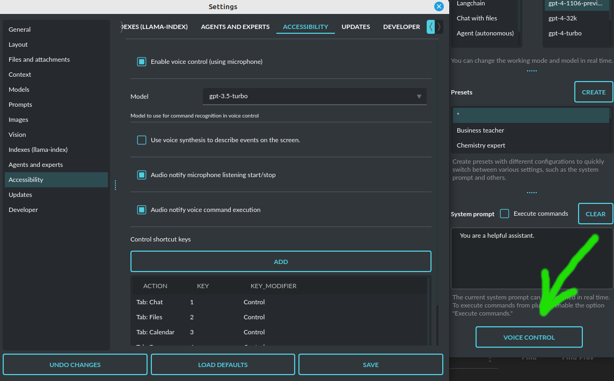

Accessibility
=============

Since version ``2.2.8``, PyGPT has added beta support for disabled people and voice control. This may be very useful for blind people.

In the ``Config / Accessibility`` menu, you can turn on accessibility features such as:

- activating voice control

- translating actions and events on the screen with audio speech

- setting up keyboard shortcuts for actions.

**To enable voice control:**

Turn on the voice control option in ``Config / Accessibility``:

.. code-block:: ini

   Enable voice control (using microphone)

Once you enable this option, an ``Voice Control`` button will appear at the bottom right corner of the window. When you click on this button, the microphone will start listening; clicking it again stops listening and starts recognizing the voice command you said. You can cancel voice recording at any time with the ``ESC`` key. You can also set a keyboard shortcut to turn voice recording on/off.

Voice command recognition works based on a model, so you don't have to worry about saying things perfectly.

**Here's a list of commands you can ask for by voice:**

- Get the current application status
- Exit the application
- Enable audio output
- Disable audio output
- Enable audio input
- Disable audio input
- Add a memo to the calendar
- Clear memos from calendar
- Read the calendar memos
- Enable the camera
- Disable the camera
- Capture image from camera
- Create a new context
- Go to the previous context
- Go to the next context
- Go to the latest context
- Focus on the input
- Send the input
- Clear the input
- Get current conversation info
- Stop executing current action
- Clear the attachments
- Read the last conversation entry
- Read the whole conversation
- Rename current context
- Search for a conversation
- Clear the search results
- Send the message to input
- Append message to current input without sending it
- Switch to chat mode
- Switch to chat with files (llama-index) mode
- Switch to the next mode
- Switch to the previous mode
- Switch to the next model
- Switch to the previous model
- Add note to notepad
- Clear notepad contents
- Read current notepad contents
- Switch to the next preset
- Switch to the previous preset
- Switch to the chat tab
- Switch to the calendar tab
- Switch to the draw (painter) tab
- Switch to the files tab
- Switch to the notepad tab
- Switch to the next tab
- Switch to the previous tab
- Start listening for voice input
- Stop listening for voice input
- Toggle listening for voice input

More commands coming soon.

Just ask for an action that matches one of the descriptions above. These descriptions are also known to the model, and relevant commands are assigned to them. When you voice a command that fits one of those patterns, the model will trigger the appropriate action.

For convenience, you can enable a short sound to play when voice recording starts and stops. To do this, turn on the option:

.. code-block:: ini

   Audio notify microphone listening start/stop

To enable a sound notification when a voice command is recognized and command execution begins, turn on the option:

.. code-block:: ini

   Audio notify voice command execution

For voice translation of on-screen events and information about completed commands via speech synthesis, you can turn on the option:

.. code-block:: ini

   Use voice synthesis to describe events on the screen.

