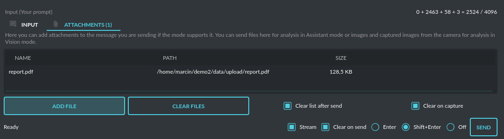
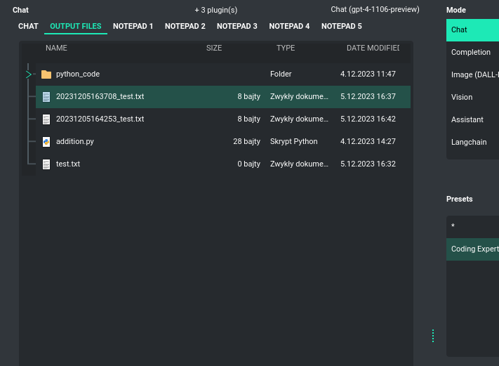

Attachments and files
=====================

Input attachments (upload)
--------------------------

**PyGPT** makes it simple for users to upload files to the server and send them to the model for tasks like analysis, similar to attaching files in ``ChatGPT``. There's a separate ``Attachments`` tab next to the text input area specifically for managing file uploads. Users can opt to have files automatically deleted after each upload or keep them on the list for repeated use.

You can use attachments to provide additional context to the conversation. Uploaded files will be converted into text using loaders from Llama-index. You can upload any file format supported by the application through Llama-index. Supported formats include:

* CSV files (csv)
* Epub files (epub)
* Excel .xlsx spreadsheets (xlsx)
* HTML files (html, htm)
* IPYNB Notebook files (ipynb)
* JSON files (json)
* Markdown files (md)
* PDF documents (pdf)
* Plain-text files (txt and etc.)
* Word .docx documents (docx)
* XML files (xml)

and:

- Image (vision) (jpg, jpeg, png, gif, bmp, tiff, webp)
- Video/audio (mp4, avi, mov, mkv, webm, mp3, mpeg, mpga, m4a, wav)

**Note:** To use images as additional context, you must enable the option in settings: ``Files and attachments -> Allow images as additional context``. Otherwise, only normal vision/handling by the vision model will be active for images.

The content from the uploaded attachments will be used in the current conversation and will be available throughout (per context). There are 3 modes available for working with additional context from attachments:

- ``Full context``: Provides best results. This mode attaches the entire content of the read file to the user's prompt. This process happens in the background and may require a large number of tokens if you uploaded extensive content.

- ``Query only``: The indexed attachment will only be queried in real-time using Llama-index. This operation does not require any additional tokens, but it may not provide access to the full content of the file 1:1.

- ``Summary``: When queried, an additional query will be generated in the background and executed by a separate model to summarize the content of the attachment and return the required information to the main model. You can change the model used for summarization in the settings under the ``Files and attachments`` section.

**Note:** Only text files from the list above are included in the additional context. Images will not be included in the context but will be used by the vision model in real-time. Adding image files to the context will be available in future versions.

Files (download, code generation)
---------------------------------

**PyGPT** enables the automatic download and saving of files created by the model. This is carried out in the background, with the files being saved to an ``data`` folder located within the user's working directory. To view or manage these files, users can navigate to the ``Files`` tab which features a file browser for this specific directory. Here, users have the interface to handle all files sent by the AI.

This ``data`` directory is also where the application stores files that are generated locally by the AI, such as code files or any other outputs requested from the model. Users have the option to execute code directly from the stored files and read their contents, with the results fed back to the AI. This hands-off process is managed by the built-in plugin system and model-triggered commands. You can also indexing files from this directory (using integrated ``Llama-index``) and use it's contents as additional context provided to discussion.

The ``Command: Files I/O`` plugin takes care of file operations in the ``data`` directory, while the ``Command: Code Interpreter`` plugin allows for the execution of code from these files.

To allow the model to manage files or python code execution, the ``Execute commands`` option must be active, along with the above-mentioned plugins:

