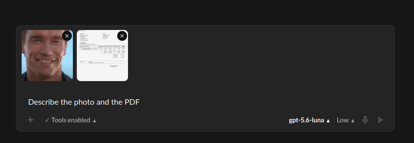
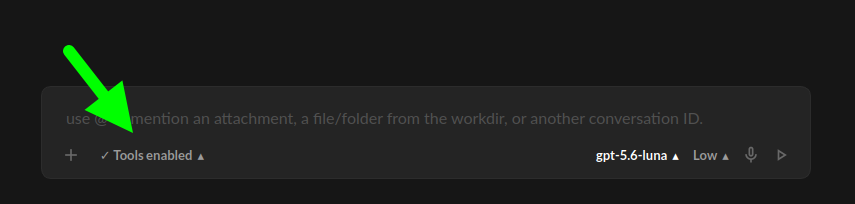

Files and Attachments
=====================

Uploading attachments
---------------------

**Using Your Own Files as Additional Context in Conversations**

You can use your own files (for example, to analyze them) during any conversation. You can do this in two ways: by indexing (embedding) your files in a vector database and selecting that index through the ``RAG`` selector in a supported conversation, or by adding a file attachment (available in its originating conversation, with optional project sharing or explicit Library mentions).

**Attachments**

Attach files directly in the chat input. Attachments always use **Full context**: extracted content is sent as **ADDITIONAL CONTEXT** after the user's text and is saved with that message. When a provider rebuilds conversation history, the content is included with its original user message. Uploading attachments does not index them.

Attachments remain available in their originating conversation. Project sharing and explicit Library mentions can also provide their context to other conversations in the same project.

Mentioning attachments, workdir files, and conversations
^^^^^^^^^^^^^^^^^^^^^^^^^^^^^^^^^^^^^^^^^^^^^^^^^^^^^^^^^^^^^

The message input supports inline ``@`` mentions for current attachments, files or directories from the active data workdir, and previously saved conversations. Type ``@`` to open a small scrollable picker above the input. Current attachments are shown first, followed by files and directories from the active workdir. Continue typing after ``@`` to filter the list; deleting characters updates the matches immediately. You can select an item with the mouse or with the keyboard (arrow keys plus ``Enter``/``Tab``; ``Esc`` closes the picker).

A numeric mention is treated specially. Type an exact conversation ID such as ``@123``. If that context exists in the local context database, the picker adds a **Chat history** section containing the conversation title. Selecting it keeps the numeric ID internally while displaying the conversation title as the mention label. This lets PyGPT reliably resolve the same stored conversation later even if the visible title is more descriptive than the ID.

When the message is sent, a conversation mention is resolved through the Chat history backend even when the optional **Chat history (inline)** plugin is not enabled. PyGPT passes the **current user request** to the history summarizer and retrieves only information from the referenced conversation that is relevant to that request. It is therefore query-focused retrieval/summarization, not a generic summary and not an unconditional copy of the entire old conversation. For long conversations, the transcript is packed according to the selected summarizer model's context window, processed from the newest chunks toward older chunks, and query-focused extracts are reduced recursively until one bounded result remains. The summarizer model and summary budget are configured in the Chat history plugin settings.

The resulting provider-facing input contains a structured block such as ``<conversation id="123" title="Previous title">...relevant context...</conversation>``. The block gives the target model the source conversation ID/title together with the retrieved context. The stored message and chat UI continue to render the compact ``@Previous title`` mention rather than exposing the expanded retrieval block.

Selected mentions are rendered with a distinct color in the input and in conversation history so they remain easy to identify. Directories are displayed with a trailing ``/``. Mention metadata is preserved when a stored message is reloaded or edited.

For non-conversation mentions, the ``@`` syntax is also a user-interface reference rather than extra prompt syntax. Before the request is sent, PyGPT converts a normal attachment mention to its plain attachment name and a workdir file/directory mention to its portable path, for example ``%workdir%/data/docs/spec.md``. If the mentioned attachment is an image and the final request model actually accepts image input, the runtime provider prompt uses ``Attached Image #N`` instead of the filename, where ``N`` follows the image-attachment order used by the multimodal request. This substitution is runtime-only: the stored conversation and UI keep the original attachment name.

You can use attachments to provide additional context to the conversation. By default, uploaded files are processed locally using loaders from LlamaIndex and are converted into text for use as additional context. You can upload any file format supported by the application through LlamaIndex. Supported formats include:

Text-based types:

* CSV files (csv)
* Epub files (epub)
* Excel .xlsx spreadsheets (xlsx)
* HTML files (html, htm)
* IPYNB Notebook files (ipynb)
* JSON files (json)
* Markdown files (md)
* PDF documents (pdf)
* Plain-text files (txt and etc.)
* Word .docx documents (docx)
* XML files (xml)

Media-types:

* Image (using vision) (jpg, jpeg, png, gif, bmp, tiff, webp)
* Video/audio (mp4, avi, mov, mkv, webm, mp3, mpeg, mpga, m4a, wav)

Archives:

* zip
* tar, tar.gz, tar.bz2

Native file upload
^^^^^^^^^^^^^^^^^^

In ``Settings -> Files and attachments -> General`` you can enable **Prefer native file upload when supported**. The option is disabled by default.

When enabled, PyGPT tries to upload each supported attachment directly through the selected provider's native file API instead of reading the file locally and appending its extracted content to the prompt. Native upload is selected only when it is supported by the current provider, model, file type, and file size. The native upload path is available for supported OpenAI, Google Gemini, Anthropic, and xAI configurations.

For an attachment uploaded natively, the original file is sent instead of locally extracted text. If native upload is unavailable or fails, PyGPT falls back to local Full context processing.

Archive files such as ZIP and TAR are a special case. PyGPT unpacks the archive locally first and evaluates every extracted file separately. Supported members can be uploaded natively, while unsupported members continue through the standard local-processing path. This means a single archive can contain both native and locally processed attachments.

.. note::

   Native upload sends the original file content to the selected API provider. Provider-specific limits and behavior apply, including supported file types, maximum file sizes, compatible models, availability, and file-retention rules.

.. tip::

   To inspect native-upload activity in the console, enable ``Settings -> Debug -> Log attachments usage to console``. Messages such as ``Uploading native attachment: ...`` are printed only when attachment logging is enabled.

When extra-context summary or project sharing is enabled, supported text documents use local extraction so their content can be budgeted and searched. Images continue through their normal provider/vision path.

Attachment context
^^^^^^^^^^^^^^^^^^

Local attachments are added to the uploading turn. Enable ``Settings -> Context -> Auto-strip -> Automatically summarize extra context`` to shorten oversized material before it reaches the model. The same gateway handles web readers and RAG evidence; source files are preserved.

Using Library and sharing attachments in a project
^^^^^^^^^^^^^^^^^^^^^^^^^^^^^^^^^^^^^^^^^^^^^^^^^^

To add a file to your chat, click **[+] Add attachment** next to the message input and choose **Files and folders**. You can also choose **Sketch** to create a drawing, or select a source under **Connect to** to use a web reader. Write your question and send the message with the attachment.

If you are working in a project and want to ask about an attachment uploaded in another chat **in the same project**, open **[+] Add attachment**, find the file in **Library**, and click its name. This inserts an ``@filename`` mention into your message. Add your question, for example ``@invoice.pdf What is the total?``, and send it. PyGPT reads the referenced attachment for that request, even if it is not shared. You can also type ``@`` and search for an attachment by name.

If you want an attachment to be available automatically in **every chat in the project**, turn on the toggle next to it in Library. The attachment is now **shared**: you can ask about it in any chat in that project without adding a mention each time. To stop including it automatically, open the attachment popup and turn the same toggle off. The attachment remains available in the chat where you uploaded it, and you can still select it from Library when you need it.

New attachments are **not shared by default**. You choose which files should be shared after adding them. Sharing applies only to the current project; Library does not give access to attachments from other projects. To use a file in another project, add it there as an attachment too.

The toggle beside the **Library** heading turns sharing on or off for **all attachments currently in Library**, including files you have not expanded yet. It does not automatically share files added later. When all files are shared, the collective toggle is on; when none are shared, it is off. If only some files are shared, it keeps its previous state. A count such as **Library (3 shared)** tells you how many attachments are shared and updates as you change the toggles.

Library initially shows the **five newest attachments**. Click **Show more** to reveal another five. Once all are visible, **Show less** folds the list back to five. An empty Library is hidden. The grey **Project** label at the top tells you that you are working inside a project, including in a new chat before sending your first message.

Sharing makes the attachment's context available to the model; it does not add another visible upload to every message. Turning sharing off does not erase earlier messages or answers. If an attachment is large, you can enable **Automatically summarize extra context** in **Settings -> Context -> Auto-strip** to reduce the text sent to the model. Project attachment sharing is independent from the project's **Use shared workdir** setting.

**Images as Additional Context**

Files such as jpg, png, and similar images are a special case. By default, images are not used as additional context; they are analyzed in real-time using a vision model. If you want to use them as additional context instead, you must enable the "Allow images as additional context" option in the settings: ``Files and attachments -> Allow images as additional context``.

Downloading files
-----------------

**PyGPT** automatically downloads and saves files created by the model in the active ``data`` workdir. Outside projects, and in projects that use the shared workdir, this is the normal ``<profile workdir>/data`` directory. A project can instead define its own data workdir; when a conversation from that project is active, the ``Files`` tab displays that project directory and file-producing tools use it automatically.

The active ``data`` directory is also where the application stores files generated locally by the AI, such as code files and other model outputs. You can execute code from these files, read them back into the conversation, and index them with the integrated ``LlamaIndex`` support. The project override applies only to this logical data root; it does not move profile-level paths such as ``tmp``, configuration files, the database or other application directories.

The ``Files I/O`` and ``Python interpreter`` plugins use the same runtime-resolved data workdir as the active conversation. In Docker sandboxes this directory is mounted as ``/mnt/data``.

If ``Settings -> Files and attachments -> General -> Store images, captures, and uploads in the workdir data directory`` is enabled, ``img``, ``capture`` and ``upload`` storage follows the active data workdir as well. When the option is disabled, those directories remain in their normal base-profile locations. The internal ``tmp`` directory always remains in the base profile workdir.

To allow the model to manage files or execute Python code, enable the ``Tools`` switch together with the required plugins:

