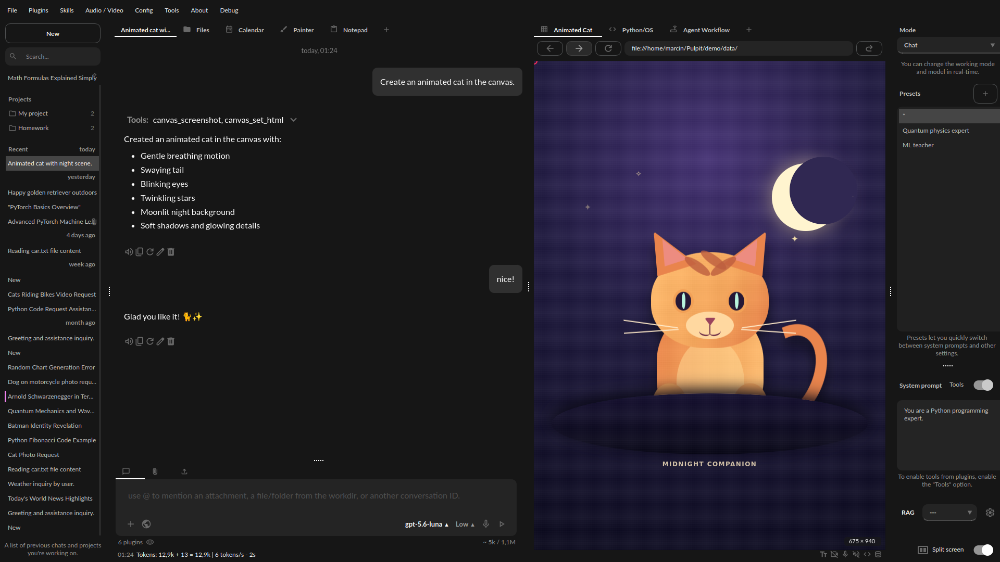

Canvas
======

.. note::
   Canvas is currently in beta and will be expanded in future PyGPT releases.

**Canvas** gives PyGPT an interactive browser and rendering workspace that can be controlled by the model directly from a conversation. It is not limited to displaying static HTML. The model can create and update complete HTML/CSS/JavaScript documents, render interactive elements live, inspect the page, click and type inside it, run JavaScript, capture screenshots, read console output, and iteratively refine the result.

Typical uses include UI and website prototypes, widgets, dashboards, animations, data visualizations, interactive demos, forms, games, small browser applications, and other tasks where a live visual result is useful. The same runtime can also be used as an interactive browser workspace for opening and working with external webpages.

Annotations
-----------

You can annotate selected text or page elements directly from the Canvas context menu. An annotation can contain a comment or instruction for the model. Pending annotations are available to the plugin and, when annotation prompting is enabled, are appended to the runtime context so the model can treat them as precise feedback about the currently displayed page.

This is useful for requests such as changing one component, adjusting spacing around a selected element, rewriting a specific fragment, or pointing out a visual problem without having to describe its exact DOM location manually.

Live interactive rendering
--------------------------

Canvas can render complete HTML/CSS/JavaScript content in the persistent built-in browser runtime. The model can inspect interactive DOM elements, use stable selectors, click, hover, type, scroll, drag, select values, toggle controls, execute JavaScript, inspect the console, and capture screenshots for visual verification. This makes it possible to work on an interface iteratively instead of only generating source code once.

Using a Painter drawing as model input
--------------------------------------

Canvas can also retrieve the current image from PyGPT's separate **Painter** tab. The ``get_user_painter_image`` tool captures the full logical Painter canvas into PyGPT's shared runtime temporary directory (``tmp/runtime_artifacts``). This is useful when the user sketches a layout, marks up an image, draws a diagram, or otherwise refers to content they created or edited in Painter.

This command is intentionally different from ``canvas_screenshot``. ``canvas_screenshot`` captures the Canvas/web-browser viewport, while ``get_user_painter_image`` reads the user's current Painter drawing. In **Agents**, the command returns the runtime path only and leaves attachment handling to the agent. In other modes, if **Files I/O** is enabled, it also returns the runtime path only and the model should call ``attach_runtime_file`` when native image inspection is required. If Files I/O is unavailable outside Agents, PyGPT automatically falls back to the same runtime-only attachment mechanism used by ``attach_runtime_file``. The image is never added to the persistent chat attachment list.

Example
-------

Enable the **Canvas (inline)** plugin and ask, for example:

.. code-block:: text

   Create an animated cat in the canvas.

The model can generate the page, open Canvas, render the animation, inspect the live result, and continue editing it from your next instructions.

You can also combine Canvas with live drawing in Painter to create a seamless end-to-end workflow. For example, you can sketch a reference image in Painter, ask the model to retrieve it directly from Painter and use it as input for the task, and then have the final interactive result displayed in Canvas — as shown in the video below:

https://github.com/user-attachments/assets/d1ca0b51-a27a-4bef-bdc8-1fe96fd669ae

Websites and local HTML server
------------------------------

Canvas can open external webpages and work with them through the same scoped browser interaction tools. The default backend is the built-in Chromium/QWebEngine runtime. An optional Playwright backend can be enabled in the plugin settings when a more isolated automation environment or Playwright-specific capabilities are needed.

For local websites and web applications, the plugin also provides a lightweight loopback-only HTTP preview server. The model can serve a directory from the PyGPT work/data area, open that local site in Canvas, inspect it, interact with it, and continue modifying or testing the project in an interactive workflow.

Enabling Canvas
---------------

To use these capabilities, enable the **Canvas (inline)** plugin from the **Plugins** menu. As an inline plugin, Canvas works independently of the global ``Tools`` switch, so ``Tools`` does not need to be enabled.

For the complete configuration reference, runtime rules, backend behavior, security notes, annotations, preview server, and a description of every available command, see :ref:`plugin-canvas-web-html` in :doc:`plugins`.
