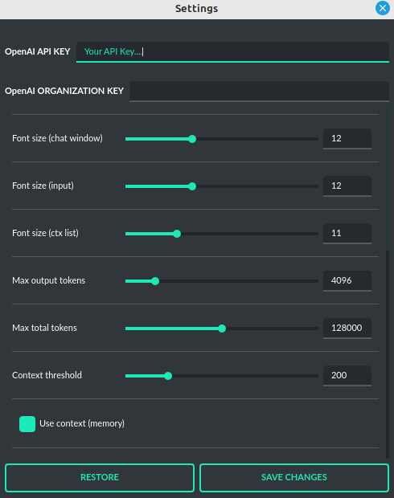

Configuration
=============

Settings
--------
The following basic options can be modified directly within the application:

.. code-block:: ini

   Config -> Settings...




**General**

* ``OpenAI API KEY``: The personal API key you'll need to enter into the application for it to function.

* ``OpenAI ORGANIZATION KEY``: The organization's API key, which is optional for use within the application.

* ``API Endpoint``: OpenAI API endpoint URL, default: https://api.openai.com/v1.

* ``Proxy address``: Proxy address to be used for connection; supports HTTP/SOCKS.

* ``Show tray icon``: Show/hide tray icon. Tray icon provides additional features like "Ask with screenshot" or "Open notepad". Restart of the application is required for this option to take effect. Default: True.

* ``Minimize to tray on exit``: Minimize to tray icon on exit. Tray icon enabled is required for this option to work. Default: False.

* ``Render engine``: chat output render engine: `WebEngine / Chromium` - for full HTML/CSS and `Legacy (markdown)` for legacy, simple markdown CSS output. Default: WebEngine / Chromium.

* ``OpenGL hardware acceleration``: enables hardware acceleration in `WebEngine / Chromium` renderer.  Default: False.

* ``Application environment (os.environ)``: Additional environment vars to set on application start.

**Layout**

* ``Zoom``: Adjusts the zoom in chat window (web render view). `WebEngine / Chromium` render mode only.

* ``Code syntax highlight``: Syntax highlight theme in code blocks. `WebEngine / Chromium` render mode only.

* ``Font Size (chat window)``: Adjusts the font size in the chat window (plain-text) and notepads.

* ``Font Size (input)``: Adjusts the font size in the input window.

* ``Font Size (ctx list)``: Adjusts the font size in contexts list.

* ``Font Size (toolbox)``: Adjusts the font size in toolbox on right.

* ``Layout density``: Adjusts layout elements density. Default: -1. 

* ``DPI scaling``: Enable/disable DPI scaling. Restart of the application is required for this option to take effect. Default: True. 

* ``DPI factor``: DPI factor. Restart of the application is required for this option to take effect. Default: 1.0. 

* ``Display tips (help descriptions)``: Display help tips, Default: True.

* ``Store dialog window positions``: Enable or disable dialogs positions store/restore, Default: True.

* ``Use theme colors in chat window``: Use color theme in chat window, Default: True.

* ``Disable markdown formatting in output``: Enable plain-text display in output window, Default: False.

**Files and attachments**

* ``Store attachments in the workdir upload directory``: Enable to store a local copy of uploaded attachments for future use. Default: True

* ``Store images, capture and uploads in data directory``: Enable to store everything in single data directory. Default: False

* ``Directory for file downloads``: Subdirectory for downloaded files, e.g. in Assistants mode, inside "data". Default: "download"

**Context**

* ``Context Threshold``: Sets the number of tokens reserved for the model to respond to the next prompt.

* ``Limit of last contexts on list to show  (0 = unlimited)``: Limit of the last contexts on list, default: 0 (unlimited).

* ``Show context groups on top of the context list``: Display groups on top, default: False

* ``Show date separators on the context list``: Show date periods, default: True

* ``Show date separators in groups on the context list``: Show date periods in groups, default: True

* ``Show date separators in pinned on the context list``: Show date periods in pinned items, default: False

* ``Use Context``: Toggles the use of conversation context (memory of previous inputs).

* ``Store History``: Toggles conversation history store.

* ``Store Time in History``: Chooses whether timestamps are added to the .txt files.

* ``Context Auto-summary``: Enables automatic generation of titles for contexts, Default: True.

* ``Lock incompatible modes``: If enabled, the app will create a new context when switched to an incompatible mode within an existing context.

* ``Search also in conversation content, not only in titles``: When enabled, context search will also consider the content of conversations, not just the titles of conversations.

* ``Show LlamaIndex sources``: If enabled, sources utilized will be displayed in the response (if available, it will not work in streamed chat).

* ``Show code interpreter output``: If enabled, output from the code interpreter in the Assistant API will be displayed in real-time (in stream mode), Default: True.

* ``Use extra context output``: If enabled, plain text output (if available) from command results will be displayed alongside the JSON output, Default: True.

* ``Convert lists to paragraphs``: If enabled, lists (ul, ol) will be converted to paragraphs (p), Default: True.

* ``Model used for auto-summary``: Model used for context auto-summary (default: *gpt-3.5-turbo-1106*).

**Models**

* ``Max Output Tokens``: Sets the maximum number of tokens the model can generate for a single response.

* ``Max Total Tokens``: Sets the maximum token count that the application can send to the model, including the conversation context.

* ``RPM limit``: Sets the limit of maximum requests per minute (RPM), 0 = no limit.

* ``Temperature``: Sets the randomness of the conversation. A lower value makes the model's responses more deterministic, while a higher value increases creativity and abstraction.

* ``Top-p``: A parameter that influences the model's response diversity, similar to temperature. For more information, please check the OpenAI documentation.

* ``Frequency Penalty``: Decreases the likelihood of repetition in the model's responses.

* ``Presence Penalty``: Discourages the model from mentioning topics that have already been brought up in the conversation.

**Prompts**

* ``Use native API function calls``: Use API function calls to run commands from plugins instead of using command prompts - Chat and Assistants modes ONLY, default: True

* ``Command execute: instruction``: Prompt for appending command execution instructions. Placeholders: {schema}, {extra}

* ``Command execute: extra footer (non-Assistant modes)``: Extra footer to append after commands JSON schema.

* ``Command execute: extra footer (Assistant mode only)``: PAdditional instructions to separate local commands from the remote environment that is already configured in the Assistants.

* ``Context: auto-summary (system prompt)``: System prompt for context auto-summary.

* ``Context: auto-summary (user message)``: User message for context auto-summary. Placeholders: {input}, {output}

* ``Agent: evaluation prompt in loop (LlamaIndex)``: Prompt used for evaluating the response in Agents (LlamaIndex) mode.

* ``Agent: system instruction (Legacy)``: Prompt to instruct how to handle autonomous mode.

* ``Agent: continue (Legacy)``: Prompt sent to automatically continue the conversation.

* ``Agent: continue (always, more steps) (Legacy)``: Prompt sent to always automatically continue the conversation (more reasoning - "Always continue..." option).

* ``Agent: goal update (Legacy)``: Prompt to instruct how to update current goal status.

* ``Experts: Master prompt``: Prompt to instruct how to handle experts.

* ``DALL-E: image generate``: Prompt for generating prompts for DALL-E (if raw-mode is disabled).

**Images**

* ``DALL-E Image size``: The resolution of the generated images (DALL-E). Default: 1792x1024

* ``DALL-E Image quality``: The image quality of the generated images (DALL-E). Default: standard

* ``Open image dialog after generate``: Enable the image dialog to open after an image is generated in Image mode.

* ``DALL-E: prompt generation model``: Model used for generating prompts for DALL-E (if raw-mode is disabled).

**Vision**

* ``Vision: Camera capture width (px)``: Video capture resolution (width).

* ``Vision: Camera capture height (px)``: Video capture resolution (height).

* ``Vision: Camera IDX (number)``: Video capture camera index (number of camera).

* ``Vision: Image capture quality``: Video capture image JPEG quality (%).

**Indexes (LlamaIndex)**

* ``Indexes``: List of created indexes.

* ``Vector Store``: Vector store to use (vector database provided by LlamaIndex).

* ``Vector Store (**kwargs)``: Keyword arguments for vector store provider (api_key, index_name, etc.).

* ``Embeddings provider``: Embeddings provider.

* ``Embeddings provider (ENV)``: ENV vars to embeddings provider (API keys, etc.).

* ``Embeddings provider (**kwargs)``: Keyword arguments for embeddings provider (model name, etc.).

* ``RPM limit for embeddings API calls``: Specify the limit of maximum requests per minute (RPM), 0 = no limit.

* ``Recursive directory indexing``: Enables recursive directory indexing, default is False.

* ``Replace old document versions in the index during re-indexing``: If enabled, previous versions of documents will be deleted from the index when the newest versions are indexed, default is True.

* ``Excluded file extensions``: File extensions to exclude if no data loader for this extension, separated by comma.

* ``Force exclude files``: If enabled, the exclusion list will be applied even when the data loader for the extension is active. Default: False.

* ``Stop indexing on error``: If enabled, indexing will stop whenever an error occurs Default: True.

* ``Custom metadata to append/replace to indexed documents (files)``: Define custom metadata key => value fields for specified file extensions, separate extensions by comma.\nAllowed placeholders: {path}, {relative_path} {filename}, {dirname}, {relative_dir} {ext}, {size}, {mtime}, {date}, {date_time}, {time}, {timestamp}. Use * (asterisk) as extension if you want to apply field to all files. Set empty value to remove field with specified key from metadata.

* ``Custom metadata to append/replace to indexed documents (web)``: Define custom metadata key => value fields for specified external data loaders.\nAllowed placeholders: {date}, {date_time}, {time}, {timestamp} + {data loader args}

* ``Additional keyword arguments (**kwargs) for data loaders``: Additional keyword arguments, such as settings, API keys, for the data loader. These arguments will be passed to the loader; please refer to the LlamaIndex or LlamaHub loaders reference for a list of allowed arguments for the specified data loader.

* ``Use local models in Video/Audio and Image (vision) loaders``: Enables usage of local models in Video/Audio and Image (vision) loaders. If disabled then API models will be used (GPT-4 Vision and Whisper). Note: local models will work only in Python version (not compiled/Snap). Default: False.

* ``Auto-index DB in real time``: Enables conversation context auto-indexing in defined modes.

* ``ID of index for auto-indexing``: Index to use if auto-indexing of conversation context is enabled.

* ``Enable auto-index in modes``: List of modes with enabled context auto-index, separated by comma.

* ``DB (ALL), DB (UPDATE), FILES (ALL)``: Index the data – batch indexing is available here.

* ``Chat mode``: chat mode for use in query engine, default: context

**Agent and experts**

**General**

* ``Display a tray notification when the goal is achieved.``: If enabled, a notification will be displayed after goal achieved / finished run.

**LlamaIndex Agents**

* ``Max steps (per iteration)`` - Max steps is one iteration before goal achieved

* ``Max evaluation steps in loop`` - Maximum evaluation steps to achieve the final result, set 0 to infinity

* ``Append and compare previous evaluation prompt in next evaluation`` - If enabled, previous improvement prompt will be checked in next eval in loop, default: False

* ``Verbose`` - enables verbose mode.

**Legacy**

* ``Sub-mode for agents``: Sub-mode to use in Agent mode (chat, completion, langchain, llama_index, etc.). Default: chat.

* ``Sub-mode for experts``: Sub-mode to use in Experts mode (chat, completion, langchain, llama_index, etc.). Default: chat.

* ``Index to use``: Only if sub-mode is llama_index (Chat with files), choose the index to use in both Agent and Expert modes.

**Accessibility**

* ``Enable voice control (using microphone)``: enables voice control (using microphone and defined commands).

* ``Model``: model used for voice command recognition.

* ``Use voice synthesis to describe events on the screen.``: enables audio description of on-screen events.

* ``Use audio output cache``: If enabled, all static audio outputs will be cached on the disk instead of being generated every time. Default: True.

* ``Audio notify microphone listening start/stop``: enables audio "tick" notify when microphone listening started/ended.

* ``Audio notify voice command execution``: enables audio "tick" notify when voice command is executed.

* ``Control shortcut keys``: configuration for keyboard shortcuts for a specified actions.

* ``Blacklist for voice synthesis events describe (ignored events)``: list of muted events for 'Use voice synthesis to describe event' option.

* ``Voice control actions blacklist``: Disable actions in voice control; add actions to the blacklist to prevent execution through voice commands.

**Updates**

* ``Check for updates on start``: Enables checking for updates on start. Default: True.

* ``Check for updates in background``: Enables checking for updates in background (checking every 5 minutes). Default: True.

**Developer**

* ``Show debug menu``: Enables debug (developer) menu.

* ``Log and debug context``: Enables logging of context input/output.

* ``Log and debug events``: Enables logging of event dispatch.

* ``Log plugin usage to console``: Enables logging of plugin usage to console.

* ``Log DALL-E usage to console``: Enables logging of DALL-E usage to console.

* ``Log LlamaIndex usage to console``: Enables logging of LlamaIndex usage to console.

* ``Log Assistants usage to console``: Enables logging of Assistants API usage to console.

* ``Log level``: toggle log level (ERROR|WARNING|INFO|DEBUG)


JSON files
-----------
The configuration is stored in JSON files for easy manual modification outside of the application. 
These configuration files are located in the user's work directory within the following subdirectory:

.. code-block:: ini

   {HOME_DIR}/.config/pygpt-net/


Manual configuration
---------------------
You can manually edit the configuration files in this directory (this is your work directory):

.. code-block:: ini

   {HOME_DIR}/.config/pygpt-net/

* ``assistants.json`` - stores the list of assistants.
* ``attachments.json`` - stores the list of current attachments.
* ``config.json`` - stores the main configuration settings.
* ``models.json`` - stores models configurations.
* ``cache`` - a directory for audio cache.
* ``capture`` - a directory for captured images from camera and screenshots
* ``css`` - a directory for CSS stylesheets (user override)
* ``history`` - a directory for context history in ``.txt`` format.
* ``idx`` - ``LlamaIndex`` indexes
* ``img`` - a directory for images generated with ``DALL-E 3`` and ``DALL-E 2``, saved as ``.png`` files.
* ``locale`` - a directory for locales (user override)
* ``data`` - a directory for data files and files downloaded/generated by GPT.
* ``presets`` - a directory for presets stored as ``.json`` files.
* ``upload`` - a directory for local copies of attachments coming from outside the workdir
* ``db.sqlite`` - a database with contexts, notepads and indexes data records
* ``app.log`` - a file with error and debug log


Setting the Working Directory Using Command Line Arguments
----------------------------------------------------------

If you want to force set current workdir using command-line argument, use:

```
python3 ./run.py --workdir="/path/to/workdir"
```
or:

```
pygpt.exe --workdir="/path/to/workdir"
```
in binary version.

Certainly! Here's the improved version:

## Setting the Working Directory Using Command Line Arguments

To set the current working directory using a command-line argument, use:

```
python3 ./run.py --workdir="/path/to/workdir"
```
or, for the binary version:

```
pygpt.exe --workdir="/path/to/workdir"
```


Translations / locale
-----------------------
Locale `.ini` files are located in the directory:

.. code-block:: ini

   ./data/locale


This directory is automatically scanned when the application launches. To add a new translation, 
create and save the file with the appropriate name, for example:

.. code-block:: ini

   locale.es.ini  


This will add Spanish as a selectable language in the application's language menu.

**Overwriting CSS and locales with Your Own Files:**

You can also overwrite files in the ``locale`` and ``css`` app directories with your own files in the user directory. 
This allows you to overwrite language files or CSS styles in a very simple way - by just creating files in your working directory.


.. code-block:: ini

   {HOME_DIR}/.config/pygpt-net/


* `locale` - a directory for locales in ``.ini`` format.
* `css` - a directory for CSS styles

**Adding Your Own Fonts**

You can add your own fonts and use them in CSS files. To load your own fonts, you should place them in the ``%workdir%/fonts`` directory. Supported font types include: ``otf``, ``ttf``.
You can see the list of loaded fonts in ``Debug / Config``.

**Example:**

.. code-block:: ini

   %workdir%
   |_css
   |_data
   |_fonts
      |_MyFont
        |_MyFont-Regular.ttf
        |_MyFont-Bold.ttf
        |...
        

.. code-block:: console

   pre {{
       font-family: 'MyFont';
   }}

Data Loaders
------------

**Configuring data loaders**

In the ``Settings -> LlamaIndex -> Data loaders`` section you can define the additional keyword arguments to pass into data loader instance.

In most cases, an internal LlamaIndex loaders are used internally. 
You can check these base loaders e.g. here:

Files loaders: https://github.com/run-llama/llama_index/tree/main/llama-index-integrations/readers/llama-index-readers-file/llama_index/readers/file

Web loaders: https://github.com/run-llama/llama_index/tree/main/llama-index-integrations/readers/llama-index-readers-web

**Tip:** to index an external data or data from the Web just ask for it, by using ``Web Search`` plugin, e.g. you can ask the model with ``Please index the youtube video: URL to video``, etc. Data loader for a specified content will be choosen automatically.

Allowed additional keyword arguments for built-in data loaders (files):

**CSV Files**  (file_csv)

* ``concat_rows`` - bool, default: ``True``
* ``encoding`` - str, default: ``utf-8``

**HTML Files** (file_html)

* ``tag`` - str, default: ``section``
* ``ignore_no_id`` - bool, default: ``False``

**Image (vision)**  (file_image_vision)

This loader can operate in two modes: local model and API.
If the local mode is enabled, then the local model will be used. The local mode requires a Python/PyPi version of the application and is not available in the compiled or Snap versions.
If the API mode (default) is selected, then the OpenAI API and the standard vision model will be used. 

**Note:** Usage of API mode consumes additional tokens in OpenAI API (for ``GPT-4 Vision`` model)!

Local mode requires ``torch``, ``transformers``, ``sentencepiece`` and ``Pillow`` to be installed and uses the ``Salesforce/blip2-opt-2.7b`` model to describing images.

* ``keep_image`` - bool, default: ``False``
* ``local_prompt`` - str, default: ``Question: describe what you see in this image. Answer:``
* ``api_prompt`` - str, default: ``Describe what you see in this image`` - Prompt to use in API
* ``api_model`` - str, default: ``gpt-4-vision-preview`` - Model to use in API
* ``api_tokens`` - int, default: ``1000`` - Max output tokens in API

**IPYNB Notebook files** (file_ipynb)

* ``parser_config`` - dict, default: ``None``
* ``concatenate`` - bool, default: ``False``

**Markdown files** (file_md)

* ``remove_hyperlinks`` - bool, default: ``True``
* ``remove_images`` - bool, default: ``True``

**PDF documents** (file_pdf)

* ``return_full_document`` - bool, default: ``False``

**Video/Audio**  (file_video_audio)

This loader can operate in two modes: local model and API.
If the local mode is enabled, then the local ``Whisper`` model will be used. The local mode requires a Python/PyPi version of the application and is not available in the compiled or Snap versions.
If the API mode (default) is selected, then the currently selected provider in ``Audio Input`` plugin will be used. If the ``OpenAI Whisper`` is chosen then the OpenAI API and the API Whisper model will be used. 

**Note:** Usage of Whisper via API consumes additional tokens in OpenAI API (for ``Whisper`` model)!

Local mode requires ``torch`` and ``openai-whisper`` to be installed and uses the ``Whisper`` model locally to transcribing video and audio.

* ``model_version`` - str, default: ``base`` - Whisper model to use, available models: https://github.com/openai/whisper

**XML files** (file_xml)

* ``tree_level_split`` - int, default: ``0``

Allowed additional keyword arguments for built-in data loaders (Web and external content):

**Bitbucket**  (web_bitbucket)

* ``username`` - str, default: `None`
* ``api_key`` - str, default: `None`
* ``extensions_to_skip`` - list, default: `[]`

**ChatGPT Retrieval**  (web_chatgpt_retrieval)

* ``endpoint_url`` - str, default: `None`
* ``bearer_token`` - str, default: `None`
* ``retries`` - int, default: `None`
* ``batch_size`` - int, default: `100`

**Google Calendar** (web_google_calendar)

* ``credentials_path`` - str, default: `credentials.json`
* ``token_path`` - str, default: `token.json`

**Google Docs** (web_google_docs)

* ``credentials_path`` - str, default: `credentials.json`
* ``token_path`` - str, default: `token.json`

**Google Drive** (web_google_drive)

* ``credentials_path`` - str, default: `credentials.json`
* ``token_path`` - str, default: `token.json`
* ``pydrive_creds_path`` - str, default: `creds.txt`

**Google Gmail** (web_google_gmail)

* ``credentials_path`` - str, default: `credentials.json`
* ``token_path`` - str, default: `token.json`
* ``use_iterative_parser`` - bool, default: `False`
* ``max_results`` - int, default: `10`
* ``results_per_page`` - int, default: `None`

**Google Keep** (web_google_keep)

* ``credentials_path`` - str, default: `keep_credentials.json`

**Google Sheets** (web_google_sheets)

* ``credentials_path`` - str, default: `credentials.json`
* ``token_path`` - str, default: `token.json`

**GitHub Issues**  (web_github_issues)

* ``token`` - str, default: `None`
* ``verbose`` - bool, default: `False`

**GitHub Repository**  (web_github_repository)

* ``token`` - str, default: `None`
* ``verbose`` - bool, default: `False`
* ``concurrent_requests`` - int, default: `5`
* ``timeout`` - int, default: `5`
* ``retries`` - int, default: `0`
* ``filter_dirs_include`` - list, default: `None`
* ``filter_dirs_exclude`` - list, default: `None`
* ``filter_file_ext_include`` - list, default: `None`
* ``filter_file_ext_exclude`` - list, default: `None`

**Microsoft OneDrive**  (web_microsoft_onedrive)

* ``client_id`` - str, default: `None`
* ``client_secret`` - str, default: `None`
* ``tenant_id`` - str, default: `consumers`

**Sitemap (XML)**  (web_sitemap)

* ``html_to_text`` - bool, default: `False`
* ``limit`` - int, default: `10`

**SQL Database**  (web_database)

* ``engine`` - str, default: `None`
* ``uri`` - str, default: `None`
* ``scheme`` - str, default: `None`
* ``host`` - str, default: `None`
* ``port`` - str, default: `None`
* ``user`` - str, default: `None`
* ``password`` - str, default: `None`
* ``dbname`` - str, default: `None`

**Twitter/X posts**  (web_twitter)

* ``bearer_token`` - str, default: `None`
* ``num_tweets`` - int, default: `100`

Vector stores
-------------

**Available vector stores** (provided by ``LlamaIndex``):

* ChromaVectorStore
* ElasticsearchStore
* PinecodeVectorStore
* RedisVectorStore
* SimpleVectorStore

You can configure selected vector store by providing config options like ``api_key``, etc. in ``Settings -> LlamaIndex`` window. 

Arguments provided here (on list: ``Vector Store (**kwargs)`` in ``Advanced settings`` will be passed to selected vector store provider. You can check keyword arguments needed by selected provider on LlamaIndex API reference page: 

https://docs.llamaindex.ai/en/stable/api_reference/storage/vector_store.html

Which keyword arguments are passed to providers?

For ``ChromaVectorStore`` and ``SimpleVectorStore`` all arguments are set by PyGPT and passed internally (you do not need to configure anything). 
For other providers you can provide these arguments:

**ElasticsearchStore**

Keyword arguments for ElasticsearchStore(``**kwargs``):

* ``index_name`` (default: current index ID, already set, not required)
* any other keyword arguments provided on list


**PinecodeVectorStore**

Keyword arguments for Pinecone(``**kwargs``):

* ``api_key``
* index_name (default: current index ID, already set, not required)

**RedisVectorStore**

Keyword arguments for RedisVectorStore(``**kwargs``):

* ``index_name`` (default: current index ID, already set, not required)
* any other keyword arguments provided on list


You can extend list of available providers by creating custom provider and registering it on app launch.

By default, you are using chat-based mode when using ``Chat with Files``.
If you want to only query index (without chat) you can enable ``Query index only (without chat)`` option.


**Adding custom vector stores and offline data loaders**

You can create a custom vector store provider or data loader for your data and develop a custom launcher for the application. 

See the section ``Extending PyGPT / Adding custom Vector Store provider`` for more details.