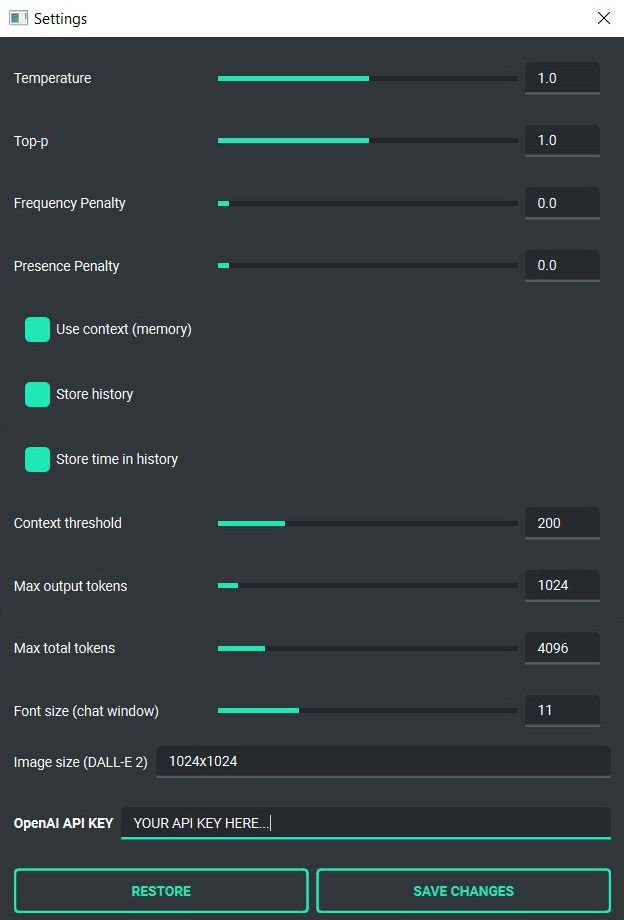

Configuration
=============

Settings
--------
The following basic options can be modified from the application level:

.. code-block:: ini

   Config -> Settings...

| - **Temperature** - defines the temperature of the conversation, the lower the value, the more deterministic the model behaves, the higher the value, the more abstract

| - **Top-p** - a parameter similar to temperature, for details please refer to the documentation on the OpenAI website

| - **Frequency Penalty** - as above

| - **Presence Penalty** - as above

| - **Use context** - enables or disables the use of context (memory of previous conversation components). When this option is disabled, context is not saved or used during the conversation

| - **Store history** - enables or disables saving conversation history and context. History is not written to disk after shutdown

| - **Store time in history** - enables or disables adding timestamps to files. txt with history, saved in the "history" directory in the user's home directory

| - **Context threshold** - specifies the reserve of tokens required to execute next prompt. If we are approaching the capacity of the model (e.g. if the model allows 4096 tokens), this value will be used when approaching the limit to leave place for the next answer.

| - **Max output tokens** - defines the maximum number of tokens to be generated by the model in response

| - **Max total tokens** - defines the maximum number of tokens that the application can send to the model, including the entire context of the conversation. It should be less than or equal to the model's maximum capacity. By setting this limit, you can reduce the size of the context attached to sent messages.

| - **Font size** - allows you to set the font size in the chat window.

| - **OpenAI API KEY** - API key that you need to paste into the application

JSON files
-----------
The configuration is stored in JSON files, which allows for easy manual modification outside the application itself. Configuration files are installed in the user's home directory in the subdirectory:

.. code-block:: ini

   {HOME_DIR}/.config/pygpt-net/