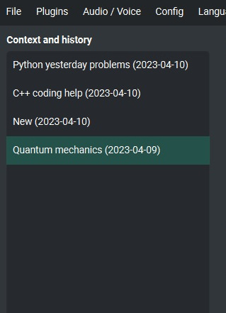

Context and memory
==================

Short and long-term memory
--------------------------
The application allows you to conduct a conversation in a continuous mode, allowing you to use a long context. The entire context of the conversation is stored on the application side and is automatically attached to all sent to AI messages (prompts). You can also return to the context of a given conversation at any time - the application allows you to continue previous conversations and saves the history of the entire conversation, which can be easily restored and continued from this point.

Handling multiple contexts
---------------------------
On the left side of the screen there is a list of saved contexts, you can add any number of contexts there and conveniently switch between them and easily return to previous conversations at any time.

Context support can be turned off in the settings, use the option:

.. code-block:: ini

   Config -> Settings -> Use context 

Clearing history
-----------------

To clear whole memory (all contexts) use the menu option:

.. code-block:: ini

   File -> Clear history...

Context storage
-----------------
On the application side, the context is stored in the user's directory in ``JSON`` files. In addition, all history is also saved to ``.txt`` files, which makes it easy to read.