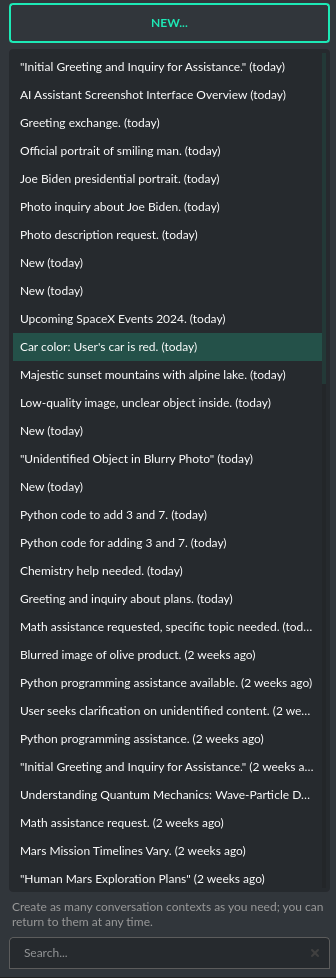

Context and memory
==================

Short and long-term memory
--------------------------
**PYGPT** features a continuous chat mode that maintains a long context of the ongoing dialogue. It preserves the entire conversation history and automatically appends it to each new message (prompt) you send to the AI. Additionally, you have the flexibility to revisit past conversations whenever you choose. The application keeps a record of your chat history, allowing you to resume discussions from the exact point you stopped.

Handling multiple contexts
---------------------------
On the left side of the application interface, there is a panel that displays a list of saved conversations. You can save numerous contexts and switch between them with ease. This feature allows you to revisit and continue from any point in a previous conversation. **PYGPT** automatically generates a summary for each context, akin to the way ``ChatGPT`` operates and gives you the option to modify these titles itself.

You can disable context support in the settings by using the following option:

.. code-block:: ini

   Config -> Settings -> Use context 

Clearing history
-----------------

You can clear the entire memory (all contexts) by selecting the menu option:

.. code-block:: ini

   File -> Clear history...

Context storage
-----------------
On the application side, the context is stored in the user's directory as ``JSON`` files. 
In addition, all history is also saved to ``.txt`` files for easy reading.