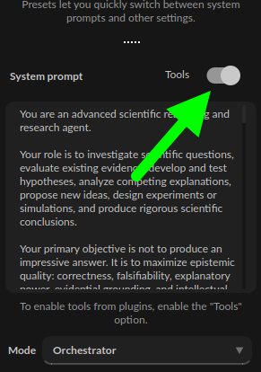

Functions, commands and tools
=============================

.. note::

	Remember to enable the ``Tools`` switch to enable execution of tools and commands from plugins.

PyGPT uses native API tool/function calls by default. You can go back to the internal prompt-based syntax (described below) by switching off ``Config -> Settings -> Prompts -> Native API tool calls``. You must also enable the ``Tool calls`` checkbox in model advanced settings for the specified model to use native API tool calls.

In background, **PyGPT** uses an internal syntax to define commands and their parameters, which can then be used by the model and executed on the application side or even directly in the system. This syntax looks as follows (example command below):

.. code-block:: console

	<tool>{"cmd": "send_email", "params": {"quote": "Why don't skeletons fight each other? They don't have the guts!"}}</tool>

It is a JSON object wrapped between ``<tool>`` tags. The application extracts the JSON object from such formatted text and executes the appropriate function based on the provided parameters and command name. Many of these types of commands are defined in plugins (e.g., those used for file operations or internet searches). You can also define your own commands using the ``Custom commands`` plugin, or simply by creating your own plugin and adding it to the application.

.. tip::
	The ``Tools`` switch must be enabled to allow the execution of commands from plugins. Disable the switch if you do not want to use commands, to prevent additional token usage (as the command execution system prompt consumes additional tokens and may slow down local models).

When native API tool calls are disabled, PyGPT uses the internal prompt-based command format. A special system prompt responsible for invoking commands is added to the main system prompt if the ``Tools`` switch is enabled.

However, there is an additional possibility to define your own commands and execute them with the help of model.
These are functions / tools - defined on the API side and described using JSON objects. You can find a complete guide on how to define functions here:

https://platform.openai.com/docs/guides/function-calling

https://cookbook.openai.com/examples/how_to_call_functions_with_chat_models

PyGPT offers compatibility of these functions with commands (tools) used in the application. All you need to do is define the appropriate functions using the correct JSON schema, and PyGPT will do the rest, translating such syntax on the fly into its own internal format.

Local functions and tools from plugins are available in supported chat and agent modes when the ``Tools`` switch is enabled.

You can define an API-side function schema that maps to a local command from the ``Custom commands`` plugin. For example:

**Name:** ``send_email``

**Description:** ``Sends a quote using email``

**Params (JSON):**

.. code-block:: console

	{
	        "type": "object",
	        "properties": {
	            "quote": {
	                "type": "string",
	                "description": "A generated funny quote"
	            }
	        },
	        "required": [
	            "quote"
	        ]
	}

Then, in the ``Custom commands`` plugin, create a new command with the same name and the same parameters:

**Command name:** ``send_email``

**Instruction/prompt:** ``send mail``

**Params list:** ``quote``

**Command to execute:** ``echo "OK. Email sent: {quote}"``

Next, enable the ``Tools`` switch and the plugin.

Ask a model:

.. code-block:: ini

	Create a funny quote and email it

In response you will receive prepared command, like this:

.. code-block:: ini

	<tool>{"cmd": "send_email", "params": {"quote": "Why do we tell actors to 'break a leg?' Because every play has a cast!"}}</tool>

After receiving this, PyGPT will execute the system ``echo`` command with params given from ``params`` field and replacing ``{quote}`` placeholder with ``quote`` param value.

As a result, response like this will be sent to the model:

.. code-block:: ini

	[{"request": {"cmd": "send_email"}, "result": "OK. Email sent: Why do we tell actors to 'break a leg?' Because every play has a cast!"}]

With this flow you can use both forms - API provider JSON schema and PyGPT schema - to define and execute commands and functions in the application. They will cooperate with each other and you can use them interchangeably.