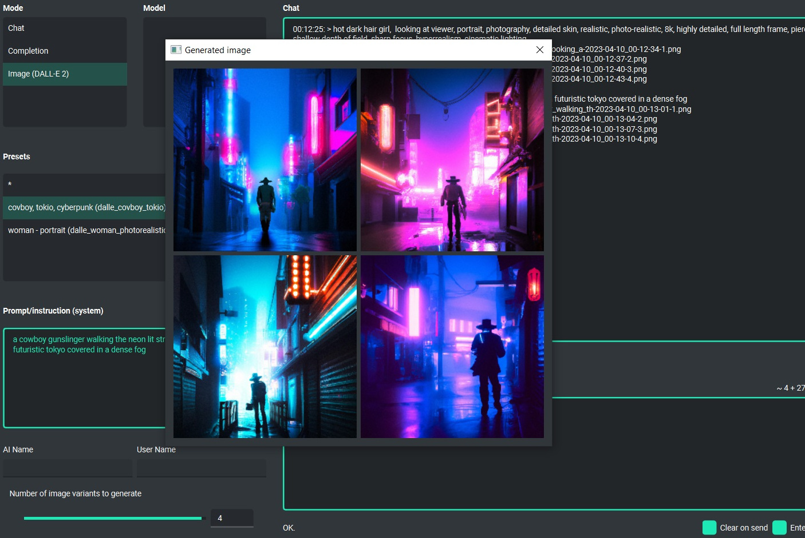

Image generation (DALL-E 2)
============================

DALL-E 2
---------
PYGPT allows you to quickly and easily generate images using ``DALL-E 2``. Generating images resembles a chat conversation - the prompt sent by the user initiates image generation, then downloading it, saving it on the computer and displaying it on the screen.

Multiple variants
-----------------
You can generate up to **4 different variants** for a given prompt in one go. To set the required number of variants that you want to be generated, use the slider located in the corner on the right at the bottom of the screen (appears in place of the slider with the conversation temperature when switching to the image generation mode).

Images storage
---------------
The image generated in this way can then be easily saved anywhere on the disk (just right-click on it), deleted or displayed in full size in the browser.

**Tip:** with presets, you can save prepared prompts and use them later when generating subsequent images.

All queries are saved in the history, thanks to which you can return to a given session at any time and use old queries to, for example, generate new content.