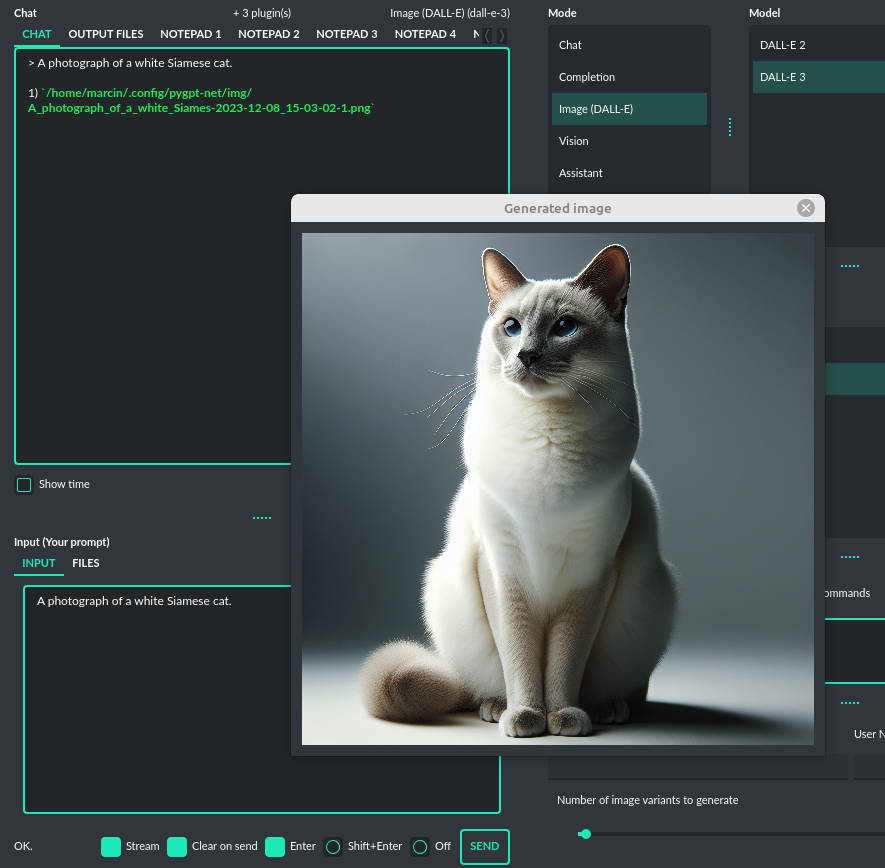
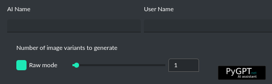

Images generation (DALL-E 3)
============================

DALL-E 3
---------
**PyGPT** enables quick and straightforward image creation with ``DALL-E 3``. 
The older model version, ``DALL-E 2``, is also accessible. Generating images is akin to a chat conversation  -  
a user's prompt triggers the generation, followed by downloading, saving to the computer, 
and displaying the image onscreen.

**INFO: From version 2.0.68 (released 2023-12-31) image generation using DALL-E is available in every mode via plugin "DALL-E 3 Image Generation (inline)". Just ask any model, in any mode, like e.g. GPT-4 to generate an image and it will do it inline, without need to mode change.**

Multiple variants
-----------------
You can generate up to **4 different variants** for a given prompt in one session. 
To select the desired number of variants to create, use the slider located in the right-hand corner at 
the bottom of the screen. This replaces the conversation temperature slider when you switch to image generation mode.

## Raw mode

There is an option for switching prompt generation mode.

If **Raw Mode** is enabled, DALL-E will receive the prompt exactly as you have provided it.
If **Raw Mode** is disabled, GPT will generate the best prompt for you based on your instructions.

Images storage
---------------
Once you've generated an image, you can easily save it anywhere on your disk by right-clicking on it. 
You also have the options to delete it or view it in full size in your web browser.

**Tip:** Use presets to save your prepared prompts. 
This lets you quickly use them again for generating new images later on.

The app keeps a history of all your prompts, allowing you to revisit any session and reuse previous 
prompts for creating new images.