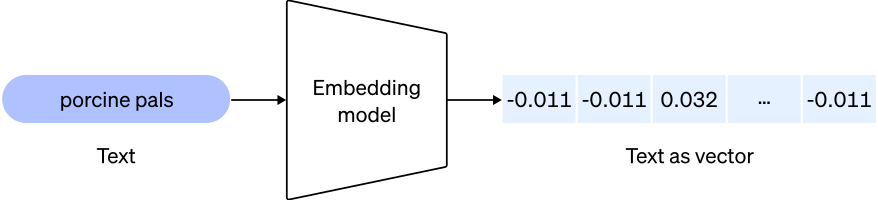

Indexing and RAG
================

PyGPT uses LlamaIndex and a vector store to provide persistent Retrieval-Augmented
Generation (RAG) over indexed files, external data, and conversation history.
Indexing and retrieval are configured in ``Settings -> Indexes / RAG``.

Using RAG in Chat
-----------------

At the bottom of the Chat toolbox, use the ``RAG`` selector to choose the index
that should provide additional context. Selecting ``---`` keeps the normal Chat
provider path. When a valid index is selected, PyGPT routes the request through
the LlamaIndex RAG runtime automatically, using the selected model through its
LlamaIndex provider wrapper.

The ``RAG mode`` option in ``Settings -> Indexes / RAG -> Chat`` controls how the
selected index is used:

* ``Chat`` retrieves relevant indexed context and generates a normal conversational
  answer with the selected model.
* ``Query the Index Only`` sends the prompt through the index query path without
  the normal conversational chat flow.
* ``Retrieve Only`` returns retrieved index context without generating the normal
  chat response.

The separate ``Chat mode`` setting controls the LlamaIndex chat-engine mode used
when ``RAG mode`` is set to ``Chat``.

When the ``Tools`` switch is enabled in RAG-backed Chat, PyGPT uses native tool
calls whenever the current model/provider path supports them. If native tool
calls are unavailable, it can fall back to a LlamaIndex ReAct agent. The ReAct
fallback is non-streaming; normal native tool-call paths can stream.

.. note::
   RAG is also available in other supported workflows. The exact execution path
   depends on the mode: for example, Completion uses its LlamaIndex completion
   path, while Chat with Agents exposes the selected index as a RAG tool.

Indexing files for RAG
----------------------

To use persistent RAG, first index (embed) the files or external data you want to
query. Embedding transforms document content into vectors stored in the selected
vector store.

To index files, copy or upload them into the active ``data`` directory and use
``Index all`` or ``RMB -> Embed into index`` in the Files view. You can also use
the Indexer tool or supported plugins. The active data directory is normally
``<profile workdir>/data``; when the current conversation belongs to a project
with a custom data workdir, that project directory is used instead.

If you are unfamiliar with embeddings, see:

https://stackoverflow.blog/2023/11/09/an-intuitive-introduction-to-text-embeddings/

For a visualization from OpenAI's page:

Source: https://cdn.openai.com/new-and-improved-embedding-model/draft-20221214a/vectors-3.svg

Querying single files
---------------------

You can query an individual file on the fly with the ``query_file`` command from
the ``Files I/O`` plugin. A temporary in-memory index is created for that query;
it is not persisted as a normal index unless the plugin is configured to index
read files automatically. A similar command is available for querying web and
external content through LlamaIndex.

For example, if ``data/my_cars.txt`` contains ``My car is red.``, you can ask the
model to query that file for the car color and receive ``Red`` as the result.
Enable the ``Tools`` switch when using tool commands from plugins.

Index types
-----------

PyGPT uses three related index concepts:

* **Configured indexes** are the normal persistent indexes listed in
  ``Settings -> Indexes / RAG -> General -> Indexes``. They can contain files,
  external data, and indexed conversation context.
* **Project indexes** are isolated persistent indexes created automatically for
  projects. They are shown to the user as ``Current project`` and are not added
  to the normal configured index list.
* **Temporary indexes** are created in memory for operations such as querying a
  single attachment or using the Files I/O ``query_file`` tool. They are not
  persisted as normal indexes.

.. important::
   Removing an item from the normal ``Indexes`` list removes only its
   configuration entry. It does not delete the already stored vector data. Use
   ``Clear and truncate`` when you want to permanently remove index data.

Supported data
--------------

Built-in file loaders include:

* CSV files (csv)
* Epub files (epub)
* Excel .xlsx spreadsheets (xlsx)
* HTML files (html, htm)
* IPYNB Notebook files (ipynb)
* Image/vision files (jpg, jpeg, png, gif, bmp, tiff, webp)
* JSON files (json)
* Markdown files (md)
* PDF documents (pdf)
* Plain-text files (txt)
* Video/audio (mp4, avi, mov, mkv, webm, mp3, mpeg, mpga, m4a, wav)
* Word .docx documents (docx)
* XML files (xml)

Built-in web/external loaders include:

* Bitbucket
* ChatGPT Retrieval Plugin
* GitHub Issues
* GitHub Repository
* Google Calendar
* Google Docs
* Google Drive
* Google Gmail
* Google Keep
* Google Sheets
* Microsoft OneDrive
* RSS
* SQL Database
* Sitemap (XML)
* Twitter/X posts
* Webpages (crawling external content)
* YouTube transcriptions

Additional loader arguments can be configured in
``Settings -> Indexes / RAG -> Data loaders``. Custom loaders can also be
registered by extensions.

File indexing
-------------

The ``File indexing`` tab controls how files and directories are embedded into
persistent indexes. The main options include recursive directory indexing,
replacement of old versions during re-indexing, excluded extensions,
stop-on-error behavior, and custom metadata for file and web/external documents.

The Files view is project-aware. If the active conversation belongs to a project
with a custom data workdir, the view uses that directory as its filesystem root;
outside projects, or when ``Use shared workdir`` is enabled, it uses the shared
``<profile workdir>/data`` directory. File-indexing actions therefore operate on
files from the effective data workdir of the active conversation.

When the current conversation belongs to a project, ``Current project`` is
available as a runtime index target. Selecting it indexes the file or directory
into the isolated index for that project. The project's filesystem data workdir
and its isolated vector index are separate concepts: changing the data workdir
does not move, rename, or rebuild the project's vector index.

Context indexing
----------------

LlamaIndex is integrated with the context database, so stored conversation
history can also be indexed and used as RAG context. ``Context indexing`` is
configured separately from file indexing.

``Conversation auto-indexing`` has three policies:

``Off``
   Automatic conversation-context indexing is disabled.

``Auto-index all conversations``
   Automatic context indexing is enabled for conversations both inside and
   outside projects.

``Auto-index only in projects``
   Automatic context indexing is enabled only when the conversation belongs to
   a project.

``Enable auto-indexing in modes`` further limits which PyGPT work modes may
trigger the automatic context-indexing path.

Global context indexes
~~~~~~~~~~~~~~~~~~~~~~

``Indexes for global auto-indexing`` is a multi-select list. One or more normal
configured indexes can be selected. When global indexing is used, new context
items are appended to each selected index.

The global selection is used for conversations outside projects and for project
conversations when ``Use isolated index per project`` is disabled. It is not
used when a project conversation is routed to its isolated project index.

Isolated project indexes
------------------------

``Use isolated index per project`` is enabled by default. When it is enabled and
a conversation belongs to a project, PyGPT routes conversation indexing to that
project's isolated index instead of the configured global auto-index targets.

The UI uses the virtual ID ``__project__`` for ``Current project``. At runtime it
is resolved to the physical index ID ``proj_<group_id>``. The physical project
IDs are intentionally not added to the normal ``Indexes`` configuration list,
which keeps the list compact even when many projects exist.

Project context indexing is incremental. PyGPT stores project-index progress in
the database, including the project ID, physical index ID, last indexed context
metadata/item IDs, and the last update time. Later updates continue from the
last indexed item rather than rebuilding the whole project every time.

Project lifecycle
~~~~~~~~~~~~~~~~~

Project indexes follow the project lifecycle:

* ``Update project index`` continues indexing from the last indexed item.
* ``Truncate project index`` permanently removes that project's index data and
  resets its tracked indexing state.
* Deleting a project also removes its isolated project index when it exists.
* Duplicating a project creates/rebuilds an isolated index for the duplicate
  only when the source project already had a project index.

Using the current project index
-------------------------------

The active project index can be used from multiple places:

* In a supported mode such as ``Chat``, choose ``Current project`` from the
  ``RAG`` selector at the bottom of the toolbox.
* In the Files view, use ``RMB -> Embed into index -> Current project`` for a file
  or directory.
* In the ``RAG (inline)`` plugin, enable ``Use project index if in use`` to query
  the active project's isolated index automatically.
* In the ``Files I/O`` plugin, enable ``Use project index if in use`` so
  persistent file indexing performed by the plugin targets the active project
  instead of the configured global file index.

Outside a project, the virtual ``Current project`` target is unavailable and
normal configured indexes are used.

Attachments and temporary RAG
-----------------------------

Attachments can provide additional context independently of the persistent RAG
index selected in the toolbox. In attachment ``RAG`` mode, PyGPT creates or uses
a temporary vector index for the attachment. This temporary context is scoped to
the conversation/attachment flow and does not automatically become part of the
selected persistent index.

Vector stores
-------------

Available vector stores provided by LlamaIndex include:

* ChromaVectorStore
* ElasticsearchStore
* PineconeVectorStore
* QdrantVectorStore
* RedisVectorStore
* SimpleVectorStore

Configure the selected backend in ``Settings -> Indexes / RAG -> Vector Store``.
Provider-specific connection arguments can be supplied through the Vector Store
``**kwargs`` setting when required.

Embeddings
----------

Embedding configuration is shared by persistent file indexing, conversation
context indexing, and attachment RAG. Configure it in
``Settings -> Indexes / RAG -> Embeddings``. Provider credentials and endpoints
are normally inherited from the provider's global configuration.

Data loaders
------------

The ``Data loaders`` tab configures additional arguments for built-in LlamaIndex
file, web, and external-content loaders. It is placed after ``Context indexing``
and before ``Clear and truncate`` in the Settings window.

See :doc:`configuration` for the available configuration fields and loader
arguments.

Clear and truncate
------------------

``Clear and truncate`` is the destructive index-management tab. It can
permanently remove all data belonging to a selected stored index, including
related tracking records. It also provides an action for truncating all tracked
project indexes at once. Both operations require confirmation.

This is different from deleting an entry from the normal ``Indexes`` list,
which intentionally leaves vector-store data untouched.

Performance and indexed-file tracking
-------------------------------------

Indexed-file status is loaded lazily instead of hydrating the complete
indexed-files table when the file explorer opens. This keeps the Files view
responsive when a workdir or vector store contains a large number of indexed
files.

Token and usage notes
---------------------

Indexing uses the configured embedding provider and can generate API usage and
token costs. Re-indexing large file collections or conversation histories may
generate many embedding requests.

When ``RAG mode`` is ``Chat``, retrieved context is added to the model-facing
request. Large retrieved context plus plugin/tool instructions can approach the
model's context limit. Disable unused plugins/tools or reduce retrieval scope if
you encounter token-limit errors.

.. warning::
   Monitor embedding and model usage with the selected provider, especially
   when indexing or re-indexing large data sets.
