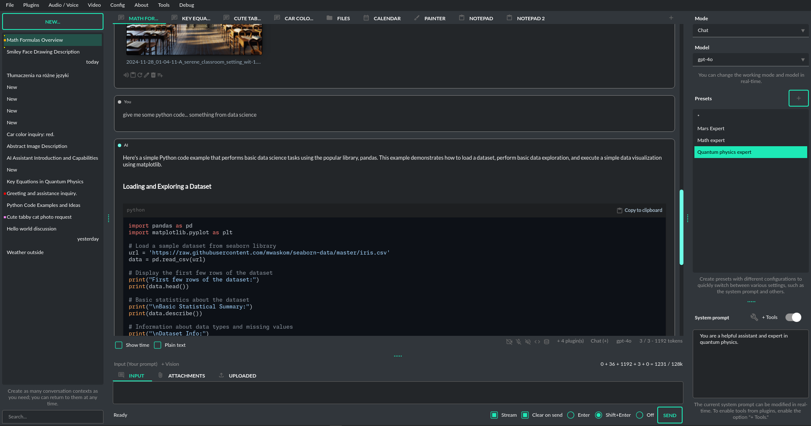

Introduction
=============

Overview
----------------

**PyGPT** is **all-in-one** Desktop AI Assistant that provides direct interaction with OpenAI language models, including ``GPT-4``, ``GPT-4 Vision``, and ``GPT-3.5``, through the ``OpenAI API``. The application also integrates with alternative LLMs, like those available on ``HuggingFace``, by utilizing ``Langchain``.

This assistant offers multiple modes of operation such as chat, assistants, completions, and image-related tasks using ``DALL-E 3`` for generation and ``GPT-4 Vision`` for analysis. **PyGPT** has filesystem capabilities for file I/O, can generate and run Python code, execute system commands, and manage file transfers. It also allows models to perform web searches with the ``Google Custom Search API``.

For audio interactions, **PyGPT** includes speech synthesis using the ``Microsoft Azure Text-to-Speech API`` and ``OpenAI's TTS API``. Additionally, it features speech recognition capabilities provided by ``OpenAI Whisper``, enabling the application to understand spoken commands and transcribe audio inputs into text. It features context memory with save and load functionality, enabling users to resume interactions from predefined points in the conversation. Prompt creation and management are streamlined through an intuitive preset system.

**PyGPT**'s functionality extends through plugin support, allowing for custom enhancements. Its multi-modal capabilities make it an adaptable tool for a range of AI-assisted operations, such as text-based interactions, system automation, daily assisting, vision applications, natural language processing, code generation and image creation.

Multiple operation modes are included, such as chatbot, text completion, assistant, vision, Langchain, commands execution and image generation, making **PyGPT** a comprehensive tool for many AI-driven tasks.

Features
---------
* Desktop AI Assistant for ``Windows`` and ``Linux``, written in Python.
* Works similarly to ``ChatGPT``, but locally (on a desktop computer).
* 6 modes of operation: Assistant, Chat, Vision, Completion, Image generation, Langchain.
* Supports multiple models: ``GPT-4``, ``GPT-3.5``, and ``GPT-3``, including any model accessible through ``Langchain``.
* Handles and stores the full context of conversations (short-term memory).
* Real-time video camera capture in Vision mode
* Internet access via ``Google Custom Search API``.
* Speech synthesis via ``Microsoft Azure TTS`` and ``OpenAI TTS``.
* Speech recognition through ``OpenAI Whisper``.
* Image analysis via ``GPT-4 Vision``.
* Crontab / Task scheduler included
* Integrated ``Langchain`` support (you can connect to any LLM, e.g., on ``HuggingFace``).
* Integrated experimental ``Llama-index`` support: chat with ``txt``, ``pdf``, ``csv``, ``md``, ``docx``, ``json``, ``epub`` and ``xlsx``.
* Integrated calendar, day notes and search in contexts by selected date
* Commands execution (via plugins: access to the local filesystem, Python code interpreter, system commands execution).
* Custom commands creation and execution
* Manages files and attachments with options to upload, download, and organize.
* Context history with the capability to revert to previous contexts (long-term memory).
* Allows you to easily manage prompts with handy editable presets.
* Provides an intuitive operation and interface.
* Includes a notebook.
* Includes optional Autonomous Mode
* Supports multiple languages.
* Enables the use of all the powerful features of ``GPT-4``, ``GPT-4V``, and ``GPT-3.5``.
* Requires no previous knowledge of using AI models.
* Simplifies image generation using ``DALL-E 3`` and ``DALL-E 2``.
* Possesses the potential to support future OpenAI models.
* Fully configurable.
* Themes support.
* Plugins support.
* Built-in token usage calculation.
* It's open source; source code is available on ``GitHub``.
* Utilizes the user's own API key.

The application is free, open-source, and runs on PCs with ``Windows 10``, ``Windows 11``, and ``Linux``. 
The full Python source code is available on ``GitHub``.

**PyGPT uses the user's API key  -  to use the application, 
you must have a registered OpenAI account and your own API key.**

.. note::
   This application is not officially associated with OpenAI. The author shall not be held liable for any damages 
   resulting from the use of this application. It is provided "as is," without any form of warranty. 
   Users are reminded to be mindful of token usage - always verify the number of tokens utilized by the model on 
   the OpenAI website and engage with the application responsibly. Activating plugins, such as Web Search, 
   may consume additional tokens that are not displayed in the main window. 
   **Always monitor your actual token usage on the OpenAI website.**
