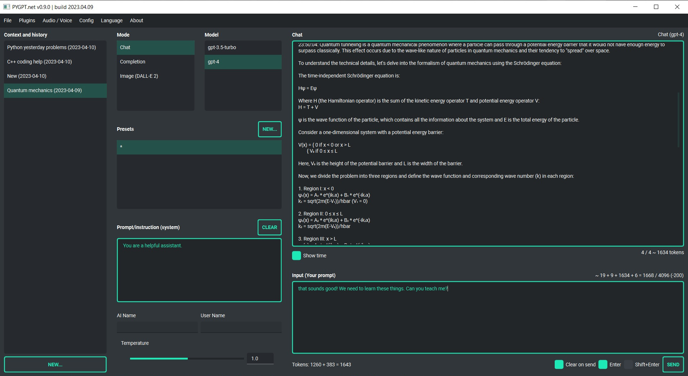

Introduction
=============

What is PYGPT?
----------------

**PYGPT** is a desktop application that allows you to talk to OpenAI's artificial intelligence models such as **GPT4** and **GPT3** using your own computer and ``OpenAI API``. It allows you to talk in chat mode and in completion mode, as well as generate images using **DALL-E 2**. Moreover, the application has implemented context memory support, context storage, history of contexts, which can be restored at any time and e.g. continue the conversation from point in history, and also has a convenient and intuitive system of presets that allows you to quickly and pleasantly create and manage your prompts.

Features
---------
| - desktop application for ``Windows`` and ``Linux``, written in Python
| - works similar to ``ChatGPT``, but locally (on desktop)
| - 3 modes of operation: chatbot, text completion and image generation
| - supports multiple models: ``GPT4`` and ``GPT3``
| - handles and stores full context of the conversation (short-term memory)
| - stores the history of contexts with the ability to return to previous context (long-term memory)
| - allows you to easily manage prompts with handly editable presets
| - intuitive operation and interface
| - allows you to use all the powerful features of ``GPT4`` and ``GPT3``
| - no knowledge of using AI models required
| - enables easy and convenient generation of images using ``DALL-E 2``
| - has the ability to support future OpenAI models
| - fully configurable
| - plugins support
| - built-in tokens usage calculation
| - it's open source, source code is available on ``GitHub``
| - **uses the user's API key**

The application is free, open source and runs on PC with ``Windows 10``, ``Windows 11`` and ``Linux``. 
The full **Python** source code is available on ``GitHub``.

**PYGPT uses the user's API key - to use the application, you must have a registered OpenAI account and your own API key.**

