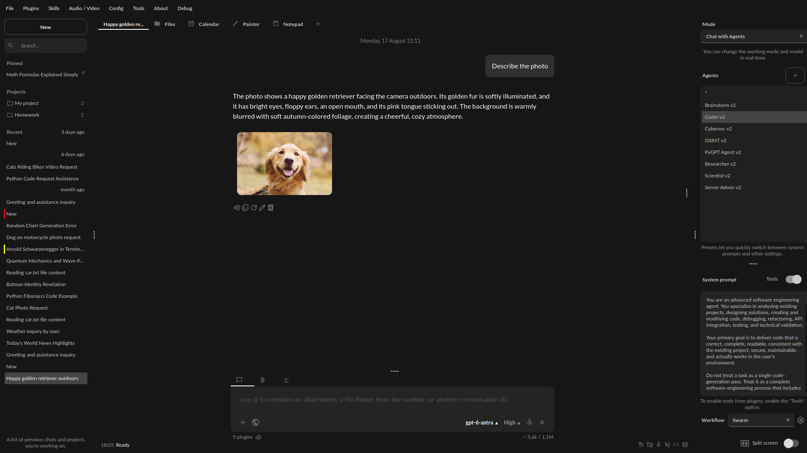
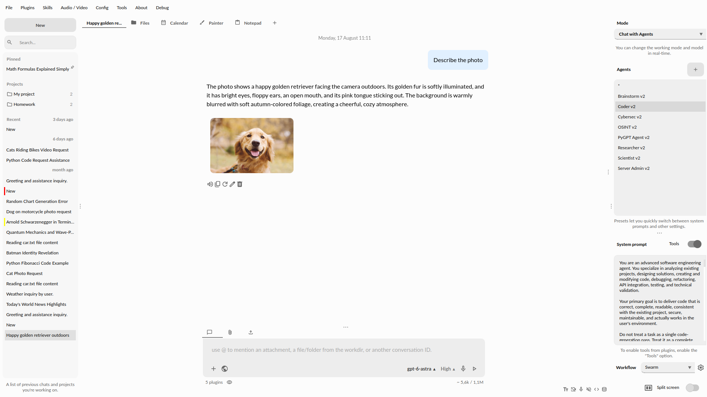

Introduction
=============

Overview
----------------

**PyGPT** is an **all-in-one desktop AI assistant** supporting models from ``OpenAI`` (``GPT-5``, ``GPT-4``, ``o1``, ``o3``), ``Google Gemini``, ``Anthropic Claude``, ``xAI Grok``, ``Perplexity / Sonar``, ``DeepSeek``, and models available through ``HuggingFace``, ``LlamaIndex``, OpenAI-compatible APIs, and local ``Ollama`` installations such as ``gpt-oss``, ``Llama 3``, ``Mistral``, ``DeepSeek`` and ``Bielik``.

It supports chat, assistants, agents, completions, Chat with Files (via ``LlamaIndex``), image and video generation, and image analysis. Models can work with files, run Python and system or custom commands, transfer files, call external APIs, and search the web with ``DuckDuckGo``, ``Google`` and ``Microsoft Bing``.

**PyGPT** also provides speech synthesis through ``Microsoft Azure``, ``Google``, ``Eleven Labs`` and ``OpenAI``, plus speech recognition with ``OpenAI Whisper``, ``Google`` and ``Bing``. It stores conversation history and memory, supports reusable presets, and can be extended with built-in or custom plugins for tools, automation and external integrations.

*Dark theme*

*Light theme*

Features
---------
* Desktop AI Assistant for ``Linux``, ``Windows`` and ``Mac``, written in Python.
* Works similarly to ``ChatGPT``, but locally (on a desktop computer).
* 11 modes of operation: Chat, Chat with Files, Realtime + audio, Research (Perplexity), Completion, Image and Video generation, Assistants, Experts, Computer use, Agents and Autonomous Mode.
* Supports multiple models like ``OpenAI GPT-5``, ``GPT-4``, ``o1``, ``o3``, ``o4``, ``Google Gemini``, ``Anthropic Claude``, ``xAI Grok``, ``DeepSeek V3/R1``, ``Perplexity / Sonar``, and any model accessible through ``LlamaIndex`` and ``Ollama`` such as ``DeepSeek``, ``gpt-oss``, ``Llama 3``, ``Mistral``, ``Bielik``, etc.
* Chat with your own Files: integrated ``LlamaIndex`` support: chat with data such as: ``txt``, ``pdf``, ``csv``, ``html``, ``md``, ``docx``, ``json``, ``epub``, ``xlsx``, ``xml``, webpages, ``Google``, ``GitHub``, video/audio, images and other data types, or use conversation history as additional context provided to the model.
* Built-in vector databases support and automated files and data embedding.
* Image generation via models like ``gpt-image``, ``Imagen``, ``Gemini`` and ``Nano Banana``.
* Video generation via models like ``Veo3`` and ``Sora2``.
* Internet access via ``DuckDuckGo``, ``Google`` and ``Microsoft Bing``.
* Speech synthesis via ``Microsoft Azure``, ``Google``, ``Eleven Labs`` and ``OpenAI`` Text-To-Speech services.
* Speech recognition via ``OpenAI Whisper``, ``Google`` and ``Microsoft Speech Recognition``.
* Plugins support with built-in plugins like ``Files I/O``, ``Code Interpreter``, ``Web Search``, ``Google``, ``Facebook``, ``X/Twitter``, ``Slack``, ``Telegram``, ``GitHub``, ``MCP``, and many more.
* MCP support.
* Camera capture for real-time image analysis in Chat and other supported modes.
* Image analysis via vision models.
* Included support features for individuals with disabilities: customizable keyboard shortcuts, voice control, and translation of on-screen actions into audio via speech synthesis.
* Handles and stores the full context of conversations (short and long-term memory).
* Integrated calendar, day notes and search in contexts by selected date.
* Tools and commands execution (via plugins: access to the local filesystem, Python Code Interpreter, system commands execution, and more).
* Custom commands creation and execution.
* Crontab / Task scheduler included.
* Built-in real-time Python Code Interpreter / IPython.
* Manages files and attachments with options to upload, download, and organize.
* Context history with the capability to revert to previous contexts (long-term memory).
* Allows you to easily manage prompts with handy editable presets.
* Provides an intuitive operation and interface.
* Includes a notepad.
* Includes simple painter / drawing tool.
* Includes a node-based Agents Builder.
* Supports multiple languages.
* Requires no previous knowledge of using AI models.
* Fully configurable.
* Themes support.
* Real-time code syntax highlighting.
* Built-in token usage calculation.
* **Open source**; source code is available on ``GitHub``.
* Utilizes the user's own API key.
* and many more.

The application is free, open-source, and runs on PCs with ``Linux``, ``Windows 10``, ``Windows 11`` and ``Mac``. 
Full Python source code is available on ``GitHub``.

PyGPT uses your own API credentials to connect to supported AI providers such as OpenAI, Google, Anthropic, xAI, Perplexity, Mistral, OpenRouter, and others. Depending on the selected model and provider, you may need an account and a valid API key for that service. Local models do not require external API credentials.

.. note::
   This application is not officially associated with OpenAI. The author shall not be held liable for any damages 
   resulting from the use of this application. It is provided "as is," without any form of warranty. 
   Users are reminded to be mindful of token usage - always verify the number of tokens utilized by the model on 
   the API website and engage with the application responsibly. Activating plugins, such as Web Search, 
   may consume additional tokens that are not displayed in the main window. 
   **Always monitor your actual token usage on the OpenAI, Google, Anthropic, etc. websites.**
