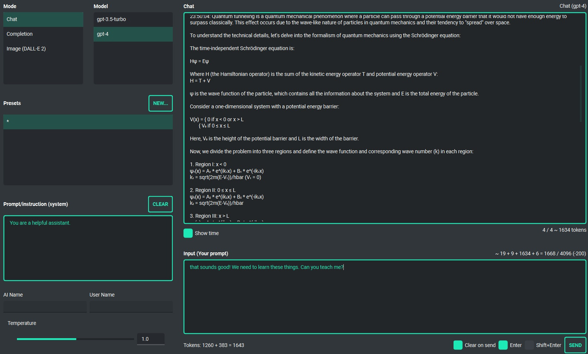
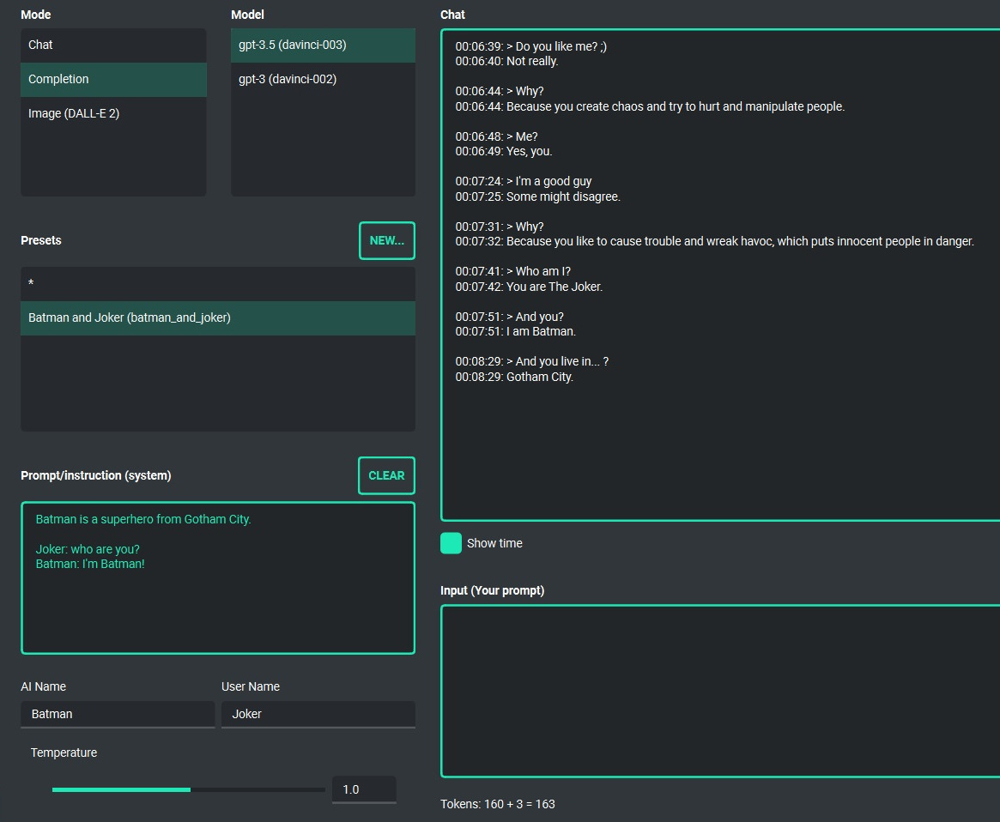

Chatbot and completion (GPT3, GPT4)
===================================

Chatbot
-------
This is the default mode of operation and works very similarly to **ChatGPT**.
The mode allows you to talk to models such as **GPT3**, **GPT3.5** and **GPT4**.
You can switch between the currently used model at any time.

In the middle window of the application there is a chat window, and below it there is a field for the text entered by the user (prompt). On the right side of the application window, you can conveniently define your own system prompt for the model at any time, or create a preset with a prompt and save it, for example, for later use. This allows you to easily and quickly switch between different starting configurations for the model, and allows you to conveniently experiment with the whole thing.

Under the chat window and above the input window, the calculated amount of tokens that will be used to perform a given query is always shown in real time.

Text Completion
---------------
This is a more advanced and capable mode that allows more extensive use of the **GPT3** model. It works similarly to a chat, but it allows for more configuration and has more features than a regular chat. In this mode, you can use the model for more tasks, such as completing text, simulating conversation as various persons, analyzing text, and many more.

As in the chat mode, here on the right there are convenient presets, thanks to which you can freely configure the model and quickly switch between different configurations.

This mode additionally has fields in which you can enter a name for the AI and for the user. This allows, for example, to simulate a conversation as two fictitious actors, if so defined in the start prompt. Thanks to these options, it is possible, for example, to simulate a conversation between e.g. Batman and the Joker. ;)

In this mode, models from the ``davinci`` family - included in the **GPT3** - are available.