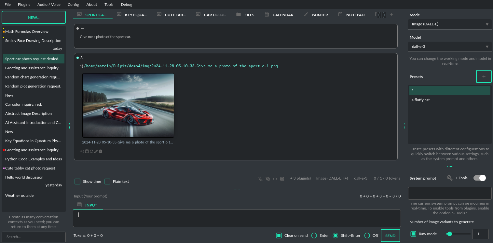

Work modes
==========

Chat
-----

**+ Inline Vision and Image generation**

This mode in **PyGPT** mirrors ``ChatGPT``, allowing you to chat with models such as ``o1``, ``o3``, ``GPT-4``, ``GPT-4o`` and ``Claude``, ``Gemini``, ``Grok``, ``Perplexity``, ``Deepseek``, etc. It works by using the ``Responses`` and ``ChatCompletions`` OpenAI API (or compatible). You can select the API endpoint to use in: ``Config -> Settings -> API Keys``.

.. note::
   **Tip:** This mode directly uses the OpenAI API. Other models, such as Gemini, Claude, Grok, Perplexity, or Llama3, are supported in Chat mode via LlamaIndex or OpenAI API compatible endpoints (if available), which the application switches to in the background when working with models other than OpenAI.

The main part of the interface is a chat window where you see your conversations. Below it is a message box for typing. On the right side, you can set up or change the model and system prompt. You can also save these settings as presets to easily switch between models or tasks.

Above where you type your messages, the interface shows you the number of tokens your message will use up as you type it – this helps to keep track of usage. There is also a feature to attach and upload files in this area. Go to the ``Files and Attachments`` section for more information on how to use attachments.

.. image:: images/v2_mode_chat.png
   :width: 800

**Vision:** If you want to send photos from your disk or images from your camera for analysis, and the selected model does not support Vision, you must enable the ``GPT-4 Vision (inline)`` plugin in the Plugins menu. This plugin allows you to send photos or images from your camera for analysis in any Chat mode.

.. image:: images/v3_vision_plugins.png
   :width: 400

With this plugin, you can capture an image with your camera or attach an image and send it for analysis to discuss the photograph:

.. image:: images/v3_vision_chat.png
   :width: 800

**Image generation:** If you want to generate images (using DALL-E) directly in chat you must enable plugin ``DALL-E 3 (inline)`` in the Plugins menu. Plugin allows you to generate images in Chat mode:

.. image:: images/v3_img_chat.png
   :width: 800

Chat with Files (LlamaIndex)
-----------------------------

This mode enables chat interaction with your documents and entire context history through conversation. 
It seamlessly incorporates ``LlamaIndex`` into the chat interface, allowing for immediate querying of your indexed documents.

**Tip:** If you do not want to call tools/commands, disable the checkbox ``+Tools``. It will speed up the response time when using local models. You can also enable the ReAct agent for tool calls in: ``Settings -> Indexes / LlamaIndex -> Chat -> Use ReAct agent for Tool calls in Chat with Files mode``. Stream mode is disabled if the ReAct agent and ``+Tools`` checkbox are active.

**Querying single files**

You can also query individual files "on the fly" using the ``query_file`` command from the ``Files I/O`` plugin. This allows you to query any file by simply asking a question about that file. A temporary index will be created in memory for the file being queried, and an answer will be returned from it. From version ``2.1.9`` similar command is available for querying web and external content: ``Directly query web content with LlamaIndex``.

**For example:**

If you have a file: ``data/my_cars.txt`` with content ``My car is red.``

You can ask for: ``Query the file my_cars.txt about what color my car is.``

And you will receive the response: ``Red``.

Note: this command indexes the file only for the current query and does not persist it in the database. To store queried files also in the standard index you must enable the option ``Auto-index readed files`` in plugin settings. Remember to enable ``+ Tools`` checkbox to allow usage of tools and commands from plugins.

**Using Chat with Files mode**

In this mode, you are querying the whole index, stored in a vector store database.
To start, you need to index (embed) the files you want to use as additional context.
Embedding transforms your text data into vectors. If you're unfamiliar with embeddings and how they work, check out this article:

https://stackoverflow.blog/2023/11/09/an-intuitive-introduction-to-text-embeddings/

For a visualization from OpenAI's page, see this picture:

.. image:: images/vectors.png

Source: https://cdn.openai.com/new-and-improved-embedding-model/draft-20221214a/vectors-3.svg

To index your files, simply copy or upload them into the ``data`` directory and initiate indexing (embedding) by clicking the ``Index all`` button, or right-click on a file and select ``Index...``. Additionally, you have the option to utilize data from indexed files in any Chat mode by activating the ``Chat with Files (LlamaIndex, inline)`` plugin.

Built-in file loaders: 

**Files:**

* CSV files (csv)
* Epub files (epub)
* Excel .xlsx spreadsheets (xlsx)
* HTML files (html, htm)
* IPYNB Notebook files (ipynb)
* Image (vision) (jpg, jpeg, png, gif, bmp, tiff, webp)
* JSON files (json)
* Markdown files (md)
* PDF documents (pdf)
* Plain-text files (txt)
* Video/audio (mp4, avi, mov, mkv, webm, mp3, mpeg, mpga, m4a, wav)
* Word .docx documents (docx)
* XML files (xml)

**Web/external content:**

* Bitbucket
* ChatGPT Retrieval Plugin
* GitHub Issues
* GitHub Repository
* Google Calendar
* Google Docs
* Google Drive 
* Google Gmail
* Google Keep
* Google Sheets
* Microsoft OneDrive
* RSS
* SQL Database
* Sitemap (XML)
* Twitter/X posts
* Webpages (crawling any webpage content)
* YouTube (transcriptions)

You can configure data loaders in ``Settings / LlamaIndex / Data Loaders`` by providing list of keyword arguments for specified loaders.
You can also develop and provide your own custom loader and register it within the application.

LlamaIndex is also integrated with context database - you can use data from database (your context history) as additional context in discussion. 
Options for indexing existing context history or enabling real-time indexing new ones (from database) are available in ``Settings / LlamaIndex`` section.

**WARNING:** remember that when indexing content, API calls to the embedding model are used. Each indexing consumes additional tokens. 
Always control the number of tokens used on the OpenAI page.

**Tip:** Using the Chat with Files mode, you have default access to files manually indexed from the /data directory. However, you can use additional context by attaching a file - such additional context from the attachment does not land in the main index, but only in a temporary one, available only for the given conversation.

**Token limit:** When you use ``Chat with Files`` in non-query mode, LlamaIndex adds extra context to the system prompt. If you use a plugins (which also adds more instructions to system prompt), you might go over the maximum number of tokens allowed. If you get a warning that says you've used too many tokens, turn off plugins you're not using or turn off the "+ Tools" option to reduce the number of tokens used by the system prompt.

**Available vector stores** (provided by ``LlamaIndex``):

* ChromaVectorStore
* ElasticsearchStore
* PinecodeVectorStore
* RedisVectorStore
* SimpleVectorStore

You can configure selected vector store by providing config options like ``api_key``, etc. in ``Settings -> LlamaIndex`` window. See the section: ``Configuration / Vector stores`` for configuration reference.

**Configuring data loaders**

In the ``Settings -> LlamaIndex -> Data loaders`` section you can define the additional keyword arguments to pass into data loader instance. See the section: ``Configuration / Data Loaders`` for configuration reference.

Chat with Audio
---------------
This mode works like the Chat mode but with native support for audio input and output using a multimodal model - ``gpt-4o-audio``. In this mode, audio input and output are directed to and from the model directly, without the use of external plugins. This enables faster and better audio communication.

More info: https://platform.openai.com/docs/guides/audio/quickstart

Currently in beta. Tool and function calls are not enabled in this mode.

Research
----------------------
2025-03-02: currently in beta.

This mode (when using Sonar and R1 models) operates using the Perplexity API: https://perplexity.ai.

It allows for deep web searching and utilizes Sonar models, available in ``Perplexity AI``.

It requires a Perplexity API key, which can be generated at: https://perplexity.ai.

From version ``2.5.27`` also OpenAI deep-research models are available in this mode.

Completion
----------
An older mode of operation that allows working in the standard text completion mode. However, it allows for a bit more flexibility with the text by enabling you to initiate the entire discussion in any way you like.

Similar to chat mode, on the right-hand side of the interface, there are convenient presets. These allow you to fine-tune instructions and swiftly transition between varied configurations and pre-made prompt templates.

Additionally, this mode offers options for labeling the AI and the user, making it possible to simulate dialogues between specific characters - for example, you could create a conversation between Batman and the Joker, as predefined in the prompt. This feature presents a range of creative possibilities for setting up different conversational scenarios in an engaging and exploratory manner.

**Info:** From version ``2.0.107`` the davinci models are deprecated and has been replaced with ``gpt-3.5-turbo-instruct`` model.

Image generation
-----------------

**DALL-E 3**

**PyGPT** enables quick and easy image creation with ``DALL-E 3`` or ``gpt-image-1``. 
The older model version, ``DALL-E 2``, is also accessible. Generating images is akin to a chat conversation  - a user's prompt triggers the generation, followed by downloading, saving to the computer, and displaying the image onscreen. You can send raw prompt to ``DALL-E`` in ``Image generation`` mode or ask the model for the best prompt.

Image generation using DALL-E is available in every mode via plugin "DALL-E 3 Image Generation (inline)". Just ask any model, in any mode, like e.g. GPT-4 to generate an image and it will do it inline, without need to mode change.

.. image:: images/v3_img_chat.png
   :width: 800

**Multiple variants**

You can generate up to **4 different variants** (DALL-E 2) for a given prompt in one session. DALL-E 3 allows one image.
To select the desired number of variants to create, use the slider located in the right-hand corner at 
the bottom of the screen. This replaces the conversation temperature slider when you switch to image generation mode.

**Raw mode**

There is an option for switching prompt generation mode.

.. image:: images/v2_dalle2.png
   :width: 400

If **Raw Mode** is enabled, DALL-E will receive the prompt exactly as you have provided it.
If **Raw Mode** is disabled, a model will generate the best prompt for you based on your instructions.

**Image storage**

Once you've generated an image, you can easily save it anywhere on your disk by right-clicking on it. 
You also have the options to delete it or view it in full size in your web browser.

**Tip:** Use presets to save your prepared prompts. 
This lets you quickly use them again for generating new images later on.

The app keeps a history of all your prompts, allowing you to revisit any session and reuse previous 
prompts for creating new images.

Images are stored in ``img`` directory in PyGPT's user data folder.

Vision
-------

This mode enables image analysis using the ``gpt-4o``, ``gpt-4-vision`` and other vision (multimodal) models. Functioning much like the chat mode, 
it also allows you to upload images or provide URLs to images. The vision feature can analyze both local 
images and those found online.

Vision is also integrated into any chat mode via plugin ``GPT-4 Vision (inline)``. Just enable the plugin and use Vision in other work modes, such as Chat or Chat with Files.

Vision mode also includes real-time video capture from camera. To capture image from camera and append it to chat just click on video at left side. You can also enable ``Auto capture`` - image will be captured and appended to chat message every time you send message.

**1) Video camera real-time image capture:**

.. image:: images/v2_capture1.png
   :width: 800

.. image:: images/v3_vision_chat.png
   :width: 800

**2) you can also provide an image URL**

.. image:: images/v2_mode_vision.png
   :width: 800

**3) or you can just upload your local images or use the inline Vision in the standard chat mode:**

.. image:: images/v2_mode_vision_upload.png
   :width: 800

**Tip:** When using ``Vision (inline)`` by utilizing a plugin in standard mode, such as ``Chat`` (not ``Vision`` mode), the ``+ Vision`` label will appear at the bottom of the Chat window.

Assistants
----------
This mode uses the OpenAI's **Assistants API**.

This mode expands on the basic chat functionality by including additional external tools like a ``Code Interpreter`` for executing code, ``Retrieval Files`` for accessing files, and custom ``Functions`` for enhanced interaction and integration with other APIs or services. In this mode, you can easily upload and download files. **PyGPT** streamlines file management, enabling you to quickly upload documents and manage files created by the model.

Setting up new assistants is simple - a single click is all it takes, and they instantly sync with the ``OpenAI API``. Importing assistants you've previously created with OpenAI into **PyGPT** is also a seamless process.

.. image:: images/v2_mode_assistant.png
   :width: 800

In Assistant mode you are allowed to storage your files in remote vector store (per Assistant) and manage them easily from app:

.. image:: images/v2_mode_assistant_upload.png
   :width: 800

**Vector stores (via Assistants API)**

Assistant mode supports the use of external vector databases offered by the OpenAI API. This feature allows you to store your files in a database and then search them using the Assistant's API. Each assistant can be linked to one vector database—if a database is linked, all files uploaded in this mode will be stored in the linked vector database. If an assistant does not have a linked vector database, a temporary database is automatically created during the file upload, which is accessible only in the current thread. Files from temporary databases are automatically deleted after 7 days.

To enable the use of vector stores, enable the ``Chat with Files`` checkbox in the Assistant settings. This enables the ``File search`` tool in Assistants API.

To manage external vector databases, click the DB icon next to the vector database selection list in the Assistant creation and editing window (screen below). In this management window, you can create a new vector database, edit an existing one, or import a list of all existing databases from the OpenAI server:

.. image:: images/v2_assistant_stores.png
   :width: 800

You can define, using ``Expire days``, how long files should be automatically kept in the database before deletion (as storing files on OpenAI incurs costs). If the value is set to 0, files will not be automatically deleted.

The vector database in use will be displayed in the list of uploaded files, on the field to the right—if a file is stored in a database, the name of the database will be displayed there; if not, information will be shown indicating that the file is only accessible within the thread.

.. image:: images/v2_assistant_stores_upload.png
   :width: 800

Agent (LlamaIndex) 
-------------------

Mode that allows the use of agents offered by ``LlamaIndex``.

Includes built-in agents:

* OpenAI
* ReAct
* Structured Planner (sub-tasks)
* CodeAct (connected to Code Interpreter plugin)

In the future, the list of built-in agents will be expanded.

You can also create your own agent by creating a new provider that inherits from ``pygpt_net.provider.agents.base``.

**Tools and Plugins**

In this mode, all commands from active plugins are available (commands from plugins are automatically converted into tools for the agent on-the-fly).

**RAG - using indexes**

If an index is selected in the agent preset, a tool for reading data from the index is automatically added to the agent, creating a RAG automatically.

Multimodality is currently unavailable, only text is supported. Vision support will be added in the future.

**Loop / Evaluate Mode**

You can run the agent in autonomous mode, in a loop, and with evaluation of the current output. When you enable the ``Loop / Evaluate`` checkbox, after the final response is given, the quality of the answer will be rated on a percentage scale of ``0% to 100%`` by another agent. If the response receives a score lower than the one expected (set using a slider at the bottom right corner of the screen, with a default value ``75%``), a prompt will be sent to the agent requesting improvements and enhancements to the response.

Setting the expected (required) score to ``0%`` means that the response will be evaluated every time the agent produces a result, and it will always be prompted to self-improve its answer. This way, you can put the agent in an autonomous loop, where it will continue to operate until it succeeds.

You can choose between two methods of evaluation:

- By the percentage of tasks completed
- By the accuracy (score) of the final response

You can set the limit of steps in such a loop by going to ``Settings -> Agents and experts -> LlamaIndex agents -> Max evaluation steps``. The default value is ``3``, meaning the agent will only make three attempts to improve or correct its answer. If you set the limit to zero, there will be no limit, and the agent can operate in this mode indefinitely (watch out for tokens!).

You can change the prompts used for evaluating the response in ``Settings -> Prompts -> Agent: evaluation prompt in loop``. Here, you can adjust it to suit your needs, for example, by defining more or less critical feedback for the responses received.

Agent (OpenAI)
--------------

**Added in: 2.5.76** - currently in beta.

The mode operates on the ``openai-agents`` library integrated into the application:

https://github.com/openai/openai-agents-python

It allows running agents for OpenAI models and models compatible with the OpenAI.

In this mode, you can use pre-configured Experts in Expert mode presets - they will be launched as agents (in the ``openai_agents_experts`` type, which allows launching one main agent and subordinate agents to which queries will be appropriately directed).

**Agent types:**

* ``Agent with experts`` - uses attached experts as sub-agents
* ``Agent with experts + feedback`` - uses attached experts as sub-agents + feedback agent in a loop
* ``Agent with feedback`` - single agent + feedback agent in a loop
* ``Planner`` - planner agent, 3 sub-agents inside: planner, base agent + feedback
* ``Research bot`` - researcher, 3 sub-agents inside: planner, searcher and writer as base agent
* ``Simple agent`` - a single agent.
* ``Evolve`` - in each generation (cycle), the best response from a given parent agent is selected; in the next generation, the cycle repeats.
* ``B2B`` - bot-to-bot communication, involving two bots interacting with each other while keeping a human in the loop.

More types will be available in the future.

There are also predefined presets added as examples:

* ``Coder``
* ``Experts agent``
* ``Planner``
* ``Researcher``
* ``Simple agent``
* ``Writer with Feedback``
* ``2 bots``

In the Agents (OpenAI) mode, all remote tools are available for the base agent according to the configuration in the Config -> Settings -> Remote tools menu.

Remote tools for experts can be selected separately for each expert in the preset configuration.

Local tools (from plugins) are available for agents and experts according to the enabled plugins, as in other modes.

In agents with feedback and plans, tools can be allowed in a preset configuration for each agent. They also have separate prompts that can be configured in presets.

**Description of how different types of agents work:**

Below is a pattern for how different types of agents work. You can use these patterns to create agents for different tasks by modifying the appropriate prompts in the preset for the specific task.

**Simple Agent**

* The agent completes its task and then stops working.

**Agent with Feedback**

* The first agent answers a question.
* The second agent (feedback) evaluates the answer and, if necessary, goes back to the first agent to enforce corrections.
* The cycle repeats until the feedback agent is satisfied with the evaluation.

**Agent with Experts**

* The agent completes the assigned task on its own or delegates it to the most suitable expert (another agent).

**Agent with Experts + Feedback**

* The first agent answers a question or delegates it to the most suitable expert.
* The second agent (feedback) evaluates and, if necessary, goes back to the first agent to enforce corrections.
* The cycle repeats until the feedback agent is satisfied with the evaluation.

**Research Bot**

* The first agent (planner) prepares a list of phrases to search.
* The second agent (search) finds information based on the phrases and creates a summary.
* The third agent (writer) prepares a report based on the summary.

**Planner**

* The first agent (planner) breaks down a task into sub-tasks and sends the list to the second agent.
* The second agent performs the task based on the prepared task list.
* The third agent, responsible for feedback, evaluates, requests corrections if needed, and sends the request back to the first agent. The cycle repeats.

**Evolve**

* You select the number of agents (parents) to operate in each generation (iteration).
* Each agent prepares a separate answer to a question.
* The best agent (producing the best answer) in a generation is selected by the next agent (chooser).
* Another agent (feedback) verifies the best answer and suggests improvements.
* A request for improving the best answer is sent to a new pair of agents (new parents).
* From this new pair, the best answer is selected again in the next generation, and the cycle repeats.

**B2B**
* A human provides a topic for discussion.
* Bot 1 generates a response and sends it to Bot 2.
* Bot 2 receives the response from Bot 1 as input, provides an answer, and sends the response back to Bot 1 as its input. This cycle repeats.
* The human can interrupt the loop at any time and update the entire discussion.

**Limitations:**

* When the `Computer use` tool is selected for an expert or when the `computer-use` model is chosen, all other tools will not be available for that model.

* Ollama models are not supported in this mode.

Agent (Autonomous)
-------------------

This is an older version of the Agent mode, still available as legacy. However, it is recommended to use the newer mode: ``Agent (LlamaIndex)``.

**WARNING: Please use this mode with caution!** - autonomous mode, when connected with other plugins, may produce unexpected results!

The mode activates autonomous mode, where AI begins a conversation with itself. 
You can set this loop to run for any number of iterations. Throughout this sequence, the model will engage
in self-dialogue, answering his own questions and comments, in order to find the best possible solution, subjecting previously generated steps to criticism.

**WARNING:** Setting the number of run steps (iterations) to ``0`` activates an infinite loop which can generate a large number of requests 
and cause very high token consumption, so use this option with caution! Confirmation will be displayed every time you run the infinite loop.

This mode is similar to ``Auto-GPT`` - it can be used to create more advanced inferences and to solve problems by breaking them down into 
subtasks that the model will autonomously perform one after another until the goal is achieved. 

You can create presets with custom instructions for multiple agents, incorporating various workflows, instructions, and goals to achieve.

All plugins are available for agents, so you can enable features such as file access, command execution, web searching, image generation, 
vision analysis, etc., for your agents. Connecting agents with plugins can create a fully autonomous, self-sufficient system. All currently enabled plugins are automatically available to the Agent.

When the ``Auto-stop`` option is enabled, the agent will attempt to stop once the goal has been reached.

In opposition to ``Auto-stop``, when the ``Always continue...`` option is enabled, the agent will use the "always continue" prompt to generate additional reasoning and automatically proceed to the next step, even if it appears that the task has been completed.

**Options**

The agent is essentially a **virtual** mode that internally sequences the execution of a selected underlying mode. 
You can choose which internal mode the agent should use in the settings:

.. code-block:: ini

   Settings / Agent (autonomous) / Sub-mode to use

Available choices include: ``chat``, ``completion``, ``langchain``, ``vision``, ``llama_index`` (Chat with Files).

Default is: ``chat``.

If you want to use the LlamaIndex mode when running the agent, you can also specify which index ``LlamaIndex`` should use with the option:

.. code-block:: ini

   Settings / Agent (autonomous) / Index to use

.. image:: images/v2_agent_settings.png
   :width: 800

Experts (Co-op, co-operation mode)
----------------------------------

Expert mode allows for the creation of experts (using presets) and then consulting them during a conversation. In this mode, a primary base context is created for conducting the conversation. From within this context, the model can make requests to an expert to perform a task and return the results to the main thread. When an expert is called in the background, a separate context is created for them with their own memory. This means that each expert, during the life of one main context, also has access to their own memory via their separate, isolated context.

**In simple terms - you can imagine an expert as a separate, additional instance of the model running in the background, which can be called at any moment for assistance, with its own context and memory, as well as its own specialized instructions in a given subject.**

Experts do not share contexts with one another, and the only point of contact between them is the main conversation thread. In this main thread, the model acts as a manager of experts, who can exchange data between them as needed.

An expert is selected based on the name in the presets; for example, naming your expert as: ID = python_expert, name = "Python programmer" will create an expert whom the model will attempt to invoke for matters related to Python programming. You can also manually request to refer to a given expert:

.. code-block:: ini

   Call the Python expert to generate some code.

Experts can be activated or deactivated - to enable or disable use RMB context menu to select the ``Enable/Disable`` options from the presets list. Only enabled experts are available to use in the thread.

Experts can also be used in ``Agent (autonomous)`` mode - by creating a new agent using a preset. Simply move the appropriate experts to the active list to automatically make them available for use by the agent.

You can also use experts in "inline" mode - by activating the ``Experts (inline)`` plugin. This allows for the use of experts in any mode, such as normal chat.

Expert mode, like agent mode, is a "virtual" mode - you need to select a target mode of operation for it, which can be done in the settings at ``Settings / Agent (autonomous) / Sub-mode for experts``.

You can also ask for a list of active experts at any time:

.. code-block:: ini

   Give me a list of active experts.

Computer use
-------------

**2.5.71**: Currently in beta.

This mode allows for autonomous computer control.

In this mode, the model takes control of the mouse and keyboard and can navigate within the user's environment. The ``Computer use`` remote tool is used here: https://platform.openai.com/docs/guides/tools-computer-use, combined with the ``Mouse and Keyboard`` plugin.

**Example of use:**

.. code-block:: ini

   Click on the Start Menu to open it, search for the Notepad in the list, and run it.

You can change the environment in which the navigation mode operates by using the list at the bottom of the toolbox.

**Available Environments:**

* Browser
* Linux
* Windows
* Mac

**Tip:** DO NOT enable the `Mouse and Keyboard` plugin in Computer use mode — it is already connected to Computer use mode "in the background."