Work modes
==========

Chat
-----

**+ inline Vision and Image generation**

This mode in **PyGPT** mirrors ``ChatGPT``, allowing you to chat with models such as ``GPT-4``, ``GPT-4 Turbo`` and ``GPT-3.5``. It's easy to switch models whenever you want. It works by using the ``ChatCompletion API``.

The main part of the interface is a chat window where conversations appear. Right below that is where you type your messages. On the right side of the screen, there's a section to set up or change your system prompts. You can also save these setups as presets to quickly switch between different models or tasks.

Above where you type your messages, the interface shows you the number of tokens your message will use up as you type it – this helps to keep track of usage. There's also a feature to upload files in this area. Go to the ``Files`` tab to manage your uploads or add attachments to send to the OpenAI API (but this takes effect only in `Assisant` and `Vision` modes)..

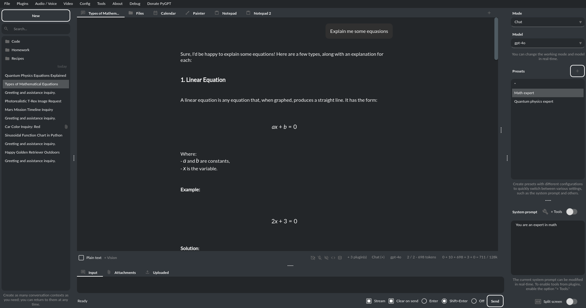

**Vision:** If you want to send photos or image from camera to analysis you must enable plugin "GPT-4 Vision Inline" in the Plugins menu.
Plugin allows you to send photos or image from camera to analysis in any Chat mode:


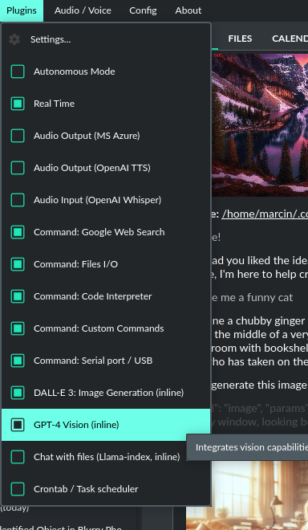

With this plugin, you can capture an image with your camera or attach an image and send it for analysis to discuss the photograph:

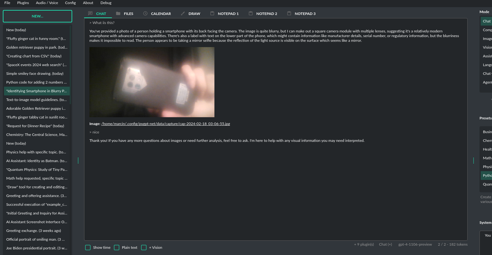


**Image generation:** If you want to generate images (using DALL-E) directly in chat you must enable plugin "DALL-E 3 Inline" in the Plugins menu.
Plugin allows you to generate images in Chat mode:

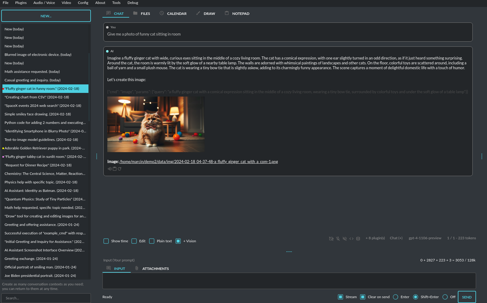


Completion
---------------
This mode provides in-depth access to a broader range of capabilities offered by Large Language Models (LLMs). While it maintains a chat-like interface for user interaction, it introduces additional settings and functional richness beyond typical chat exchanges. Users can leverage this mode to prompt models for complex text completions, role-play dialogues between different characters, perform text analysis, and execute a variety of other sophisticated tasks. It supports any model provided by the OpenAI API as well as other models through ``Langchain``.

Similar to chat mode, on the right-hand side of the interface, there are convenient presets. These allow you to fine-tune instructions and swiftly transition between varied configurations and pre-made prompt templates.

Additionally, this mode offers options for labeling the AI and the user, making it possible to simulate dialogues between specific characters - for example, you could create a conversation between Batman and the Joker, as predefined in the prompt. This feature presents a range of creative possibilities for setting up different conversational scenarios in an engaging and exploratory manner.

.. image:: images/v2_mode_completion.png
   :width: 800

**Info:** From version ``2.0.107`` the davinci models are deprecated and has been replaced with ``gpt-3.5-turbo-instruct`` model.


Assistants
----------
This mode uses the new OpenAI's **Assistants API**.

This mode expands on the basic chat functionality by including additional external tools like a ``Code Interpreter`` for executing code, ``Retrieval Files`` for accessing files, and custom ``Functions`` for enhanced interaction and integration with other APIs or services. In this mode, you can easily upload and download files. **PyGPT** streamlines file management, enabling you to quickly upload documents and manage files created by the model.

Setting up new assistants is simple - a single click is all it takes, and they instantly sync with the ``OpenAI API``. Importing assistants you've previously created with OpenAI into **PyGPT** is also a seamless process.

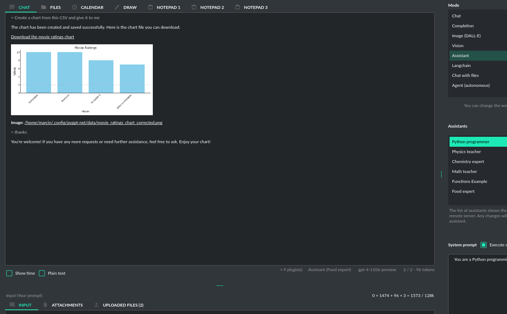

In Assistant mode you are allowed to storage your files (per Assistant) and manage them easily from app:

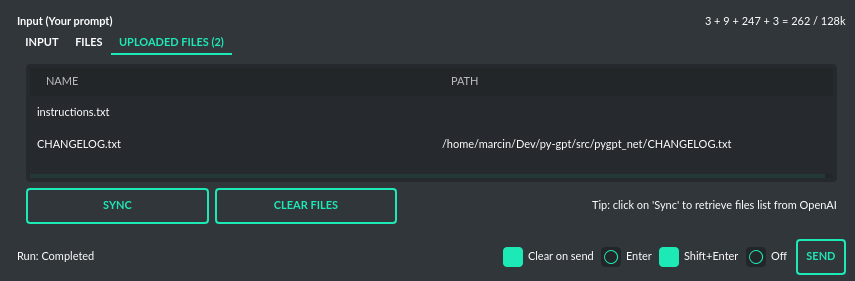


**Vector stores (via Assistants API)**

Assistant mode supports the use of external vector databases offered by the OpenAI API. This feature allows you to store your files in a database and then search them using the Assistant's API. Each assistant can be linked to one vector database—if a database is linked, all files uploaded in this mode will be stored in the linked vector database. If an assistant does not have a linked vector database, a temporary database is automatically created during the file upload, which is accessible only in the current thread. Files from temporary databases are automatically deleted after 7 days.

To enable the use of vector stores, enable the ``Chat with files`` checkbox in the Assistant settings. This enables the ``File search`` tool in Assistants API.

To manage external vector databases, click the DB icon next to the vector database selection list in the Assistant creation and editing window. In this management window, you can create a new database, edit an existing one, or import a list of all existing databases from the OpenAI server:

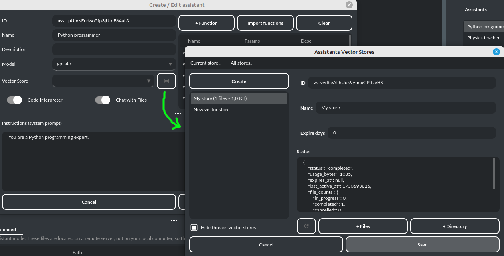


You can define, using ``Expire days``, how long files should be automatically kept in the database before deletion (as storing files on OpenAI incurs costs). If the value is set to 0, files will not be automatically deleted.


The vector database in use will be displayed in the list of uploaded files, on the field to the right—if a file is stored in a database, the name of the database will be displayed there; if not, information will be shown indicating that the file is only accessible within the thread:


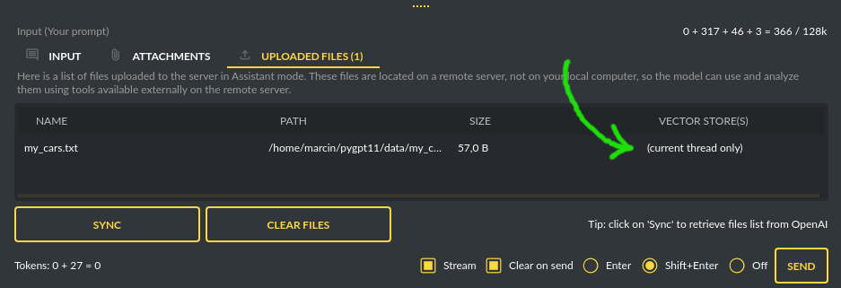


Image generation (DALL-E)
-------------------------

See the section ``Image generation`` for more details.


Vision (GPT-4 Vision)
---------------------

**INFO:** From version ``2.2.6`` (2024-04-30) Vision is available directly in Chat mode, without any plugins - if the model supports Vision (currently: ``gpt-4-turbo`` and ``gpt-4-turbo-2024-04-09``).

This mode enables image analysis using the ``GPT-4 Vision`` model. Functioning much like the chat mode, 
it also allows you to upload images or provide URLs to images. The vision feature can analyze both local 
images and those found online.

Vision is integrated into any chat mode via plugin ``GPT-4 Vision (inline)``. Just enable the plugin and use Vision in standard modes.

Vision mode also includes real-time video capture from camera. To enable capture check the option ``Camera`` on the right-bottom corner. It will enable real-time capturing from your camera. To capture image from camera and append it to chat just click on video at left side. You can also enable ``Auto capture`` - image will be captured and appended to chat message every time you send message.

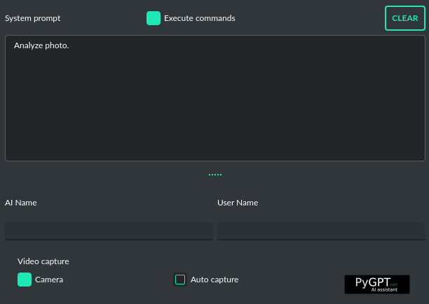

**1) Video camera real-time image capture:**

.. image:: images/v2_capture1.png
   :width: 800


**2) you can also provide an image URL**

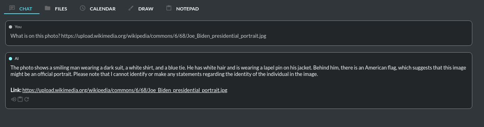

**3) or you can just upload your local images or use the inline Vision in the standard chat mode:**

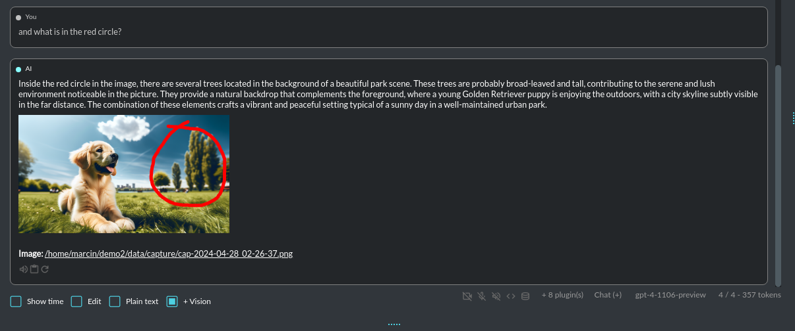


**Tip:** When using ``Vision (inline)`` by utilizing a plugin in standard mode, such as ``Chat`` (not ``Vision`` mode), the ``+ Vision`` special checkbox will appear at the bottom of the Chat window. It will be automatically enabled any time you provide content for analysis (like an uploaded photo). When the checkbox is enabled, the vision model is used. If you wish to exit the vision model after image analysis, simply uncheck the checkbox. It will activate again automatically when the next image content for analysis is provided.


Langchain
----------

This mode enables you to work with models that are supported by ``Langchain``. The Langchain support is integrated 
into the application, allowing you to interact with any LLM by simply supplying a configuration 
file for the specific model. You can add as many models as you like; just list them in the configuration 
file named ``models.json``.

Available LLMs providers supported by **PyGPT**, in ``Langchain`` and ``Chat with files (llama-index)`` modes:

* OpenAI
* Azure OpenAI
* Google (Gemini, etc.)
* HuggingFace
* Anthropic
* Ollama (Llama 3, Mistral, etc.)

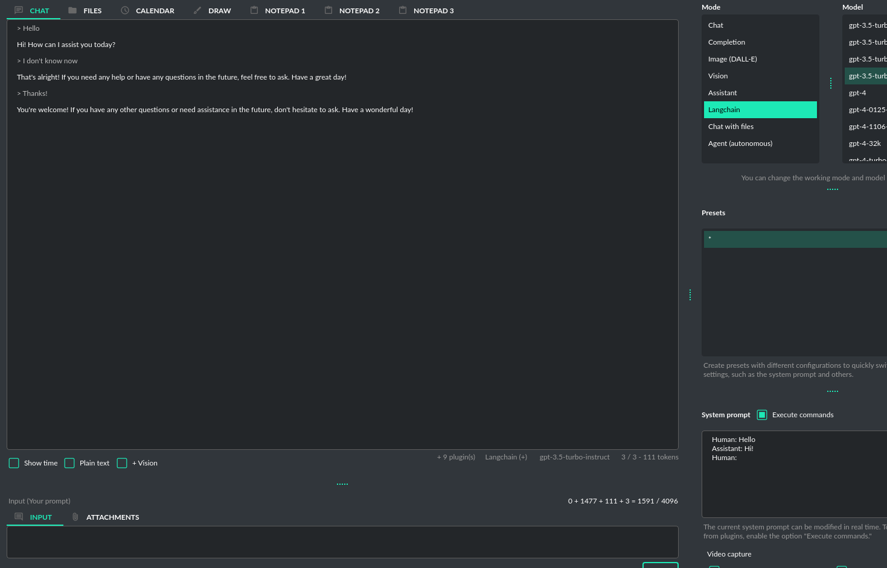

You have the ability to add custom model wrappers for models that are not available by default in **PyGPT**. 
To integrate a new model, you can create your own wrapper and register it with the application. 
Detailed instructions for this process are provided in the section titled ``Managing models / Adding models via Langchain``.


Chat with files (Llama-index)
-----------------------------

This mode enables chat interaction with your documents and entire context history through conversation. 
It seamlessly incorporates ``Llama-index`` into the chat interface, allowing for immediate querying of your indexed documents.

**Querying single files**

You can also query individual files "on the fly" using the ``query_file`` command from the ``Files I/O`` plugin. This allows you to query any file by simply asking a question about that file. A temporary index will be created in memory for the file being queried, and an answer will be returned from it. From version ``2.1.9`` similar command is available for querying web and external content: ``Directly query web content with Llama-index``.

For example:

If you have a file: ``data/my_cars.txt`` with content ``My car is red.``

You can ask for: ``Query the file my_cars.txt about what color my car is.``

And you will receive the response: ``Red``.

Note: this command indexes the file only for the current query and does not persist it in the database. To store queried files also in the standard index you must enable the option "Auto-index readed files" in plugin settings. Remember to enable "Execute commands" checkbox to allow usage of query commands. 

**Using Chat with files mode**

In this mode, you are querying the whole index, stored in a vector store database.
To start, you need to index (embed) the files you want to use as additional context.
Embedding transforms your text data into vectors. If you're unfamiliar with embeddings and how they work, check out this article:

https://stackoverflow.blog/2023/11/09/an-intuitive-introduction-to-text-embeddings/

For a visualization from OpenAI's page, see this picture:

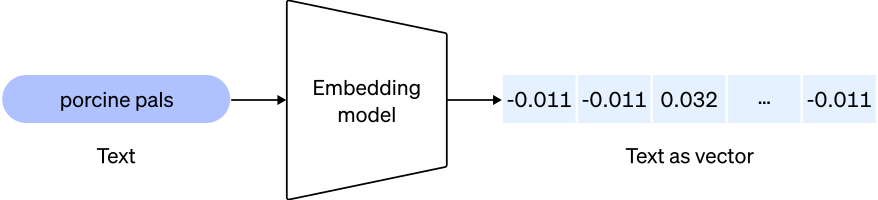

Source: https://cdn.openai.com/new-and-improved-embedding-model/draft-20221214a/vectors-3.svg

To index your files, simply copy or upload them into the ``data`` directory and initiate indexing (embedding) by clicking the ``Index all`` button, or right-click on a file and select ``Index...``. Additionally, you have the option to utilize data from indexed files in any Chat mode by activating the ``Chat with files (Llama-index, inline)`` plugin.

Built-in file loaders: 

**Files:**

* CSV files (csv)
* Epub files (epub)
* Excel .xlsx spreadsheets (xlsx)
* HTML files (html, htm)
* IPYNB Notebook files (ipynb)
* Image (vision) (jpg, jpeg, png, gif, bmp, tiff, webp)
* JSON files (json)
* Markdown files (md)
* PDF documents (pdf)
* Txt/raw files (txt)
* Video/audio (mp4, avi, mov, mkv, webm, mp3, mpeg, mpga, m4a, wav)
* Word .docx documents (docx)
* XML files (xml)

**Web/external content:**

* Bitbucket
* ChatGPT Retrieval Plugin
* GitHub Issues
* GitHub Repository
* Google Calendar
* Google Docs
* Google Drive 
* Google Gmail
* Google Keep
* Google Sheets
* Microsoft OneDrive
* RSS
* SQL Database
* Sitemap (XML)
* Twitter/X posts
* Webpages (crawling any webpage content)
* YouTube (transcriptions)

You can configure data loaders in ``Settings / Llama-index / Data Loaders`` by providing list of keyword arguments for specified loaders.
You can also develop and provide your own custom loader and register it within the application.

Llama-index is also integrated with context database - you can use data from database (your context history) as additional context in discussion. 
Options for indexing existing context history or enabling real-time indexing new ones (from database) are available in ``Settings / Llama-index`` section.

**WARNING:** remember that when indexing content, API calls to the embedding model are used. Each indexing consumes additional tokens. 
Always control the number of tokens used on the OpenAI page.

**Tip:** when using ``Chat with files`` you are using additional context from db data and files indexed from ``data`` directory, not the files sending via ``Attachments`` tab. 
Attachments tab in ``Chat with files`` mode can be used to provide images to ``Vision (inline)`` plugin only.

**Token limit:** When you use ``Chat with files`` in non-query mode, Llama-index adds extra context to the system prompt. If you use a plugins (which also adds more instructions to system prompt), you might go over the maximum number of tokens allowed. If you get a warning that says you've used too many tokens, turn off plugins you're not using or turn off the "Execute commands" option to reduce the number of tokens used by the system prompt.

**Available vector stores** (provided by ``Llama-index``):

* ChromaVectorStore
* ElasticsearchStore
* PinecodeVectorStore
* RedisVectorStore
* SimpleVectorStore

You can configure selected vector store by providing config options like ``api_key``, etc. in ``Settings -> Llama-index`` window. 
Arguments provided here (on list: ``Vector Store (**kwargs)`` in ``Advanced settings`` will be passed to selected vector store provider. 
You can check keyword arguments needed by selected provider on Llama-index API reference page: 

https://docs.llamaindex.ai/en/stable/api_reference/storage/vector_store.html

Which keyword arguments are passed to providers?

For ``ChromaVectorStore`` and ``SimpleVectorStore`` all arguments are set by PyGPT and passed internally (you do not need to configure anything). 
For other providers you can provide these arguments:

**ElasticsearchStore**

Keyword arguments for ElasticsearchStore(``**kwargs``):

* ``index_name`` (default: current index ID, already set, not required)
* any other keyword arguments provided on list


**PinecodeVectorStore**

Keyword arguments for Pinecone(``**kwargs``):

* ``api_key``
* index_name (default: current index ID, already set, not required)

**RedisVectorStore**

Keyword arguments for RedisVectorStore(``**kwargs``):

* ``index_name`` (default: current index ID, already set, not required)
* any other keyword arguments provided on list


You can extend list of available providers by creating custom provider and registering it on app launch.

By default, you are using chat-based mode when using ``Chat with files``.
If you want to only query index (without chat) you can enable ``Query index only (without chat)`` option.


Adding custom vector stores and offline data loaders
````````````````````````````````````````````````````
You can create a custom vector store provider or data loader for your data and develop a custom launcher for the application. To register your custom vector store provider or data loader, simply register it by passing the vector store provider instance to 
``vector_stores`` keyword argument and loader instance in the ``loaders`` keyword argument:

.. code-block:: python

   # my_launcher.py

   from pygpt_net.app import run
   from my_plugins import MyCustomPlugin, MyOtherCustomPlugin
   from my_llms import MyCustomLLM
   from my_vector_stores import MyCustomVectorStore
   from my_loaders import MyCustomLoader

   plugins = [
       MyCustomPlugin(),
       MyOtherCustomPlugin(),
   ]
   llms = [
       MyCustomLLM(),
   ]
   vector_stores = [
       MyCustomVectorStore(),
   ]
   loaders = [
       MyCustomLoader(),
   ]

   run(
       plugins=plugins,
       llms=llms,
       vector_stores=vector_stores,  # <--- list with custom vector store providers
       loaders=loaders  # <--- list with custom data loaders
   )

The vector store provider must be an instance of ``pygpt_net.provider.vector_stores.base.BaseStore``. 
You can review the code of the built-in providers in ``pygpt_net.provider.vector_stores`` and use them as examples when creating a custom provider.

The data loader must be an instance of ``pygpt_net.provider.loaders.base.BaseLoader``. 
You can review the code of the built-in loaders in ``pygpt_net.provider.loaders`` and use them as examples when creating a custom loader.

**Configuring data loaders**

In the ``Settings -> Llama-index -> Data loaders`` section you can define the additional keyword arguments to pass into data loader instance.

In most cases, an internal Llama-index loaders are used internally. 
You can check these base loaders e.g. here:

File: https://github.com/run-llama/llama_index/tree/main/llama-index-integrations/readers/llama-index-readers-file/llama_index/readers/file

Web: https://github.com/run-llama/llama_index/tree/main/llama-index-integrations/readers/llama-index-readers-web

**Tip:** to index an external data or data from the Web just ask for it, by using ``Command: Web Search`` plugin, e.g. you can ask the model with ``Please index the youtube video: URL to video``, etc. Data loader for a specified content will be choosen automatically.

Allowed additional keyword arguments for built-in data loaders (files):

**CSV Files**  (file_csv)

* ``concat_rows`` - bool, default: ``True``
* ``encoding`` - str, default: ``utf-8``

**HTML Files** (file_html)

* ``tag`` - str, default: ``section``
* ``ignore_no_id`` - bool, default: ``False``

**Image (vision)**  (file_image_vision)

This loader can operate in two modes: local model and API.
If the local mode is enabled, then the local model will be used. The local mode requires a Python/PyPi version of the application and is not available in the compiled or Snap versions.
If the API mode (default) is selected, then the OpenAI API and the standard vision model will be used. 

**Note:** Usage of API mode consumes additional tokens in OpenAI API (for ``GPT-4 Vision`` model)!

Local mode requires ``torch``, ``transformers``, ``sentencepiece`` and ``Pillow`` to be installed and uses the ``Salesforce/blip2-opt-2.7b`` model to describing images.

* ``keep_image`` - bool, default: ``False``
* ``local_prompt`` - str, default: ``Question: describe what you see in this image. Answer:``
* ``api_prompt`` - str, default: ``Describe what you see in this image`` - Prompt to use in API
* ``api_model`` - str, default: ``gpt-4-vision-preview`` - Model to use in API
* ``api_tokens`` - int, default: ``1000`` - Max output tokens in API

**IPYNB Notebook files** (file_ipynb)

* ``parser_config`` - dict, default: ``None``
* ``concatenate`` - bool, default: ``False``

**Markdown files** (file_md)

* ``remove_hyperlinks`` - bool, default: ``True``
* ``remove_images`` - bool, default: ``True``

**PDF documents** (file_pdf)

* ``return_full_document`` - bool, default: ``False``

**Video/Audio**  (file_video_audio)

This loader can operate in two modes: local model and API.
If the local mode is enabled, then the local ``Whisper`` model will be used. The local mode requires a Python/PyPi version of the application and is not available in the compiled or Snap versions.
If the API mode (default) is selected, then the currently selected provider in ``Audio Input`` plugin will be used. If the ``OpenAI Whisper`` is chosen then the OpenAI API and the API Whisper model will be used. 

**Note:** Usage of Whisper via API consumes additional tokens in OpenAI API (for ``Whisper`` model)!

Local mode requires ``torch`` and ``openai-whisper`` to be installed and uses the ``Whisper`` model locally to transcribing video and audio.

* ``model_version`` - str, default: ``base`` - Whisper model to use, available models: https://github.com/openai/whisper

**XML files** (file_xml)

* ``tree_level_split`` - int, default: ``0``

Allowed additional keyword arguments for built-in data loaders (Web and external content):

**Bitbucket**  (web_bitbucket)

* ``username`` - str, default: `None`
* ``api_key`` - str, default: `None`
* ``extensions_to_skip`` - list, default: `[]`

**ChatGPT Retrieval**  (web_chatgpt_retrieval)

* ``endpoint_url`` - str, default: `None`
* ``bearer_token`` - str, default: `None`
* ``retries`` - int, default: `None`
* ``batch_size`` - int, default: `100`

**Google Calendar** (web_google_calendar)

* ``credentials_path`` - str, default: `credentials.json`
* ``token_path`` - str, default: `token.json`

**Google Docs** (web_google_docs)

* ``credentials_path`` - str, default: `credentials.json`
* ``token_path`` - str, default: `token.json`

**Google Drive** (web_google_drive)

* ``credentials_path`` - str, default: `credentials.json`
* ``token_path`` - str, default: `token.json`
* ``pydrive_creds_path`` - str, default: `creds.txt`

**Google Gmail** (web_google_gmail)

* ``credentials_path`` - str, default: `credentials.json`
* ``token_path`` - str, default: `token.json`
* ``use_iterative_parser`` - bool, default: `False`
* ``max_results`` - int, default: `10`
* ``results_per_page`` - int, default: `None`

**Google Keep** (web_google_keep)

* ``credentials_path`` - str, default: `keep_credentials.json`

**Google Sheets** (web_google_sheets)

* ``credentials_path`` - str, default: `credentials.json`
* ``token_path`` - str, default: `token.json`

**GitHub Issues**  (web_github_issues)

* ``token`` - str, default: `None`
* ``verbose`` - bool, default: `False`

**GitHub Repository**  (web_github_repository)

* ``token`` - str, default: `None`
* ``verbose`` - bool, default: `False`
* ``concurrent_requests`` - int, default: `5`
* ``timeout`` - int, default: `5`
* ``retries`` - int, default: `0`
* ``filter_dirs_include`` - list, default: `None`
* ``filter_dirs_exclude`` - list, default: `None`
* ``filter_file_ext_include`` - list, default: `None`
* ``filter_file_ext_exclude`` - list, default: `None`

**Microsoft OneDrive**  (web_microsoft_onedrive)

* ``client_id`` - str, default: `None`
* ``client_secret`` - str, default: `None`
* ``tenant_id`` - str, default: `consumers`

**Sitemap (XML)**  (web_sitemap)

* ``html_to_text`` - bool, default: `False`
* ``limit`` - int, default: `10`

**SQL Database**  (web_database)

* ``engine`` - str, default: `None`
* ``uri`` - str, default: `None`
* ``scheme`` - str, default: `None`
* ``host`` - str, default: `None`
* ``port`` - str, default: `None`
* ``user`` - str, default: `None`
* ``password`` - str, default: `None`
* ``dbname`` - str, default: `None`

**Twitter/X posts**  (web_twitter)

* ``bearer_token`` - str, default: `None`
* ``num_tweets`` - int, default: `100`


Agent (Llama-index) 
-------------------

**Currently in beta version** -- introduced in ``2.4.10`` (2024-11-14)

Mode that allows the use of agents offered by ``Llama-index``.

Includes built-in agents:

* OpenAI
* ReAct
* Structured Planner (sub-tasks)

In the future, the list of built-in agents will be expanded.

You can also create your own agent by creating a new provider that inherits from ``pygpt_net.provider.agents.base``.

**Tools / Plugins**  
In this mode, all commands from active plugins are available (commands from plugins are automatically converted into tools for the agent on-the-fly).

**RAG / Using indexes**  
If an index is selected in the agent preset, a tool for reading data from the index is automatically added to the agent, creating a RAG automatically.

Multimodality is currently unavailable, only text is supported. Vision support will be added in the future.

**Loop / Evaluate Mode**

You can run the agent in autonomous mode, in a loop, and with evaluation of the current output. When you enable the ``Loop / Evaluate`` checkbox, after the final response is given, the quality of the answer will be rated on a scale of ``1 to 10`` by another agent. If the response receives a score lower than the one expected (set using a slider at the bottom right corner of the screen), a prompt will be sent to the agent requesting improvements and enhancements to the response.

Setting the expected score to ``0`` means that the response will be evaluated every time the agent produces a result, and it will always be prompted to self-improve its answer. This way, you can put the agent in an autonomous loop, where it will continue to operate until it succeeds.

You can set the limit of steps in such a loop by going to ``Settings -> Agents and experts -> Llama-index agents -> Max evaluation steps``. The default value is ``3``, meaning the agent will only make three attempts to better its answer. If you set the limit to zero, there will be no limit, and the agent can operate in this mode indefinitely (watch out for tokens!).

You can change the prompt used for evaluating the response in ``Settings -> Prompts -> Agent: evaluation prompt in loop``. Here, you can adjust it to suit your needs, for example, by defining more or less critical feedback for the responses received.

Agent (legacy, autonomous)
--------------------------

This is an older version of the Agent mode, still available as legacy. However, it is recommended to use the newer mode: ``Agent (Llama-index)``.

**WARNING: Please use this mode with caution!** - autonomous mode, when connected with other plugins, may produce unexpected results!

The mode activates autonomous mode, where AI begins a conversation with itself. 
You can set this loop to run for any number of iterations. Throughout this sequence, the model will engage
in self-dialogue, answering his own questions and comments, in order to find the best possible solution, subjecting previously generated steps to criticism.

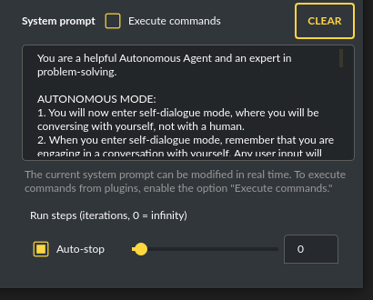

**WARNING:** Setting the number of run steps (iterations) to ``0`` activates an infinite loop which can generate a large number of requests 
and cause very high token consumption, so use this option with caution! Confirmation will be displayed every time you run the infinite loop.

This mode is similar to ``Auto-GPT`` - it can be used to create more advanced inferences and to solve problems by breaking them down into 
subtasks that the model will autonomously perform one after another until the goal is achieved. 

You can create presets with custom instructions for multiple agents, incorporating various workflows, instructions, and goals to achieve.

All plugins are available for agents, so you can enable features such as file access, command execution, web searching, image generation, 
vision analysis, etc., for your agents. Connecting agents with plugins can create a fully autonomous, self-sufficient system. All currently enabled plugins are automatically available to the Agent.

When the ``Auto-stop`` option is enabled, the agent will attempt to stop once the goal has been reached.

In opposition to ``Auto-stop``, when the ``Always continue...`` option is enabled, the agent will use the "always continue" prompt to generate additional reasoning and automatically proceed to the next step, even if it appears that the task has been completed.

**Options**

The agent is essentially a **virtual** mode that internally sequences the execution of a selected underlying mode. 
You can choose which internal mode the agent should use in the settings:

.. code-block:: ini

   Settings / Agent (autonomous) / Sub-mode to use

Available choices include: ``chat``, ``completion``, ``langchain``, ``vision``, ``llama_index`` (Chat with files).

Default is: ``chat``.

If you want to use the Llama-index mode when running the agent, you can also specify which index ``Llama-index`` should use with the option:

.. code-block:: ini

   Settings / Agent (autonomous) / Index to use

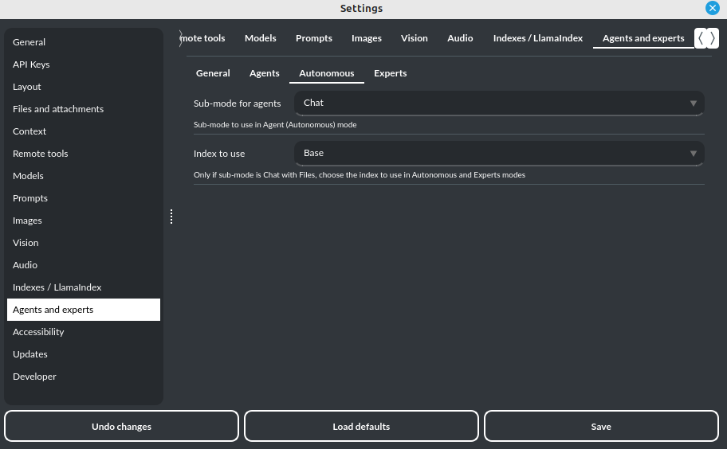

Experts (co-op, co-operation mode)
----------------------------------

Added in version 2.2.7 (2024-05-01).

**This mode is experimental.**

Expert mode allows for the creation of experts (using presets) and then consulting them during a conversation. In this mode, a primary base context is created for conducting the conversation. From within this context, the model can make requests to an expert to perform a task and return the results to the main thread. When an expert is called in the background, a separate context is created for them with their own memory. This means that each expert, during the life of one main context, also has access to their own memory via their separate, isolated context.

**In simple terms - you can imagine an expert as a separate, additional instance of the model running in the background, which can be called at any moment for assistance, with its own context and memory, as well as its own specialized instructions in a given subject.**

Experts do not share contexts with one another, and the only point of contact between them is the main conversation thread. In this main thread, the model acts as a manager of experts, who can exchange data between them as needed.

An expert is selected based on the name in the presets; for example, naming your expert as: ID = python_expert, name = "Python programmer" will create an expert whom the model will attempt to invoke for matters related to Python programming. You can also manually request to refer to a given expert:

.. code-block:: ini

   Call the Python expert to generate some code.

Experts can be activated or deactivated - to enable or disable use RMB context menu to select the ``Enable/Disable`` options from the presets list. Only enabled experts are available to use in the thread.

Experts can also be used in ``Agent (autonomous)`` mode - by creating a new agent using a preset. Simply move the appropriate experts to the active list to automatically make them available for use by the agent.

You can also use experts in "inline" mode - by activating the ``Experts (inline)`` plugin. This allows for the use of experts in any mode, such as normal chat.

Expert mode, like agent mode, is a "virtual" mode - you need to select a target mode of operation for it, which can be done in the settings at ``Settings / Agent (autonomous) / Sub-mode for experts``.

You can also ask for a list of active experts at any time:

.. code-block:: ini

   Give me a list of active experts.