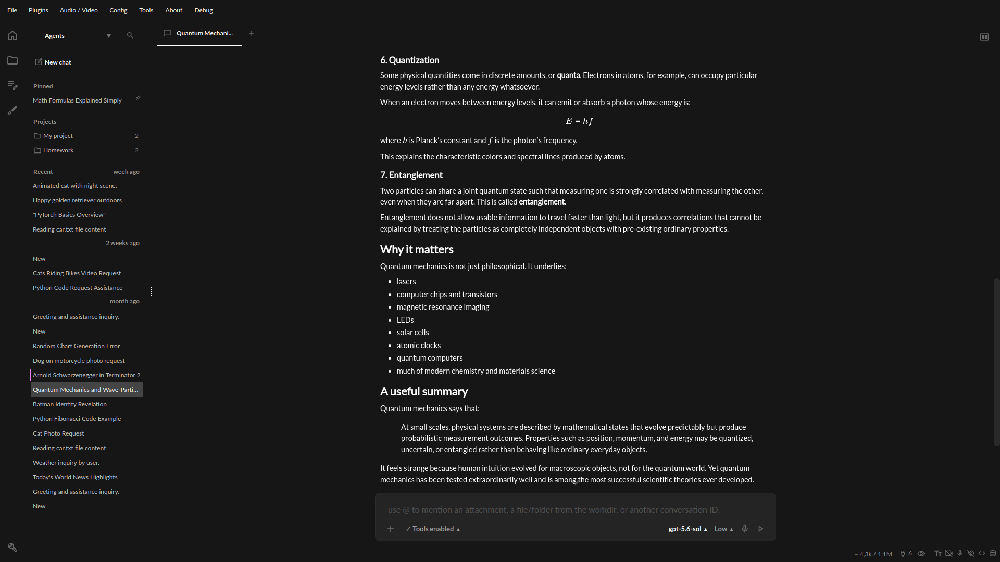
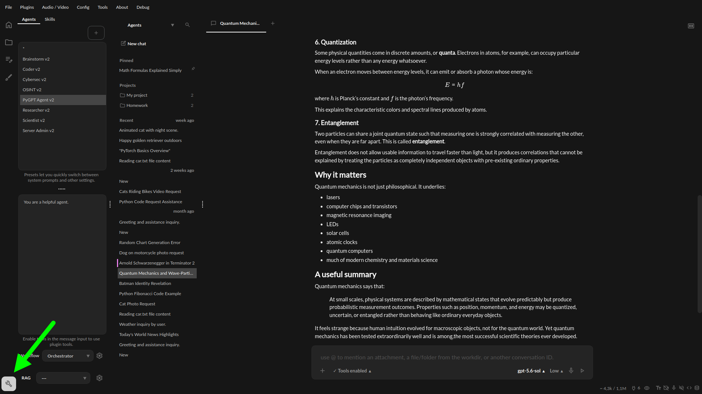
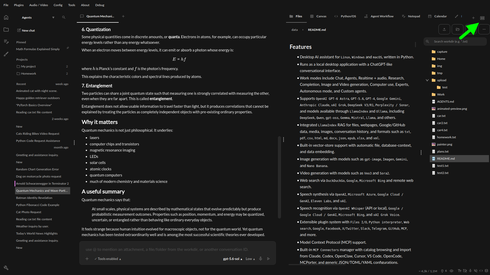
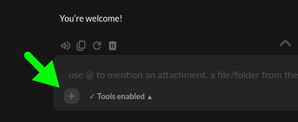
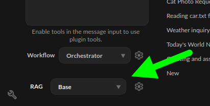
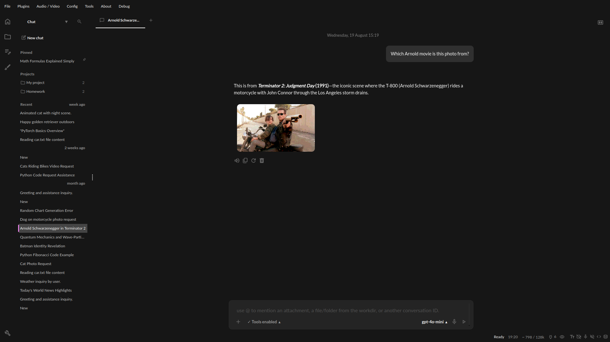
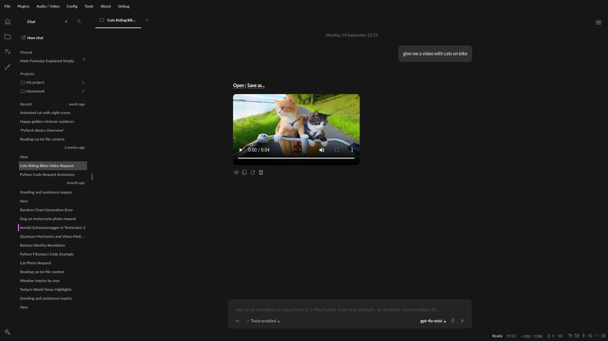

Modes
=====

Chat
-----

In **PyGPT**, this mode lets you chat with models such as ``GPT-6 Astra/Luna/Sol``, ``GPT-5.6``, ``Claude``, ``Gemini``, ``Grok``, ``Sonar (Perplexity)``, ``DeepSeek``, and many others, including local models running through ``Ollama``.

The Chat mode supports regular conversations as well as more advanced tasks, including calling tools, executing Python code, using external integrations through MCP, searching the web, uploading and analyzing attachments, working with images, and generating new images. Depending on the selected model and enabled tools, it can also perform multi-step tasks that combine several of these capabilities in a single conversation.

PyGPT, in this and other modes, can use native SDKs provided by popular AI providers such as OpenAI, Google, Anthropic, and xAI. It also supports OpenAI-compatible ``Chat Completions API`` endpoints, custom providers, and providers available through LlamaIndex integrations. Both cloud-based and locally hosted models are supported, allowing PyGPT to work with a wide range of commercial, self-hosted, and local AI backends.

   Currently built-in native clients:

   - Anthropic SDK
   - OpenAI SDK
   - Google GenAI SDK
   - xAI SDK

The main window is divided into several sections: tabs at the top, the main chat area in the center, the user input at the bottom, conversation history on the left, and the Toolbox with additional tools and options. PyGPT also supports split-screen mode, allowing you to work with multiple conversations side by side.

Toolbox expanded:

Right column expanded (split screen):

At the bottom of the chat window, PyGPT also shows an estimated number of tokens that will be sent to the model, as well as the number of tokens used for each generated response.

**Attachments:** You can attach and upload files from the input area. See :doc:`Files and Attachments <attachments>` for supported formats and attachment modes.

**RAG:** At the bottom of the toolbox, use the ``RAG`` selector to choose an index for additional context. When a valid index is selected, Chat is routed from the normal native/OpenAI-compatible SDK path to the LlamaIndex RAG runtime automatically. Select ``---`` to use the normal Chat provider path. See :doc:`indexing` for RAG modes, indexing, project indexes, vector stores, and retrieval configuration.

**Vision:** If the selected model is multimodal and supports image input, vision is available natively by default. For models without native vision support, enable the ``Vision (inline)`` plugin to automatically route image analysis through a configured vision-capable model.

Images can be analyzed in real time from attachments, the camera enabled from the ``Audio / Video`` menu, or screenshots captured directly from the application. You can also use the built-in drawing tool to quickly sketch, annotate images, add arrows and markings, and send the result directly for analysis.

**Image generation:** If you want to generate images directly in chat, enable the ``Image generation (inline)`` plugin in the Plugins menu. The plugin allows you to generate images in Chat mode.

For supported models/providers, you can alternatively enable the provider-side image-generation remote tool in ``Config -> Settings -> Remote Tools``. When available, this lets the model generate images natively without the inline plugin.

Agents
----------------

**Agents** is PyGPT's multi-agent work mode for tasks that benefit from delegation, parallel execution, tool use, verification, and specialist workers. It uses a dedicated runtime built on LlamaIndex agent workflows and is separate from the more experimental ``Custom agents`` mode and the separate ``Autonomous mode``.

The **Workflow** selector below the system prompt controls how the workflow operates. The default workflow is **Chat**.

Agent modes
^^^^^^^^^^^

**Chat**
   The default mode. The primary agent responds directly and can delegate tasks to workers when useful.

**Orchestrator**
   Coordinates specialist workers for structured, multi-step tasks. The default limit is ``16`` workers; set **Max workers (Chat / Orchestrator)** to ``0`` for no limit.

**Swarm**
   Launches a group of workers and reports aggregate progress. If no worker count is requested, the orchestrator chooses a small team. Swarm has no built-in worker-count limit.

.. warning::
   Large swarms can generate high API/token usage and many concurrent tool operations. Use a reasonable worker count, especially when tools can modify files or execute commands.

Autonomous execution
^^^^^^^^^^^^^^^^^^^^

The selected workflow continues across intermediate checkpoints until it completes, needs user input, is stopped, or reaches a configured limit. Agents can use available tools, inspect results and verify work before returning the final response.

Iteration limits apply to internal agent cycles rather than user conversation turns. Reaching a limit may return incomplete work; ``0`` disables the corresponding application-level limit.

Swarm collaboration
^^^^^^^^^^^^^^^^^^^

Swarm workers can exchange messages, share findings and coordinate work while the workflow is running. Peer messages are treated as worker output, not as user instructions or authorization.

Agent Workflows
^^^^^^^^^^^^^^^^^^^^^^^^^^^^^^^^^

Open ``Config -> Agent Workflows...`` or use the settings icon in the Agents toolbox. The built-in **Chat**, **Orchestrator**, and **Swarm** profiles cannot be deleted. Their prompts can be customized, while their runtime type remains fixed.

Use **New** to create a custom profile with a name, system prompt, and **Runtime**: **Primary agent**, **Orchestrator**, or **Swarm**. The selected runtime controls how the profile delegates work and which workflow tools are available.

Custom profiles use only the prompt you provide. **From defaults** loads the built-in prompt for the selected runtime as a starting point. Older custom profiles without a runtime setting continue to use **Orchestrator**.

The editor also includes a Help reference for workflow tools and runtime context placeholders.

Agent Workflow monitor
^^^^^^^^^^^^^^^^^^^^^^

The built-in **Agent Workflow** tool provides a real-time view of an active Agents run. It groups the primary agent/orchestrator and worker agents into a readable tree and shows timestamped run events such as status updates, worker creation, task execution and tool calls. Tool rows can be expanded to inspect input/output, and each agent exposes a **Details** panel with the runtime metadata available for that agent, including prompts and task/input information.

Open the monitor from ``Tools -> Agent Workflow`` or pin it as an output tab. It is included in the default second-column tab layout and is revealed automatically on the first actual Agents run.

The monitor is runtime-only. Every new top-level agent run clears the previous view automatically, and **Clear view** can clear it manually. The tool does not replace persisted conversation history, the full-workflow rendering option, or Debug workflow logging.

Project instructions with ``.agents/``
^^^^^^^^^^^^^^^^^^^^^^^^^^^^^^^^^^^^^^^^^^^^^^

Agents can use an optional ``%workdir%/.agents/`` directory for project-specific instructions and agent resources. PyGPT does **not** read or append these files automatically. When **Add support for .agents directory** is enabled in ``Settings -> Agents and experts -> Agents`` (default: on), PyGPT checks the active conversation/project workdir when the run starts. If ``.agents/`` exists, the top-level Agents prompt receives the directory layout and tells the agent to inspect the relevant files itself. If it does not exist, the prompt only mentions that the agent may create ``.agents/`` and keep persistent work notes under ``.agents/memories/``.

Example layout:

.. code-block:: text

   .agents/
   ├── agents.md            # additional instructions
   ├── system-prompt.md     # system prompt
   ├── mcp.json             # MCP server configuration
   ├── skills/
   │   └── code-review/
   │       └── skill.md     # skill definition
   ├── agents/
   │   └── code-reviewer/
   │       └── agent.md     # sub-agent profile
   ├── tasks/
   │   └── daily-code-review/
   │       └── task.md      # repeat task
   └── memories/
       └── project-arch.md  # persistent memory for agents

The agent may create or update its own persistent project notes in ``.agents/memories/``. Reading and writing still depends on the filesystem/tools exposed to that agent and the normal PyGPT security rules. The existence check is performed once per run against the active host workdir, including a project-specific workdir. The same convention can be enabled independently for **Custom agents** in ``Settings -> Agents and experts -> Custom agents``.

Tools and provider capabilities
^^^^^^^^^^^^^^^^^^^^^^^^^^^^^^^

Agents can use both local and provider-side capabilities:

* **Local tools** from enabled PyGPT plugins can be made available to the primary agent/orchestrator and workers.
* **Remote tools** exposed by the selected provider can be made available when supported by the provider/model and enabled in PyGPT.
* Local and remote tools can be enabled or disabled independently in the Agents preset with ``Allow local tools`` and ``Allow remote tools``.
* Models with native function calling use it when available. For compatible models without native function calling, the runtime can use a ReAct agent as a fallback.

Local plugin execution is integrated with the normal PyGPT command/tool system, so enabled plugins can provide filesystem access, Python interpreter, system commands, web search, custom commands, integrations, and other capabilities according to their own configuration and security restrictions.

Settings
^^^^^^^^

Agent-related application settings are available under ``Settings -> Agents and experts``. The **Agents** section contains settings intended for this workflow. ``Add support for .agents directory`` is enabled by default and adds the directory-usage guidance described above. ``Show full tool-chain in Agents`` is disabled by default. When enabled, the final response stores and displays the complete chain of normal tool calls performed during the workflow, with a separate expandable Request/Response pair for each tool call. Internal orchestration and worker-management tools are excluded.

The global ``Chats -> Render -> Display tool calls JSON`` option must also be enabled for expandable request/response blocks to be shown. If it is disabled, tool execution remains unchanged and live tool activity is represented by one aggregated ``Tool/Tools`` status row.

``Display full agent workflow`` is disabled by default. When enabled, completed Agents turns keep the full visible sequence of persisted agent partial responses in the chat, followed by the final response, both immediately after completion and after reloading the conversation. When disabled, completed turns are collapsed to the authoritative final response only. This setting controls UI rendering only; it does not change what is stored in the database or the separate ``Restore full workflow history on next request`` policy used for model-facing history.

``Restore full workflow history on next request`` controls how completed Agents turns are replayed to the main agent on later requests. It is enabled by default for backward compatibility. When enabled, PyGPT rebuilds the ordered workflow from durable partials and restores intermediate main-agent output together with persisted worker results. This provides richer continuity but can use substantially more input tokens. When disabled, PyGPT restores only the authoritative final response from each completed Agents turn. The full workflow remains stored in the database and available to the UI; it is simply omitted from later model-facing history, reducing token usage at the cost of less detailed workflow context.

The same policy is used by the live history token estimate and by Advanced Context Handling when it sizes and snapshots durable history for checkpoints. With final-response-only history selected, those checkpoint snapshots use the final response rather than reintroducing the full stored workflow. Compact rolling memory created inside a currently running long workflow remains available so Advanced Context Handling can keep that active run coherent.

The runtime worker-count and iteration limits are configurable in the same section:

* ``Max iterations (Chat / Orchestrator)`` - main-agent iteration limit for Chat and Orchestrator. Default: ``48``.
* ``Max workers (Chat / Orchestrator)`` - maximum number of worker agents that can be created in Chat and Orchestrator workflows. Default: ``16``; set ``0`` for unlimited. This setting does not limit Swarm size.
* ``Max iterations (Swarm)`` - main-agent/orchestrator iteration limit for Swarm. Default: ``4096``.
* ``Worker max iterations`` - per-worker iteration limit in all Agents modes. Default: ``24``.

For every limit, ``0`` means **unlimited**. The three iteration settings control internal agent reasoning/tool-call cycles, not user conversation turns; the worker limit controls how many worker agents may be created in a Chat or Orchestrator workflow. Higher or unlimited values may substantially increase API calls, token consumption, execution time, and tool activity. Swarm keeps its separately declared worker count and is not constrained by the Chat/Orchestrator worker limit.

Options specific to older agent implementations are kept in the **Options** tab. ``Display full agent output in chat view`` controls full output rendering for legacy agent modes, while ``Display a tray notification when the goal is achieved`` controls legacy agent completion notifications. These options do not control the Agents tool-chain display.

RAG, attachments and artifacts
^^^^^^^^^^^^^^^^^^^^^^^^^^^^^^^

If a valid index is selected in the Agents preset, a ``query_index`` RAG tool is exposed to the workflow. User attachments and extracted attachment context are shared with the active workflow and its workers. When the selected model supports image input, current image attachments are also supplied as native image blocks.

Files, images, URLs and attachments produced by workers, local tools, or supported provider-side tools are collected by the runtime and propagated to the main user-visible response.

Memory
^^^^^^

The user-facing primary agent or orchestrator keeps hidden conversation history across turns in the current conversation/preset. This history is subject to the normal PyGPT/model token-window policy. For completed Agents turns, the ``Restore full workflow history on next request`` setting determines whether later requests receive the full persisted workflow or only the final response. Worker memory inside the active workflow is runtime-local and can be retained when the same worker is reused during that workflow.

Worker lifecycle by mode
^^^^^^^^^^^^^^^^^^^^^^^^

**Chat**
   The primary agent delegates individual tasks to workers when useful. The normal interaction remains a direct chat with the primary agent, so the full worker-management lifecycle is not the main user-facing workflow.

**Orchestrator**
   The orchestrator explicitly manages workers with operations for creating, updating, running, inspecting, waiting for, stopping, and removing them. The workflow cannot be finalized while required worker activity remains unresolved.

**Swarm**
   Swarm extends the orchestrator lifecycle with swarm initialization and aggregate swarm-status reporting. The runtime tracks the requested swarm size, numbers workers for status output, and reports collective progress while the swarm is active.

Recommended use cases
^^^^^^^^^^^^^^^^^^^^^

Use **Chat** for general agent conversations and tasks where delegation is occasional. Use **Orchestrator** for controlled multi-stage work such as coding and file operations, research with independent verification, RAG-assisted tasks, implementation plus testing, or workflows that combine several tools. Use **Swarm** only when a task genuinely benefits from many parallel, independent workers and you intentionally want to choose the swarm size yourself.

Agent Skills
^^^^^^^^^^^^

**Agent Skills** extend Agents with reusable ``SKILL.md`` instruction packages containing procedures, references, scripts and assets. Enabled skills are discovered from compact metadata and loaded only when needed. See :doc:`skills` for installation, supported formats, runtime behavior and security notes.

Realtime + audio
----------------
This mode provides native, low-latency voice conversations with **OpenAI Realtime**, **Google Gemini Live**, and **xAI Grok** real-time models. Audio is streamed directly between PyGPT and the selected provider without the regular audio input/output plugins.

The audio toolbox exposes a single turn-control option: **Auto (VAD)**. The separate **Loop** switch has been removed. Auto VAD now owns the complete continuous ``listen -> respond -> listen`` cycle. Fresh profiles start with Auto VAD disabled.

* **Auto (VAD)** - enables automatic voice activity detection for the live microphone stream. While you speak, microphone audio is streamed to the active real-time provider. The provider detects speech boundaries using the configured VAD prefix padding and end-silence values, commits the utterance automatically, and PyGPT stops the current capture as the model response begins.
* After the model's audio response finishes playing, PyGPT automatically starts the microphone again for the next VAD turn. There is no separate Loop setting to enable for this behavior.
* You can click the microphone while a response is still pending or playing to start a new turn immediately. PyGPT interrupts the current response/playback, preserves the partial assistant output already received, keeps the live provider session open, and starts the new microphone capture.
* Pressing **Esc** or using **Stop** cancels the current capture/response, stops playback, and cancels any queued automatic VAD restart. Auto VAD remains enabled, but the automatic cycle stays paused until you explicitly start the microphone again.
* Sending a normal typed message while Auto VAD is active also pauses the automatic listen/respond/listen cycle. Click the microphone to resume voice turns; the live provider session/conversation is kept.
* With **Auto (VAD)** disabled, microphone turns are manual and PyGPT does not automatically restart listening after a response.

The VAD timing can be adjusted in ``Config -> Settings -> Audio -> Options`` with **VAD prefix padding (in ms)** (default: ``300``) and **VAD end silence (in ms)** (default: ``2000``). Prefix padding preserves audio immediately before detected speech starts; end silence controls how long silence must last before the utterance is considered complete.

Research
--------

## Research

**Research** is a provider-aware mode designed for models and APIs specialized in web research, information gathering, and deep-research workflows. It is intended for tasks that require searching multiple sources, collecting and comparing information, and producing more comprehensive, source-grounded answers.

Depending on the selected model and provider, PyGPT can use Perplexity Sonar research models as well as other provider-specific research paths, including Google Deep Research through the **Interactions API**. The exact workflow, available tools, and research capabilities depend on the selected provider and model.

.. warning::
   Regular tool calls are temporarily disabled in **Research** mode. RAG can still be selected, but support is provider/model-dependent and may not work correctly with some research models or provider-specific research APIs. Verify the response when indexed RAG context is required.

Completion
----------
An older mode of operation that allows working in the standard text completion mode. However, it allows for a bit more flexibility with the text by enabling you to initiate the entire discussion in any way you like.

Similar to chat mode, on the right-hand side of the interface, there are convenient presets. These allow you to fine-tune instructions and swiftly transition between varied configurations and pre-made prompt templates.

Additionally, this mode offers options for labeling the AI and the user, making it possible to simulate dialogues between specific characters - for example, you could create a conversation between Batman and the Joker, as predefined in the prompt. This feature presents a range of creative possibilities for setting up different conversational scenarios in an engaging and exploratory manner.

Image and video generation
--------------------------

**PyGPT** enables quick and easy image and video generation using models such as ``gpt-image``, ``Imagen``, ``Gemini``, ``Nano Banana``, and ``Grok`` for images, as well as ``Veo`` and ``Sora`` for video.

Generating images and videos works similarly to a chat conversation: you provide a prompt, the selected model generates the requested media, and PyGPT downloads, saves, and displays the result in the application. In ``Image and video`` mode, you can either send a raw prompt directly to the model or ask PyGPT to prepare and optimize the prompt for you.

To generate images directly inside a chat, enable **Image generation (inline)** in the Plugins menu.

For supported models/providers, you can also enable remote image generation in ``Config -> Settings -> Remote Tools``. If enabled, image generation is available natively in supported work modes without the inline plugin.

**Tip:** To use ``Imagen`` models you must enable ``Use Vertex AI`` in ``Config -> Settings -> API Keys -> Google -> Advanced options``.

**Remix, Edit, or Extend**

To remix or extend from a previous image or video instead of creating a new one from scratch, enable the ``Remix/Extend`` option checkbox in the toolbox. The last generated image or video in the current context will be used as a reference for your prompt, allowing you to request changes to the generated content. If the ``Remix/Extend`` option is enabled, uploading an image attachment as a reference will not take effect.

**Raw mode**

There is an option for switching prompt generation mode.

If **Raw Mode** is enabled, a model will receive the prompt exactly as you have provided it.
If **Raw Mode** is disabled, a model will generate the best prompt for you based on your instructions.

**Image storage**

Generated images and videos are automatically saved to the working directory, under the ``img`` or ``video`` folder depending on the media type. You can also quickly save generated media to another location, open a preview, view it in full size, or remove it when it is no longer needed.

By default, images are stored in the base-profile ``img`` directory. If **Store images, captures, and uploads in the workdir data directory** is enabled, generated images are stored under the active ``data`` workdir instead, including a custom project data workdir when one is active.

Computer use
-------------

.. warning::
   **Computer use can give the model full control of your computer.** The model can move the mouse, type, click, open applications, read visible content, and perform actions with your user permissions. Use this mode only for tasks you trust and supervise sensitive operations.

Computer use lets supported models operate the desktop or browser through mouse and keyboard actions.

PyGPT uses the selected provider's native ``Computer use`` capability when supported by the current model (OpenAI, Google, or Anthropic), combined with the built-in ``Mouse and keyboard`` integration.

**Example of use:**

.. code-block:: ini

   Click on the Start Menu to open it, search for the Notepad in the list, and run it.

You can change the environment in which the navigation mode operates by using the list at the bottom of the toolbox.

**Available Environments:**

* Browser
* Linux
* Windows
* Mac

You can run this mode in a browser sandbox powered by ``Playwright``. The Playwright package and at least one browser engine must be installed in an environment accessible to PyGPT. For example, to install Chromium:

.. code-block:: ini

   pip install playwright
   playwright install chromium

You can install another supported engine instead with ``playwright install firefox`` or ``playwright install webkit``.

Then open ``Plugins -> Settings -> Mouse and keyboard -> Sandbox (Playwright)`` and configure the sandbox:

* set ``Engine`` to the installed browser engine, for example ``chromium``;
* leave ``Browsers directory`` empty when using Playwright's default browser location, or set it to the custom directory where the Playwright browsers are installed;
* optionally configure ``Headless mode``, browser arguments, home URL and viewport size.

Finally, enable the ``Sandbox`` switch in the Computer use toolbox when you want Computer use to run inside the Playwright browser sandbox.

.. tip::
   **DO NOT** enable the ``Mouse and keyboard`` plugin in ``Computer use`` mode — it is already connected to ``Computer use`` mode in the background.

Experts
-------

**Experts** lets you define reusable, specialized agents as presets and delegate tasks to them from a normal conversation. Experts are powered by regular agents from the same **Agents v2 runtime** that powers **Agents**. There is no separate legacy execution engine for an Expert.

Each enabled Expert is exposed to the current conversation as a regular ``expert_call`` tool. The main model can call it in exactly the same way as other tools: it selects an Expert, passes an instruction, waits for the agent to complete the task, and receives the Expert's final response directly as the tool result.

In **Experts** mode, the main conversation follows the normal **Chat** tool flow. Enabled local tools from plugins and supported remote provider tools remain available according to the usual Chat configuration, while ``expert_call`` adds the ability to delegate work to specialized agents.

Each Expert uses its own preset configuration, including its model/provider, system prompt, local and remote tool permissions, and optional RAG index. Because Experts run on the same runtime as **Agents**, they use the same agent and tool infrastructure. Each Expert also keeps an isolated hidden child context inside the parent conversation, so repeated calls to the same Expert can retain that Expert's own conversation memory without mixing it with the memory of other Experts.

How to use Experts
~~~~~~~~~~~~~~~~~~

1. Switch to **Experts** mode and create or edit an Expert preset. Give it a clear ID/name and specialized instructions, then enable it.
2. Start a conversation in **Experts** mode, or enable the **Experts (inline)** plugin to make the same Experts available in another supported chat mode.
3. Ask the model to use the Expert in natural language. For example:

.. code-block:: ini

   Ask the Python programmer expert to review this code and suggest a fix.

The main model can then invoke ``expert_call`` automatically, use the returned result in its own answer, and call other tools or Experts if the task requires it. You do not need to manually start a separate Expert session. Defining and enabling the Expert is enough for it to become available to the model.

Experts can be activated or deactivated from the preset list using the RMB context menu and the ``Enable/Disable`` actions. Only enabled Experts are exposed through ``expert_call``.

The **Experts (inline)** plugin does not implement a separate Expert engine. It exposes the same ``expert_call`` tool in supported chat modes and executes the selected Expert through the same **Agents / Agents v2** runtime.

Autonomous mode
---------------

``Autonomous mode`` is a single-agent loop for tasks that should continue across multiple model passes without requiring a new user message after every step. The same model keeps working on the original request, reviews the accumulated result, performs additional useful work or verification, and continues until the run is stopped by its configured rules. It does not create or orchestrate worker agents.

The current implementation is **Chat-backed**. Autonomous requests use the same bridge, provider routing, API selection, native tool/function-call settings, and normal tool execution flow as standard ``Chat``.

RAG / index routing
~~~~~~~~~~~~~~~~~~~

Autonomous uses the same global ``RAG`` selector shown at the bottom of the toolbox. If no index is selected, it follows normal Chat routing. Selecting a valid index routes the run through the LlamaIndex RAG runtime with that index. Select ``---`` to keep normal Chat routing.

Run controls
~~~~~~~~~~~~

* **Max run steps (iterations)** limits the number of autonomous model passes. Set it to ``0`` for an unlimited loop. Tool calls and their results are handled inside the normal tool flow and do not represent a separate user turn.
* **Auto-stop** allows the agent to terminate the run early when it determines that the original goal is complete, or when a run-control condition requires stopping. When Auto-stop is disabled, the agent is not given the internal completion-control tool; the loop is then governed by the configured run limit or a manual/application stop.
* **Always continue** keeps the run open-ended and instructs the agent to continue exploring useful in-scope refinements instead of voluntarily finishing. Enabling it automatically disables Auto-stop and ignores the configured iteration limit, so the run continues until it is stopped externally.
* **Dynamic continuous prompt** is enabled by default. After each completed Autonomous pass, PyGPT makes a hidden, tool-free call to the same selected model and uses it as a judge. The judge receives the original user input plus a configurable tail of recent Assistant responses from the current Autonomous run, identifies the highest-value remaining correction, verification, or refinement, and returns only the instruction for the next pass. That instruction is displayed in the live conversation as a localized ``Judge:`` pseudo-input, but it does not create a new user turn. If the judge call fails or returns an empty result, PyGPT falls back to the normal static continuation prompt.
* **Responses to judge** controls how many of the most recent Autonomous Assistant responses are included in that hidden judge request. The original user input is always included. The default is ``3``; set it to ``0`` to include every Assistant response produced since the current user input. Tool rounds belonging to one Autonomous provider pass are grouped into that pass rather than counted as separate judge responses.
* **Auto-stop** and **Always continue** are mutually exclusive. Enabling either one immediately disables the other; both may also be disabled.

When the run limit is set to ``0``, PyGPT shows an infinite-loop confirmation because an unattended run can generate substantial API usage, token consumption, and repeated tool actions.

.. warning::
   Autonomous execution can perform repeated tool calls and external actions. Review enabled plugins and remote tools before starting a long or unlimited run, especially when file access, code/system execution, web actions, or other side effects are available.

Custom agents
-------------

**Custom agents** is a flexible, slightly older LlamaIndex-based agent mode. For most multi-agent tasks, the newer **Agents** mode is recommended because it provides the current primary agent runtime, workflow monitor, worker management, and newer orchestration features.

The mode remains available for experimentation with non-standard agent workflow patterns and direct workflow construction. Built-in patterns include:

* Simple / function agent
* Agent with experts
* Agent with feedback
* Agent with experts + feedback
* Structured planner
* Researcher
* Bot-to-bot (B2B)
* Evolve
* Supervisor + worker

You can create your own workflow constructions with the visual node editor in ``Tools -> Custom agent builder``. This makes it possible to experiment with custom graphs, routing, shared memory, bot-to-bot flows, Evolve-style loops, and other non-standard agent designs without implementing the complete workflow graph by hand.

You can also create your own agent provider by inheriting from ``pygpt_net.provider.agents.base``.

Tools and Plugins
^^^^^^^^^^^^^^^^^

Commands from active plugins can be exposed to Custom agents as tools according to the selected workflow and preset configuration.

``Add support for .agents directory`` is enabled by default in ``Settings -> Agents and experts -> Custom agents``. At the start of a Custom agent run, PyGPT checks the active workdir. When ``.agents/`` exists, the agent receives the same project-directory guidance as Agents; otherwise it receives only the short note about optionally creating ``.agents/`` and using ``.agents/memories/``. Files are read by the agent when needed rather than preloaded by PyGPT.

RAG - using indexes
^^^^^^^^^^^^^^^^^^^

If an index is selected in the agent preset, a tool for reading data from the index is automatically added to the agent, creating a RAG workflow automatically.

Custom agents currently supports text input only; multimodal input is not available.

Loop / Evaluate Mode
^^^^^^^^^^^^^^^^^^^^

You can run a Custom agent in an autonomous evaluate/improve loop. When ``Loop / Evaluate`` is enabled, another agent evaluates the current result and requests improvements until the configured score or completion threshold is reached, the step limit is reached, or the run is stopped.

You can choose between two evaluation methods:

* By the percentage of tasks completed
* By the accuracy (score) of the final response

The loop limit is configured in ``Settings -> Agents and experts -> Custom agents -> Max evaluation steps in loop``. Set it to ``0`` for no application-level limit. Evaluation prompts can be adjusted in ``Settings -> Prompts -> Agent: response evaluation in loop [LlamaIndex]``.
