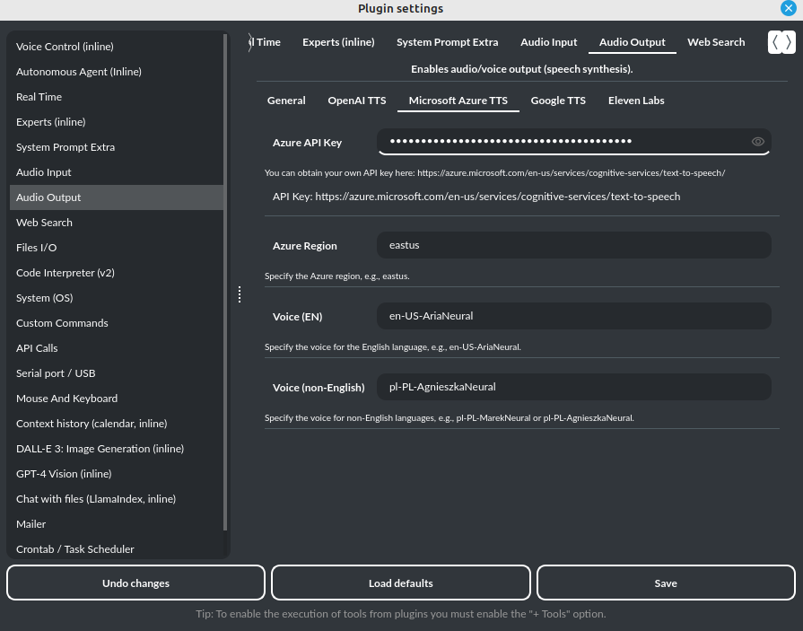
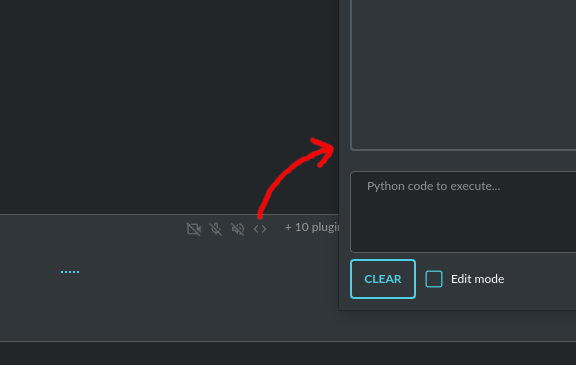
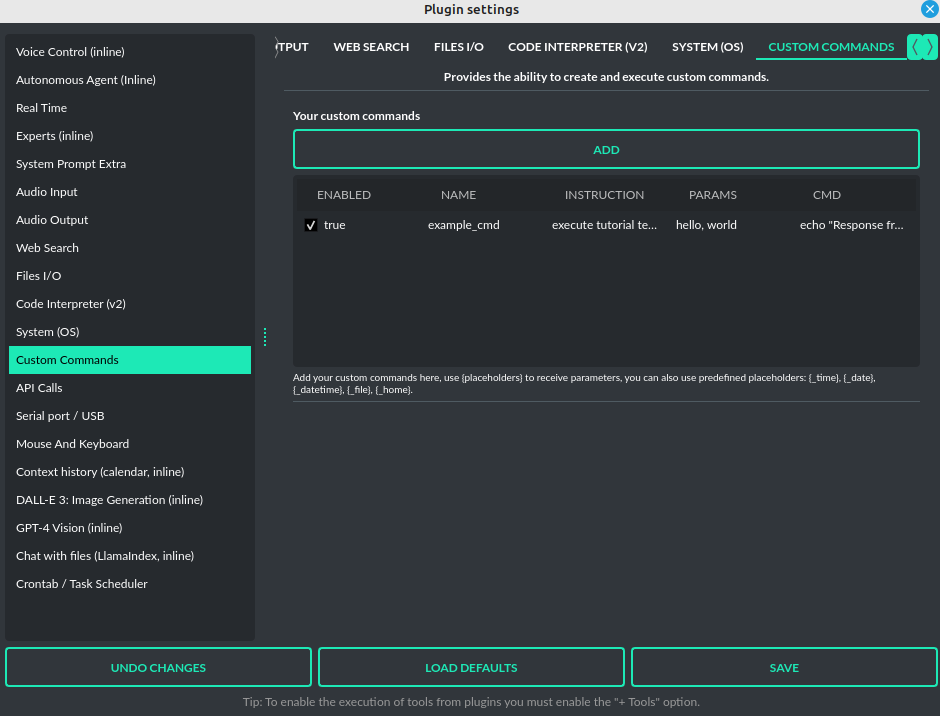
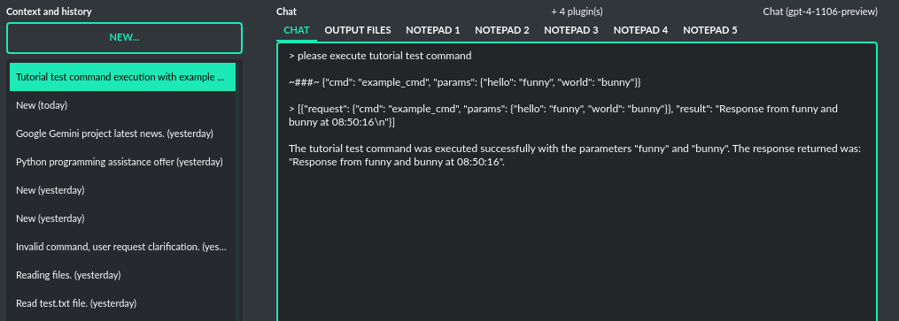
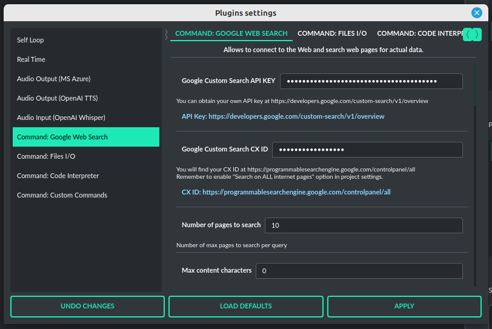
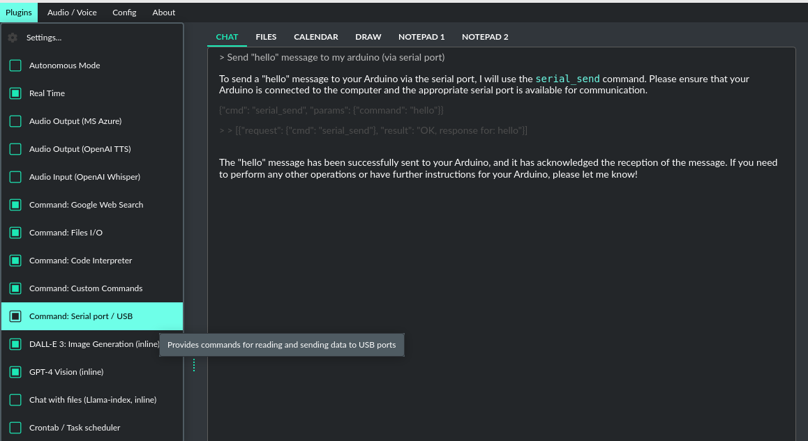
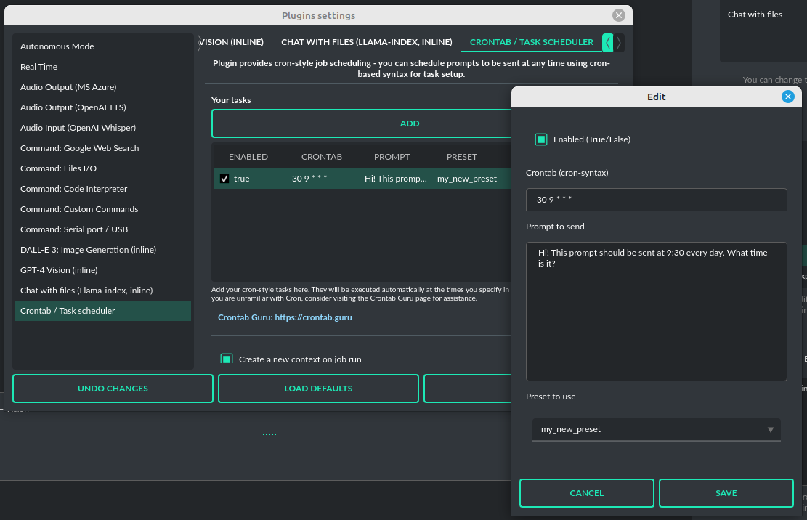
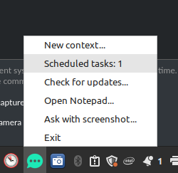

Plugins
=======

**PyGPT** can be enhanced with plugins to add new features.

**Tip:** Plugins works best with GPT-4 models.

The following plugins are currently available, and model can use them instantly:

* ``Audio Input`` - provides speech recognition.
* ``Audio Output`` - provides voice synthesis.
* ``Autonomous Agent (inline)`` - enables autonomous conversation (AI to AI), manages loop, and connects output back to input. This is the inline Agent mode.
* ``Chat with files (Llama-index, inline)`` - plugin integrates Llama-index storage in any chat and provides additional knowledge into context (from indexed files).
* ``API calls`` - plugin lets you connect the model to the external services using custom defined API calls.
* ``Code Interpreter`` - responsible for generating and executing Python code, functioning much like the `Code Interpreter` on `ChatGPT`, but locally. This means GPT can interface with any script, application, or code. The plugin can also execute system commands, allowing GPT to integrate with your operating system. Plugins can work in conjunction to perform sequential tasks; for example, the `Files` plugin can write generated Python code to a file, which the `Code Interpreter` can execute it and return its result to GPT.
* ``Custom Commands`` - allows you to create and execute custom commands on your system.
* ``Files I/O`` - grants access to the local filesystem, enabling GPT to read and write files, as well as list and create directories.
* ``System (OS)`` - provides access to the operating system and executes system commands.
* ``Mouse and Keyboard`` - provides the ability to control the mouse and keyboard by the model.
* ``Web Search`` - provides the ability to connect to the Web, search web pages for current data, and index external content using Llama-index data loaders.
* ``Serial port / USB`` - plugin provides commands for reading and sending data to USB ports.
* ``Context history (calendar, inline)`` - provides access to context history database.
* ``Crontab / Task scheduler`` - plugin provides cron-based job scheduling - you can schedule tasks/prompts to be sent at any time using cron-based syntax for task setup.
* ``DALL-E 3: Image Generation (inline)`` - integrates DALL-E 3 image generation with any chat and mode. Just enable and ask for image in Chat mode, using standard model like GPT-4. The plugin does not require the ``+ Tools`` option to be enabled.
* ``Experts (inline)`` - allows calling experts in any chat mode. This is the inline Experts (co-op) mode.
* ``GPT-4 Vision (inline)`` - integrates vision capabilities with any chat mode, not just Vision mode. When the plugin is enabled, the model temporarily switches to vision in the background when an image attachment or vision capture is provided.
* ``Real Time`` - automatically appends the current date and time to the system prompt, informing the model about current time.
* ``System Prompt Extra`` - appends additional system prompts (extra data) from a list to every current system prompt. You can enhance every system prompt with extra instructions that will be automatically appended to the system prompt.
* ``Voice Control (inline)`` - provides voice control command execution within a conversation.

Creating Your Own Plugins
-------------------------

You can create your own plugin for **PyGPT** at any time. The plugin can be written in Python and then registered with the application just before launching it. All plugins included with the app are stored in the ``plugin`` directory - you can use them as coding examples for your own plugins.

PyGPT can be extended with:

* Custom plugins
* Custom LLMs wrappers
* Custom vector store providers
* Custom data loaders
* Custom audio input providers
* Custom audio output providers
* Custom web search engine providers

**Examples (tutorial files)** 

See the ``examples`` directory in this repository with examples of custom launcher, plugin, vector store, LLM (Langchain and Llama-index) provider and data loader:

* ``examples/custom_launcher.py``
* ``examples/example_audio_input.py``
* ``examples/example_audio_output.py``
* ``examples/example_data_loader.py``
* ``examples/example_llm.py``
* ``examples/example_plugin.py``
* ``examples/example_vector_store.py``
* ``examples/example_web_search.py``

These example files can be used as a starting point for creating your own extensions for **PyGPT**.

Extending PyGPT with custom plugins, LLMs wrappers and vector stores:

- You can pass custom plugin instances, LLMs wrappers and vector store providers to the launcher.

- This is useful if you want to extend PyGPT with your own plugins, vectors storage and LLMs.

To register custom plugins:

- Pass a list with the plugin instances as ``plugins`` keyword argument.

To register custom LLMs wrappers:

- Pass a list with the LLMs wrappers instances as ``llms`` keyword argument.

To register custom vector store providers:

- Pass a list with the vector store provider instances as ``vector_stores`` keyword argument.

To register custom data loaders:

- Pass a list with the data loader instances as ``loaders`` keyword argument.

To register custom audio input providers:

- Pass a list with the audio input provider instances as ``audio_input`` keyword argument.

To register custom audio output providers:

- Pass a list with the audio output provider instances as ``audio_output`` keyword argument.

To register custom web providers:

- Pass a list with the web provider instances as ``web`` keyword argument.

**Example:**

.. code-block:: python

   # custom_launcher.py

   from pygpt_net.app import run
   from plugins import CustomPlugin, OtherCustomPlugin
   from llms import CustomLLM
   from vector_stores import CustomVectorStore

   plugins = [
       CustomPlugin(),
       OtherCustomPlugin(),
   ]
   llms = [
       CustomLLM(),
   ]
   vector_stores = [
       CustomVectorStore(),
   ]

   run(
       plugins=plugins,
       llms=llms,
       vector_stores=vector_stores,
   )

Handling events
---------------

In the plugin, you can receive and modify dispatched events.
To do this, create a method named ``handle(self, event, *args, **kwargs)`` and handle the received events like here:

.. code-block:: python

   # custom_plugin.py

   from pygpt_net.core.events import Event
   

   def handle(self, event: Event, *args, **kwargs):
       """
       Handle dispatched events

       :param event: event object
       """
       name = event.name
       data = event.data
       ctx = event.ctx

       if name == Event.INPUT_BEFORE:
           self.some_method(data['value'])
       elif name == Event.CTX_BEGIN:
           self.some_other_method(ctx)
       else:
           # ...

**List of Events**

Event names are defined in ``Event`` class in ``pygpt_net.core.dispatcher.Event``.

Syntax: ``event name`` - triggered on, ``event data`` *(data type)*:

- ``AI_NAME`` - when preparing an AI name, ``data['value']`` *(string, name of the AI assistant)*

- ``AUDIO_INPUT_RECORD_START`` - start audio input recording

- ``AUDIO_INPUT_RECORD_STOP`` -  stop audio input recording

- ``AUDIO_INPUT_RECORD_TOGGLE`` - toggle audio input recording

- ``AUDIO_INPUT_TRANSCRIBE`` - on audio file transcribe, ``data['path']`` *(string, path to audio file)*

- ``AUDIO_INPUT_STOP`` - force stop audio input

- ``AUDIO_INPUT_TOGGLE`` - when speech input is enabled or disabled, ``data['value']`` *(bool, True/False)*

- ``AUDIO_OUTPUT_STOP`` - force stop audio output

- ``AUDIO_OUTPUT_TOGGLE`` - when speech output is enabled or disabled, ``data['value']`` *(bool, True/False)*

- ``AUDIO_READ_TEXT`` - on text read using speech synthesis, ``data['text']`` *(str, text to read)*

- ``CMD_EXECUTE`` - when a command is executed, ``data['commands']`` *(list, commands and arguments)*

- ``CMD_INLINE`` - when an inline command is executed, ``data['commands']`` *(list, commands and arguments)*

- ``CMD_SYNTAX`` - when appending syntax for commands, ``data['prompt'], data['syntax']`` *(string, list, prompt and list with commands usage syntax)*

- ``CMD_SYNTAX_INLINE`` - when appending syntax for commands (inline mode), ``data['prompt'], data['syntax']`` *(string, list, prompt and list with commands usage syntax)*

- ``CTX_AFTER`` - after the context item is sent, ``ctx``

- ``CTX_BEFORE`` - before the context item is sent, ``ctx``

- ``CTX_BEGIN`` - when context item create, ``ctx``

- ``CTX_END`` - when context item handling is finished, ``ctx``

- ``CTX_SELECT`` - when context is selected on list, ``data['value']`` *(int, ctx meta ID)*

- ``DISABLE`` - when the plugin is disabled, ``data['value']`` *(string, plugin ID)*

- ``ENABLE`` - when the plugin is enabled, ``data['value']`` *(string, plugin ID)*

- ``FORCE_STOP`` - on force stop plugins

- ``INPUT_BEFORE`` - upon receiving input from the textarea, ``data['value']`` *(string, text to be sent)*

- ``MODE_BEFORE`` - before the mode is selected ``data['value'], data['prompt']`` *(string, string, mode ID)*

- ``MODE_SELECT`` - on mode select ``data['value']`` *(string, mode ID)*

- ``MODEL_BEFORE`` - before the model is selected ``data['value']`` *(string, model ID)*

- ``MODEL_SELECT`` - on model select ``data['value']`` *(string, model ID)*

- ``PLUGIN_SETTINGS_CHANGED`` - on plugin settings update (saving settings)

- ``PLUGIN_OPTION_GET`` - on request for plugin option value ``data['name'], data['value']`` *(string, any, name of requested option, value)*

- ``POST_PROMPT`` - after preparing a system prompt, ``data['value']`` *(string, system prompt)*

- ``PRE_PROMPT`` - before preparing a system prompt, ``data['value']`` *(string, system prompt)*

- ``SYSTEM_PROMPT`` - when preparing a system prompt, ``data['value']`` *(string, system prompt)*

- ``UI_ATTACHMENTS`` - when the attachment upload elements are rendered, ``data['value']`` *(bool, show True/False)*

- ``UI_VISION`` - when the vision elements are rendered, ``data['value']`` *(bool, show True/False)*

- ``USER_NAME`` - when preparing a user's name, ``data['value']`` *(string, name of the user)*

- ``USER_SEND`` - just before the input text is sent, ``data['value']`` *(string, input text)*

You can stop the propagation of a received event at any time by setting ``stop`` to `True`:

.. code-block:: python

   event.stop = True

Events flow can be debugged by enabling the option ``Config -> Settings -> Developer -> Log and debug events``.

Plugins reference
-----------------

Audio Input
------------

The plugin facilitates speech recognition (by default using the ``Whisper`` model from OpenAI, ``Google`` and ``Bing`` are also available). It allows for voice commands to be relayed to the AI using your own voice. Whisper doesn't require any extra API keys or additional configurations; it uses the main OpenAI key. In the plugin's configuration options, you should adjust the volume level (min energy) at which the plugin will respond to your microphone. Once the plugin is activated, a new ``Speak`` option will appear at the bottom near the ``Send`` button  -  when this is enabled, the application will respond to the voice received from the microphone.

The plugin can be extended with other speech recognition providers.

**Options**

- ``Provider`` *provider*

Choose the provider. *Default:* `Whisper`

Available providers:

* Whisper (via ``OpenAI API``)
* Whisper (local model) - not available in compiled and Snap versions, only Python/PyPi version
* Google (via ``SpeechRecognition`` library)
* Google Cloud (via ``SpeechRecognition`` library)
* Microsoft Bing (via ``SpeechRecognition`` library)

**Whisper (API)**

- ``Model`` *whisper_model*

Choose the model. *Default:* `whisper-1`

**Whisper (local)**

- ``Model`` *whisper_local_model*

Choose the local model. *Default:* `base`

Available models: https://github.com/openai/whisper

**Google**

- ``Additional keywords arguments`` *google_args*

Additional keywords arguments for r.recognize_google(audio, **kwargs)

**Google Cloud**

- ``Additional keywords arguments`` *google_args*

Additional keywords arguments for r.recognize_google_cloud(audio, **kwargs)

**Bing**

- ``Additional keywords arguments`` *bing_args*

Additional keywords arguments for r.recognize_bing(audio, **kwargs)

**General options**

- ``Auto send`` *auto_send*

Automatically send recognized speech as input text after recognition. *Default:* `True`

- ``Advanced mode`` *advanced*

Enable only if you want to use advanced mode and the settings below. Do not enable this option if you just want to use the simplified mode (default). *Default:* `False`

**Advanced mode options**

- ``Timeout`` *timeout*

The duration in seconds that the application waits for voice input from the microphone. *Default:* `5`

- ``Phrase max length`` *phrase_length*

Maximum duration for a voice sample (in seconds).  *Default:* `10`

- ``Min energy`` *min_energy*

Minimum threshold multiplier above the noise level to begin recording. *Default:* `1.3`

- ``Adjust for ambient noise`` *adjust_noise*

Enables adjustment to ambient noise levels. *Default:* `True`

- ``Continuous listen`` *continuous_listen*

Experimental: continuous listening - do not stop listening after a single input. Warning: This feature may lead to unexpected results and requires fine-tuning with the rest of the options! If disabled, listening must be started manually by enabling the ``Speak`` option. *Default:* `False`

- ``Wait for response`` *wait_response*

Wait for a response before initiating listening for the next input. *Default:* `True`

- ``Magic word`` *magic_word*

Activate listening only after the magic word is provided. *Default:* `False`

- ``Reset Magic word`` *magic_word_reset*

Reset the magic word status after it is received (the magic word will need to be provided again). *Default:* `True`

- ``Magic words`` *magic_words*

List of magic words to initiate listening (Magic word mode must be enabled). *Default:* `OK, Okay, Hey GPT, OK GPT`

- ``Magic word timeout`` *magic_word_timeout*

he number of seconds the application waits for magic word. *Default:* `1`

- ``Magic word phrase max length`` *magic_word_phrase_length*

The minimum phrase duration for magic word. *Default:* `2`

- ``Prefix words`` *prefix_words*

List of words that must initiate each phrase to be processed. For example, you can define words like "OK" or "GPT"—if set, any phrases not starting with those words will be ignored. Insert multiple words or phrases separated by commas. Leave empty to deactivate.  *Default:* `empty`

- ``Stop words`` *stop_words*

List of words that will stop the listening process. *Default:* `stop, exit, quit, end, finish, close, terminate, kill, halt, abort`

Options related to Speech Recognition internals:

- ``energy_threshold`` *recognition_energy_threshold*

Represents the energy level threshold for sounds. *Default:* `300`

- ``dynamic_energy_threshold`` *recognition_dynamic_energy_threshold*

Represents whether the energy level threshold (see recognizer_instance.energy_threshold) for sounds should be automatically adjusted based on the currently ambient noise level while listening. *Default:* `True`

- ``dynamic_energy_adjustment_damping`` *recognition_dynamic_energy_adjustment_damping*

Represents approximately the fraction of the current energy threshold that is retained after one second of dynamic threshold adjustment. *Default:* `0.15`

- ``pause_threshold`` *recognition_pause_threshold*

Represents the minimum length of silence (in seconds) that will register as the end of a phrase. *Default:* `0.8`

- ``adjust_for_ambient_noise: duration`` *recognition_adjust_for_ambient_noise_duration*

The duration parameter is the maximum number of seconds that it will dynamically adjust the threshold for before returning. *Default:* `1`

Options reference: https://pypi.org/project/SpeechRecognition/1.3.1/

Audio Output
-------------------------

The plugin lets you turn text into speech using the TTS model from OpenAI or other services like ``Microsoft Azure``, ``Google``, and ``Eleven Labs``. You can add more text-to-speech providers to it too. ``OpenAI TTS`` does not require any additional API keys or extra configuration; it utilizes the main OpenAI key. 
Microsoft Azure requires to have an Azure API Key. Before using speech synthesis via ``Microsoft Azure``, ``Google`` or ``Eleven Labs``, you must configure the audio plugin with your API keys, regions and voices if required.

Through the available options, you can select the voice that you want the model to use. More voice synthesis providers coming soon.

To enable voice synthesis, activate the ``Audio Output`` plugin in the ``Plugins`` menu or turn on the ``Audio Output`` option in the ``Audio / Voice`` menu (both options in the menu achieve the same outcome).

**Options**

- ``Provider`` *provider*

Choose the provider. *Default:* `OpenAI TTS`

Available providers:

* OpenAI TTS
* Microsoft Azure TTS
* Google TTS
* Eleven Labs TTS

**OpenAI Text-To-Speech**

- ``Model`` *openai_model*

Choose the model. Available options:

* tts-1
* tts-1-hd

*Default:* `tts-1`

- `Voice` *openai_voice*

Choose the voice. Available voices to choose from:

* alloy
* echo
* fable
* onyx
* nova
* shimmer

*Default:* `alloy`

**Microsoft Azure Text-To-Speech**

- ``Azure API Key`` *azure_api_key*

Here, you should enter the API key, which can be obtained by registering for free on the following website: https://azure.microsoft.com/en-us/services/cognitive-services/text-to-speech

- ``Azure Region`` *azure_region*

You must also provide the appropriate region for Azure here. *Default:* `eastus`

- ``Voice (EN)`` *azure_voice_en*

Here you can specify the name of the voice used for speech synthesis for English. *Default:* `en-US-AriaNeural`

- ``Voice (non-English)`` *azure_voice_pl*

Here you can specify the name of the voice used for speech synthesis for other non-english languages. *Default:* `pl-PL-AgnieszkaNeural`

**Google Text-To-Speech**

- ``Google Cloud Text-to-speech API Key`` *google_api_key*

You can obtain your own API key at: https://console.cloud.google.com/apis/library/texttospeech.googleapis.com

- ``Voice`` *google_voice*

Specify voice. Voices: https://cloud.google.com/text-to-speech/docs/voices

- ``Language code`` *google_api_key*

Language code. Language codes: https://cloud.google.com/speech-to-text/docs/speech-to-text-supported-languages

**Eleven Labs Text-To-Speech**

- ``Eleven Labs API Key`` *eleven_labs_api_key*

You can obtain your own API key at: https://elevenlabs.io/speech-synthesis

- ``Voice ID`` *eleven_labs_voice*

Voice ID. Voices: https://elevenlabs.io/voice-library

- ``Model`` *eleven_labs_model*

Specify model. Models: https://elevenlabs.io/docs/speech-synthesis/models

If speech synthesis is enabled, a voice will be additionally generated in the background while generating a response via GPT.

Both ``OpenAI TTS`` and ``OpenAI Whisper`` use the same single API key provided for the OpenAI API, with no additional keys required.

Autonomous Agent (inline)
-------------------------

**WARNING: Please use autonomous mode with caution!** - this mode, when connected with other plugins, may produce unexpected results!

The plugin activates autonomous mode in standard chat modes, where AI begins a conversation with itself. 
You can set this loop to run for any number of iterations. Throughout this sequence, the model will engage
in self-dialogue, answering his own questions and comments, in order to find the best possible solution, subjecting previously generated steps to criticism.

This mode is similar to ``Auto-GPT`` - it can be used to create more advanced inferences and to solve problems by breaking them down into subtasks that the model will autonomously perform one after another until the goal is achieved. The plugin is capable of working in cooperation with other plugins, thus it can utilize tools such as web search, access to the file system, or image generation using ``DALL-E``.

**Options**

You can adjust the number of iterations for the self-conversation in the ``Plugins / Settings...`` menu under the following option:

- ``Iterations`` *iterations*

*Default:* `3`

**WARNING**: Setting this option to ``0`` activates an **infinity loop** which can generate a large number of requests and cause very high token consumption, so use this option with caution!

- ``Prompts`` *prompts*

Editable list of prompts used to instruct how to handle autonomous mode, you can create as many prompts as you want. 
First active prompt on list will be used to handle autonomous mode.

- ``Auto-stop after goal is reached`` *auto_stop*

If enabled, plugin will stop after goal is reached. *Default:* `True`

- ``Reverse roles between iterations`` *reverse_roles*

Only for Completion/Langchain modes. 
If enabled, this option reverses the roles (AI <> user) with each iteration. For example, 
if in the previous iteration the response was generated for "Batman," the next iteration will use that 
response to generate an input for "Joker." *Default:* `True`

Chat with files (Llama-index, inline)
-------------------------------------

Plugin integrates ``Llama-index`` storage in any chat and provides additional knowledge into context.

**Options**

- ``Ask Llama-index first`` *ask_llama_first*

When enabled, then `Llama-index` will be asked first, and response will be used as additional knowledge in prompt. When disabled, then `Llama-index` will be asked only when needed. **INFO: Disabled in autonomous mode (via plugin)!** *Default:* `False`

- ``Auto-prepare question before asking Llama-index first`` *prepare_question*

When enabled, then question will be prepared before asking Llama-index first to create best query.

- ``Model for question preparation`` *model_prepare_question*

Model used to prepare question before asking Llama-index. *Default:* `gpt-3.5-turbo`

- ``Max output tokens for question preparation`` *prepare_question_max_tokens*

Max tokens in output when preparing question before asking Llama-index. *Default:* `500`

- ``Prompt for question preparation`` *syntax_prepare_question*

System prompt for question preparation.

- ``Max characters in question`` *max_question_chars*

Max characters in question when querying Llama-index, 0 = no limit, default: `1000`

- ``Append metadata to context`` *append_meta*

If enabled, then metadata from Llama-index will be appended to additional context. *Default:* `False`

- ``Model`` *model_query*

Model used for querying ``Llama-index``. *Default:* ``gpt-3.5-turbo``

- ``Index name`` *idx*

Indexes to use. If you want to use multiple indexes at once then separate them by comma. *Default:* `base`

API calls
-------------------

**PyGPT** lets you connect the model to the external services using custom defined API calls.

To activate this feature, turn on the ``API calls`` plugin found in the ``Plugins`` menu.

In this plugin you can provide list of allowed API calls, their parameters and request types. The model will replace provided placeholders with required params and make API call to external service.

- ``Your custom API calls`` *cmds*

You can provide custom API calls on the list here.

Params to specify for API call:

* **Enabled** (True / False)
* **Name:** unique API call name (ID)
* **Instruction:** description for model when and how to use this API call
* **GET params:** list, separated by comma, GET params to append to endpoint URL
* **POST params:** list, separated by comma, POST params to send in POST request
* **POST JSON:** provide the JSON object, template to send in POST JSON request, use ``%param%`` as POST param placeholders
* **Headers:** provide the JSON object with dictionary of extra request headers, like Authorization, API keys, etc.
* **Request type:** use GET for basic GET request, POST to send encoded POST params or POST_JSON to send JSON-encoded object as body
* **Endpoint:** API endpoint URL, use ``{param}`` as GET param placeholders

An example API call is provided with plugin by default, it calls the Wikipedia API:

* Name: ``search_wiki``
* Instructiom: ``send API call to Wikipedia to search pages by query``
* GET params: ``query, limit``
* Type: ``GET``
* API endpoint: https://en.wikipedia.org/w/api.php?action=opensearch&limit={limit}&format=json&search={query}

In the above example, every time you ask the model for query Wiki for provided query (e.g. ``Call the Wikipedia API for query: Nikola Tesla``) it will replace placeholders in provided API endpoint URL with a generated query and it will call prepared API endpoint URL, like below:

https://en.wikipedia.org/w/api.php?action=opensearch&limit=5&format=json&search=Nikola%20Tesla

You can specify type of request: ``GET``, ``POST`` and ``POST JSON``.

In the ``POST`` request you can provide POST params, they will be encoded and send as POST data.

In the ``POST JSON`` request you must provide JSON object template to be send, using ``%param%`` placeholders in the JSON object to be replaced with the model.

You can also provide any required credentials, like Authorization headers, API keys, tokens, etc. using the ``headers`` field - you can provide a JSON object here with a dictionary ``key => value`` - provided JSON object will be converted to headers dictonary and send with the request.

- ``Disable SSL verify`` *disable_ssl*

Disables SSL verification when making requests. *Default:* `False`

- ``Timeout`` *timeout*

Connection timeout (seconds). *Default:* `5`

- ``User agent`` *user_agent*

User agent to use when making requests, default: ``Mozilla/5.0``. *Default:* `Mozilla/5.0`

Code Interpreter
-------------------------

**Executing Code**

From version ``2.4.13`` with built-in ``IPython``.

The plugin operates similarly to the ``Code Interpreter`` in ``ChatGPT``, with the key difference that it works locally on the user's system. It allows for the execution of any Python code on the computer that the model may generate. When combined with the ``Files I/O`` plugin, it facilitates running code from files saved in the ``data`` directory. You can also prepare your own code files and enable the model to use them or add your own plugin for this purpose. You can execute commands and code on the host machine or in Docker container.

**IPython:** Starting from version ``2.4.13``, it is highly recommended to adopt the new option: ``IPython``, which offers significant improvements over previous workflows. IPython provides a robust environment for executing code within a kernel, allowing you to maintain the state of your session by preserving the results of previous commands. This feature is particularly useful for iterative development and data analysis, as it enables you to build upon prior computations without starting from scratch. Moreover, IPython supports the use of magic commands, such as ``!pip install <package_name>``, which facilitate the installation of new packages directly within the session. This capability streamlines the process of managing dependencies and enhances the flexibility of your development environment. Overall, IPython offers a more efficient and user-friendly experience for executing and managing code.

To use IPython, Docker must be installed on your system. 

You can find the installation instructions here: https://docs.docker.com/engine/install/

**Tip: connecting IPython in Docker in Snap version**:

To use IPython in the Snap version, you must connect PyGPT to the Docker daemon (built into the Snap package):

.. code-block:: console

    sudo snap connect pygpt:docker-executables docker:docker-executables

.. code-block:: console

    sudo snap connect pygpt:docker docker:docker-daemon

**Code interpreter:** a real-time Python code interpreter is built-in. Click the ``<>`` icon to open the interpreter window. Both the input and output of the interpreter are connected to the plugin. Any output generated by the executed code will be displayed in the interpreter. Additionally, you can request the model to retrieve contents from the interpreter window output.

**Executing system commands**

Another feature is the ability to execute system commands and return their results. With this functionality, the plugin can run any system command, retrieve the output, and then feed the result back to the model. When used with other features, this provides extensive integration capabilities with the system.

**Tip:** always remember to enable the ``+ Tools`` option to allow execute commands from the plugins.

**Options:**

**General**

- ``Auto-append CWD to sys_exec`` *auto_cwd*

Automatically append current working directory to ``sys_exec`` command. *Default:* ``True``

- ``Connect to the Python code interpreter window`` *attach_output*

Automatically attach code input/output to the Python code interpreter window. *Default:* ``True``

- ``Enable: sys_exec`` *cmd.sys_exec*

Allows ``sys_exec`` command execution. If enabled, provides system commands execution. *Default:* ``True``

- ``Enable: get_python_output`` *cmd.get_python_output*

Allows ``get_python_output`` command execution. If enabled, it allows retrieval of the output from the Python code interpreter window. *Default:* ``True``

- ``Enable: get_python_input`` *cmd.get_python_input*

Allows ``get_python_input`` command execution. If enabled, it allows retrieval all input code (from edit section) from the Python code interpreter window. *Default:* ``True``

- ``Enable: clear_python_output`` *cmd.clear_python_output*

Allows ``clear_python_output`` command execution. If enabled, it allows clear the output of the Python code interpreter window. *Default:* ``True``

**IPython**

- ``Dockerfile`` *ipython_dockerfile*

You can customize the Dockerfile for the image used by IPython by editing the configuration above and rebuilding the image via Tools -> Rebuild IPython Docker Image.

- ``Session Key`` *ipython_session_key*

It must match the key provided in the Dockerfile.

- ``Docker image name`` *ipython_image_name*

Custom image name

- ``Docker container name`` *ipython_container_name*

Custom container name

- ``Connection address`` *ipython_conn_addr*

Default: 127.0.0.1

- ``Port: shell`` *ipython_port_shell*

Default: 5555

- ``Port: iopub`` *ipython_port_iopub*

Default: 5556

- ``Port: stdin`` *ipython_port_stdin*

Default: 5557

- ``Port: control`` *ipython_port_control*

Default: 5558

- ``Port: hb`` *ipython_port_hb*

Default: 5559

- ``Enable: ipython_execute`` *cmd.ipython_execute*

Allows Python code execution in IPython interpreter (in current kernel). *Default:* ``True``

- ``Enable: python_kernel_restart`` *cmd.ipython_kernel_restart*

Allows to restart IPython kernel. *Default:* ``True``

**Python (legacy)**

- ``Python command template`` *python_cmd_tpl*

Python command template (use {filename} as path to file placeholder). *Default:* ``python3 {filename}``

- ``Enable: code_execute`` *cmd.code_execute*

Allows ``code_execute`` command execution. If enabled, provides Python code execution (generate and execute from file). *Default:* ``True``

- ``Enable: code_execute_all`` *cmd.code_execute_all*

Allows ``code_execute_all`` command execution. If enabled, provides execution of all the Python code in interpreter window. *Default:* ``True``

- ``Enable: code_execute_file`` *cmd.code_execute_file*

Allows ``code_execute_file`` command execution. If enabled, provides Python code execution from existing .py file. *Default:* ``True``

**HTML Canvas**

- ``Enable: render_html_output`` *cmd.render_html_output*

Allows ``render_html_output`` command execution. If enabled, it allows to render HTML/JS code in built-it HTML/JS browser (HTML Canvas). *Default:* ``True``

- ``Enable: get_html_output`` *cmd.get_html_output*

Allows ``get_html_output`` command execution. If enabled, it allows retrieval current output from HTML Canvas. *Default:* ``True``

- ``Sandbox (docker container)`` *sandbox_docker*

Execute commands in sandbox (docker container). Docker must be installed and running. *Default:* ``False``

- ``Docker image`` *sandbox_docker_image*

Docker image to use for sandbox *Default:* ``python:3.8-alpine``

Custom Commands
------------------------

With the ``Custom Commands`` plugin, you can integrate **PyGPT** with your operating system and scripts or applications. You can define an unlimited number of custom commands and instruct GPT on when and how to execute them. Configuration is straightforward, and **PyGPT** includes a simple tutorial command for testing and learning how it works:

To add a new custom command, click the **ADD** button and then:

1. Provide a name for your command: this is a unique identifier for GPT.
2. Provide an ``instruction`` explaining what this command does; GPT will know when to use the command based on this instruction.
3. Define ``params``, separated by commas - GPT will send data to your commands using these params. These params will be placed into placeholders you have defined in the ``cmd`` field. For example:

If you want instruct GPT to execute your Python script named ``smart_home_lights.py`` with an argument, such as ``1`` to turn the light ON, and ``0`` to turn it OFF, define it as follows:

- **name**: lights_cmd
- **instruction**: turn lights on/off; use 1 as 'arg' to turn ON, or 0 as 'arg' to turn OFF
- **params**: arg
- **cmd**: ``python /path/to/smart_home_lights.py {arg}``

The setup defined above will work as follows:

When you ask GPT to turn your lights ON, GPT will locate this command and prepare the command ``python /path/to/smart_home_lights.py {arg}`` with ``{arg}`` replaced with ``1``. On your system, it will execute the command:

.. code-block:: console

  python /path/to/smart_home_lights.py 1

And that's all. GPT will take care of the rest when you ask to turn ON the lights.

You can define as many placeholders and parameters as you desire.

Here are some predefined system placeholders for use:

- ``{_time}`` - current time in ``H:M:S`` format
- ``{_date}`` - current date in ``Y-m-d`` format
- ``{_datetime}`` - current date and time in ``Y-m-d H:M:S`` format
- ``{_file}`` - path to the file from which the command is invoked
- ``{_home}`` - path to PyGPT's home/working directory

You can connect predefined placeholders with your own params.

*Example:*

- **name**: song_cmd
- **instruction**: store the generated song on hard disk
- **params**: song_text, title
- **cmd**: ``echo "{song_text}" > {_home}/{title}.txt``

With the setup above, every time you ask GPT to generate a song for you and save it to the disk, it will:

1. Generate a song.
2. Locate your command.
3. Execute the command by sending the song's title and text.
4. The command will save the song text into a file named with the song's title in the **PyGPT** working directory.

**Example tutorial command**

**PyGPT** provides simple tutorial command to show how it work, to run it just ask GPT for execute ``tutorial test command`` and it will show you how it works:

.. code-block:: console

  > please execute tutorial test command

Files I/O
------------------

The plugin allows for file management within the local filesystem. It enables the model to create, read, write and query files located in the ``data`` directory, which can be found in the user's work directory. With this plugin, the AI can also generate Python code files and thereafter execute that code within the user's system.

Plugin capabilities include:

* Sending files as attachments
* Reading files
* Appending to files
* Writing files
* Deleting files and directories
* Listing files and directories
* Creating directories
* Downloading files
* Copying files and directories
* Moving (renaming) files and directories
* Reading file info
* Indexing files and directories using Llama-index
- Querying files using Llama-index
- Searching for files and directories

If a file being created (with the same name) already exists, a prefix including the date and time is added to the file name.

**Options:**

**General**

- ``Enable: send (upload) file as attachment`` *cmd.send_file*

Allows `send_file` command execution. *Default:* `True`

- ``Enable: read file`` *cmd.read_file*

Allows `read_file` command execution. *Default:* `True`

- ``Enable: append to file`` *cmd.append_file*

Allows `append_file` command execution. Text-based files only (plain text, JSON, CSV, etc.) *Default:* `True`

- ``Enable: save file`` *cmd.save_file*

Allows `save_file` command execution. Text-based files only (plain text, JSON, CSV, etc.) *Default:* `True`

- ``Enable: delete file`` *cmd.delete_file*

Allows `delete_file` command execution. *Default:* `True`

- ``Enable: list files (ls)`` *cmd.list_files*

Allows `list_dir` command execution. *Default:* `True`

- ``Enable: list files in dirs in directory (ls)`` *cmd.list_dir*

Allows `mkdir` command execution. *Default:* `True`

- ``Enable: downloading files`` *cmd.download_file*

Allows `download_file` command execution. *Default:* `True`

- ``Enable: removing directories`` *cmd.rmdir*

Allows `rmdir` command execution. *Default:* `True`

- ``Enable: copying files`` *cmd.copy_file*

Allows `copy_file` command execution. *Default:* `True`

- ``Enable: copying directories (recursive)`` *cmd.copy_dir*

Allows `copy_dir` command execution. *Default:* `True`

- ``Enable: move files and directories (rename)`` *cmd.move*

Allows `move` command execution. *Default:* `True`

- ``Enable: check if path is directory`` *cmd.is_dir*

Allows `is_dir` command execution. *Default:* `True`

- ``Enable: check if path is file`` *cmd.is_file*

Allows `is_file` command execution. *Default:* `True`

- ``Enable: check if file or directory exists`` *cmd.file_exists*

Allows `file_exists` command execution. *Default:* `True`

- ``Enable: get file size`` *cmd.file_size*

Allows `file_size` command execution. *Default:* `True`

- ``Enable: get file info`` *cmd.file_info*

Allows `file_info` command execution. *Default:* `True`

- ``Enable: find file or directory`` *cmd.find*

Allows `find` command execution. *Default:* `True`

- ``Enable: get current working directory`` *cmd.cwd*

Allows `cwd` command execution. *Default:* `True`

- ``Use data loaders`` *use_loaders*

Use data loaders from Llama-index for file reading (`read_file` command). *Default:* `True`

**Indexing**

- ``Enable: quick query the file with Llama-index`` *cmd.query_file*

Allows `query_file` command execution (in-memory index). If enabled, model will be able to quick index file into memory and query it for data (in-memory index) *Default:* `True`

- ``Model for query in-memory index`` *model_tmp_query*

Model used for query temporary index for `query_file` command (in-memory index). *Default:* `gpt-3.5-turbo`

- ``Enable: indexing files to persistent index`` *cmd.file_index*

Allows `file_index` command execution. If enabled, model will be able to index file or directory using Llama-index (persistent index). *Default:* `True`

- ``Index to use when indexing files`` *idx*

ID of index to use for indexing files (persistent index). *Default:* `base`

- ``Auto index reading files`` *auto_index*

If enabled, every time file is read, it will be automatically indexed (persistent index). *Default:* `False`

- ``Only index reading files`` *only_index*

If enabled, file will be indexed without return its content on file read (persistent index). *Default:* `False`

Mouse And Keyboard
---------------------------

Introduced in version: `2.4.4` (2024-11-09)

**WARNING: Use this plugin with caution - allowing all options gives the model full control over the mouse and keyboard**

The plugin allows for controlling the mouse and keyboard by the model. With this plugin, you can send a task to the model, e.g., "open notepad, type something in it" or "open web browser, do search, find something."

Plugin capabilities include:

* Get mouse cursor position
* Control mouse cursor position
* Control mouse clicks
* Control mouse scroll
* Control the keyboard (pressing keys, typing text)
* Making screenshots

The ``+ Tools`` option must be enabled to use this plugin.

**Options:**

**General**

- ``Prompt`` *prompt*

Prompt used to instruct how to control the mouse and keyboard.

- ``Enable: Allow mouse movement`` *allow_mouse_move*

Allows mouse movement. *Default:* `True`

- ``Enable: Allow mouse click`` *allow_mouse_click*

Allows mouse click. *Default:* `True`

- ``Enable: Allow mouse scroll`` *allow_mouse_scroll*

Allows mouse scroll. *Default:* `True`

- ``Enable: Allow keyboard key press`` *allow_keyboard*

Allows keyboard typing. *Default:* `True`

- ``Enable: Allow making screenshots`` *allow_screenshot*

Allows making screenshots. *Default:* `True`

- ``Enable: mouse_get_pos`` *cmd.mouse_get_pos*

Allows ``mouse_get_pos`` command execution. *Default:* `True`

- ``Enable: mouse_set_pos`` *cmd.mouse_set_pos*

Allows ``mouse_set_pos`` command execution. *Default:* `True`

- ``Enable: make_screenshot`` *cmd.make_screenshot*

Allows ``make_screenshot`` command execution. *Default:* `True`

- ``Enable: mouse_click`` *cmd.mouse_click*

Allows ``mouse_click`` command execution. *Default:* `True`

- ``Enable: mouse_move`` *cmd.mouse_move*

Allows ``mouse_move`` command execution. *Default:* `True`

- ``Enable: mouse_scroll`` *cmd.mouse_scroll*

Allows ``mouse_scroll`` command execution. *Default:* `True`

- ``Enable: keyboard_key`` *cmd.keyboard_key*

Allows ``keyboard_key`` command execution. *Default:* `True`

- ``Enable: keyboard_type`` *cmd.keyboard_type*

Allows ``keyboard_type`` command execution. *Default:* `True`

Web Search
--------------------------

**PyGPT** lets you connect GPT to the internet and carry out web searches in real time as you make queries.

To activate this feature, turn on the ``Web Search`` plugin found in the ``Plugins`` menu.

Web searches are provided by ``Google Custom Search Engine`` and ``Microsoft Bing`` APIs and can be extended with other search engine providers. 

**Options**

- `Provider` *provider*

Choose the provider. *Default:* `Google`

Available providers:

- Google
- Microsoft Bing

**Google**

To use this provider, you need an API key, which you can obtain by registering an account at:

https://developers.google.com/custom-search/v1/overview

After registering an account, create a new project and select it from the list of available projects:

https://programmablesearchengine.google.com/controlpanel/all

After selecting your project, you need to enable the ``Whole Internet Search`` option in its settings. 
Then, copy the following two items into **PyGPT**:

* Api Key
* CX ID

These data must be configured in the appropriate fields in the ``Plugins / Settings...`` menu:

**Options**

- ``Google Custom Search API KEY`` *google_api_key*

You can obtain your own API key at https://developers.google.com/custom-search/v1/overview

- ``Google Custom Search CX ID`` *google_api_cx*

You will find your CX ID at https://programmablesearchengine.google.com/controlpanel/all - remember to enable "Search on ALL internet pages" option in project settings.

**Microsoft Bing**

- ``Bing Search API KEY`` *bing_api_key*

You can obtain your own API key at https://www.microsoft.com/en-us/bing/apis/bing-web-search-api

- ``Bing Search API endpoint`` *bing_endpoint*

API endpoint for Bing Search API, default: https://api.bing.microsoft.com/v7.0/search

**General options**

- ``Number of pages to search`` *num_pages*

Number of max pages to search per query. *Default:* `10`

- ``Max content characters`` *max_page_content_length*

Max characters of page content to get (0 = unlimited). *Default:* `0`

- ``Per-page content chunk size`` *chunk_size*

Per-page content chunk size (max characters per chunk). *Default:* `20000`

- ``Disable SSL verify`` *disable_ssl*

Disables SSL verification when crawling web pages. *Default:* `False`

- ``Timeout`` *timeout*

Connection timeout (seconds). *Default:* `5`

- ``User agent`` *user_agent*

User agent to use when making requests. *Default:* `Mozilla/5.0`.

- ``Max result length`` *max_result_length*

Max length of summarized result (characters). *Default:* `1500`

- ``Max summary tokens`` *summary_max_tokens*

Max tokens in output when generating summary. *Default:* `1500`

- ``Enable: search the Web`` *cmd.web_search*

Allows `web_search` command execution. If enabled, model will be able to search the Web. *Default:* `True`

- ``Enable: opening URLs`` *cmd.web_url_open*

Allows `web_url_open` command execution. If enabled, model will be able to open specified URL and summarize content. *Default:* `True`

- ``Enable: reading the raw content from URLs`` *cmd.web_url_raw*

Allows `web_url_raw` command execution. If enabled, model will be able to open specified URL and get the raw content. *Default:* `True`

- ``Enable: getting a list of URLs from search results`` *cmd.web_urls*

Allows `web_urls` command execution. If enabled, model will be able to search the Web and get founded URLs list. *Default:* `True`

- ``Enable: indexing web and external content`` *cmd.web_index*

Allows `web_index` command execution. If enabled, model will be able to index pages and external content using Llama-index (persistent index). *Default:* `True`

- ``Enable: quick query the web and external content`` *cmd.web_index_query*

Allows `web_index_query` command execution. If enabled, model will be able to quick index and query web content using Llama-index (in-memory index). *Default:* `True`

- ``Auto-index all used URLs using Llama-index`` *auto_index*

If enabled, every URL used by the model will be automatically indexed using Llama-index (persistent index). *Default:* `False`

- ``Index to use`` *idx*

ID of index to use for web page indexing (persistent index). *Default:* `base`

- ``Model used for web page summarize`` *summary_model*

Model used for web page summarize. *Default:* `gpt-3.5-turbo-1106`

- ``Summarize prompt`` *prompt_summarize*

Prompt used for web search results summarize, use {query} as a placeholder for search query

- ``Summarize prompt (URL open)`` *prompt_summarize_url*

Prompt used for specified URL page summarize

Serial port / USB
---------------------------

Provides commands for reading and sending data to USB ports.

**Tip:** in Snap version you must connect the interface first: https://snapcraft.io/docs/serial-port-interface

You can send commands to, for example, an Arduino or any other controllers using the serial port for communication.

Above is an example of co-operation with the following code uploaded to ``Arduino Uno`` and connected via USB:

.. code-block:: cpp

   // example.ino

   void setup() {
     Serial.begin(9600);
   }

   void loop() {
     if (Serial.available() > 0) {
       String input = Serial.readStringUntil('\n');
       if (input.length() > 0) {
         Serial.println("OK, response for: " + input);
       }
     }
   }

**Options**

``USB port`` *serial_port*

USB port name, e.g. /dev/ttyUSB0, /dev/ttyACM0, COM3, *Default:* ``/dev/ttyUSB0``

- ``Connection speed (baudrate, bps)`` *serial_bps*

Port connection speed, in bps. *Default:* ``9600``

- ``Timeout`` *timeout*

Timeout in seconds. *Default:* ``1``

- ``Sleep`` *sleep*

Sleep in seconds after connection. *Default:* ``2``

- ``Enable: Send text commands to USB port`` *cmd.serial_send*

Allows ``serial_send`` command execution". *Default:* `True`

- ``Enable: Send raw bytes to USB port`` *cmd.serial_send_bytes*

Allows ``serial_send_bytes`` command execution. *Default:* `True`

- ``Enable: Read data from USB port`` *cmd.serial_read*

Allows ``serial_read`` command execution. *Default:* `True`

Context history (calendar, inline)
----------------------------------

Provides access to context history database.
Plugin also provides access to reading and creating day notes.

Examples of use, you can ask e.g. for the following:

* Give me today day note
* Save a new note for today
* Update my today note with...
* Get the list of yesterday conversations
* Get contents of conversation ID 123

etc.

You can also use ``@`` ID tags to automatically use summary of previous contexts in current discussion.
To use context from previous discussion with specified ID use following syntax in your query:

.. code-block:: ini

   @123

Where ``123`` is the ID of previous context (conversation) in database, example of use:

.. code-block:: ini

   Let's talk about discussion @123

**Options**

- ``Enable: using context @ ID tags`` *use_tags*

When enabled, it allows to automatically retrieve context history using @ tags, e.g. use @123 in question to use summary of context with ID 123 as additional context. *Default:* `False`

- ``Enable: get date range context list`` *cmd.get_ctx_list_in_date_range*

Allows `get_ctx_list_in_date_range` command execution. If enabled, it allows getting the list of context history (previous conversations). *Default:* `True`

- ``Enable: get context content by ID`` *cmd.get_ctx_content_by_id*

Allows `get_ctx_content_by_id` command execution. If enabled, it allows getting summarized content of context with defined ID. *Default:* `True`

- ``Enable: count contexts in date range`` *cmd.count_ctx_in_date*

Allows `count_ctx_in_date` command execution. If enabled, it allows counting contexts in date range. *Default:* `True`

- ``Enable: get day note`` *cmd.get_day_note*

Allows `get_day_note` command execution. If enabled, it allows retrieving day note for specific date. *Default:* `True`

- ``Enable: add day note`` *cmd.add_day_note*

Allows `add_day_note` command execution. If enabled, it allows adding day note for specific date. *Default:* `True`

- ``Enable: update day note`` *cmd.update_day_note*

Allows `update_day_note` command execution. If enabled, it allows updating day note for specific date. *Default:* `True`

- ``Enable: remove day note`` *cmd.remove_day_note*

Allows `remove_day_note` command execution. If enabled, it allows removing day note for specific date. *Default:* `True`

- ``Model`` *model_summarize*

Model used for summarize. *Default:* `gpt-3.5-turbo`

- ``Max summary tokens`` *summary_max_tokens*

Max tokens in output when generating summary. *Default:* `1500`

- ``Max contexts to retrieve`` *ctx_items_limit*

Max items in context history list to retrieve in one query. 0 = no limit. *Default:* `30`

- ``Per-context items content chunk size`` *chunk_size*

Per-context content chunk size (max characters per chunk). *Default:* `100000 chars`

**Options (advanced)**

- ``Prompt: @ tags (system)`` *prompt_tag_system*

Prompt for use @ tag (system).

- ``Prompt: @ tags (summary)`` *prompt_tag_summary*

Prompt for use @ tag (summary).

Crontab / Task scheduler
------------------------

Plugin provides cron-based job scheduling - you can schedule tasks/prompts to be sent at any time using cron-based syntax for task setup.

**Options**

- ``Your tasks`` *crontab*

Add your cron-style tasks here. 
They will be executed automatically at the times you specify in the cron-based job format. 
If you are unfamiliar with Cron, consider visiting the Cron Guru page for assistance: https://crontab.guru

Number of active tasks is always displayed in a tray dropdown menu:

- ``Create a new context on job run`` *new_ctx*

If enabled, then a new context will be created on every run of the job." *Default:* `True`

- ``Show notification on job run`` *show_notify*

If enabled, then a tray notification will be shown on every run of the job. *Default:* `True`

DALL-E 3: Image Generation (inline)
-----------------------------------

The plugin integrates ``DALL-E 3`` image generation with any chat mode. Simply enable it and request an image in Chat mode, using a standard model such as ``GPT-4``. The plugin does not require the ``+ Tools`` option to be enabled.

**Options**

- ``Prompt`` *prompt*

The prompt is used to generate a query for the ``DALL-E`` image generation model, which runs in the background.

Experts (inline)
-----------------

The plugin allows calling experts in any chat mode. This is the inline Experts (co-op) mode.

See the ``Mode -> Experts`` section for more details.

GPT-4 Vision (inline)
---------------------

The plugin integrates vision capabilities across all chat modes, not just Vision mode. Once enabled, it allows the model to seamlessly switch to vision processing in the background whenever an image attachment or vision capture is detected.

**Tip:** When using ``Vision (inline)`` by utilizing a plugin in standard mode, such as ``Chat`` (not ``Vision`` mode), the ``+ Vision`` special checkbox will appear at the bottom of the Chat window. It will be automatically enabled any time you provide content for analysis (like an uploaded photo). When the checkbox is enabled, the vision model is used. If you wish to exit the vision model after image analysis, simply uncheck the checkbox. It will activate again automatically when the next image content for analysis is provided.

**Options**

- ``Model`` *model*

The model used to temporarily provide vision capabilities. *Default:* `gpt-4-vision-preview`.

- ``Prompt`` *prompt*

The prompt used for vision mode. It will append or replace current system prompt when using vision model.

- ``Replace prompt`` *replace_prompt*

Replace whole system prompt with vision prompt against appending it to the current prompt. *Default:* `False`

- ``Enable: capturing images from camera`` *cmd.camera_capture*

Allows `capture` command execution. If enabled, model will be able to capture images from camera itself. The `+ Tools` option must be enabled. *Default:* `False`

- ``Enable: making screenshots`` *cmd.make_screenshot*

Allows `screenshot` command execution. If enabled, model will be able to making screenshots itself. The `+ Tools` option must be enabled. *Default:* `False`

Real Time
----------

This plugin automatically adds the current date and time to each system prompt you send. 
You have the option to include just the date, just the time, or both.

When enabled, it quietly enhances each system prompt with current time information before sending it to GPT.

**Options**

- ``Append time`` *hour*

If enabled, it appends the current time to the system prompt. *Default:* `True`

- ``Append date`` *date*

If enabled, it appends the current date to the system prompt. *Default:* `True` 

- ``Template`` *tpl*

Template to append to the system prompt. The placeholder ``{time}`` will be replaced with the 
current date and time in real-time. *Default:* `Current time is {time}.`

System Prompt Extra (append)
-----------------------------

The plugin appends additional system prompts (extra data) from a list to every current system prompt. You can enhance every system prompt with extra instructions that will be automatically appended to the system prompt.

**Options**

- ``Prompts`` *prompts*

List of extra prompts - prompts that will be appended to system prompt. 
All active extra prompts defined on list will be appended to the system prompt in the order they are listed here.

Voice Control (inline)
----------------------

The plugin provides voice control command execution within a conversation.

See the ``Accessibility`` section for more details.