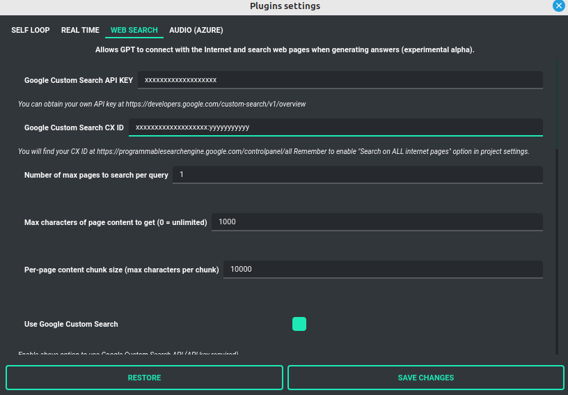
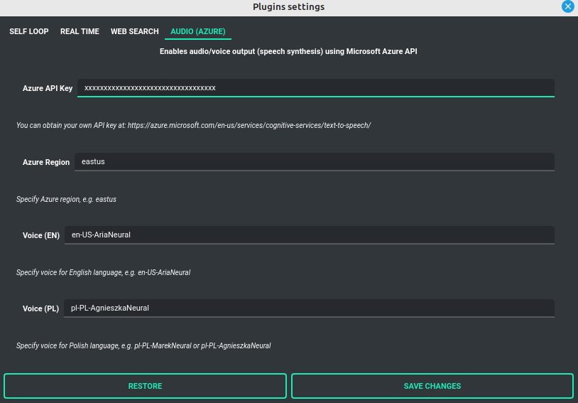

Plugins (web search, audio, etc.)
=================================

The application allows you to use plugins to extend its functionality.

Currently, the following plugins are available:

- **Web Search** - adds access to the Internet using Google Custom Search Engine and Wikipedia API

- **Audio (Azure)** - adds voice synthesis using Microsoft Azure Text-to-Speech API

- **Self Loop** - allows run GPT in a self-loop, which allows you to
  generate a continuous conversation between AI <> AI. In this mode model talks to itself.

- **Real Time** - auto-append current date and time to the prompt. It tells
  the model what time it is in real time.

Web Search
-----------

PYGPT allows you to **connect GPT to the internet** and use web search during any query in real time.

**Note: This feature is available in experimental form. It also uses additional tokens during operation to perform the entire procedure described below!**

This is enabled by a plug-in called **Web Search** - enable it in the "Plugins" menu.

The search is done automatically (in background) using the Google Custom Search Engine API and the Wikipedia API.
To use Google Search, you need an API key - you can get it by registering account on the website:

https://developers.google.com/custom-search/v1/overview

After registering an account, create a new project and then select it from the list of available projects:

https://programmablesearchengine.google.com/controlpanel/all

After selecting the project, you need to enable the "Whole Internet search" option in its settings, and then copy two things into PYGPT:

- Api Key
- CX ID

These data must be configured in the appropriate fields in the "Plugins / Settings..." menu:

**How does internet search work in PYGPT?**

**Step 1)**

At the beginning, PYGPT retrieves the current prompt from the user.
Then it tries to transform this prompt into a form more accessible to the search engine, i.e. by extract all keywords and edit the prompt so that it is best understood by the search engine. For this purpose, a connection to the "gpt-3.5-turbo" model is initiated in the background with the task of generating a reworded version for the given prompt for use in the search engine. To create a reworded version of the prompt, you can use the entire context of the conversation (all previous entries in the conversation), or only the current prompt - this option can be enabled or disabled in the plugin settings:

**- Use context memory when rebuilding question to search engine** (rebuild_question_context)

Default: `True`

Creating a reworded version of the prompt can be disabled at any time - to use the original prompt, disable the creation of a new query in the settings using the option:

**- Rebuild question to search engine** (rebuild_question)

Default: `True`

When this option is disabled, the reworded version of the query will not be generated and the original query will be used.

The content of the query used by GPT3.5 when generating a more understood version of the prompt can be configured in the fields:

**- Question build prompt** (prompt_question)

Default: `Today is {time}. You are providing single best query for search in Google based on the questionand context of whole conversation and nothing more in the answer.`

This is a system prompt sent to GPT3.5. When parsing this setting, placeholder {time} is replaced with the current time.

**- Question prefix prompt** (prompt_question_prefix)

Default: `Prepare single query for this question and put it in <query>: `

This is the prefix appended to the user's query and then sent to GPT.
The result of executing the above will be a response with a redacted query content returned between `<query></query>`

**Example:**

If the user is having a conversation about a movie like "Terminator",
then in the last sentence they will ask "What was the last part?" then the system will try to rewrite it in the form:

`<query>The title of the last part of the Terminator movie</query>`

Then the content between the `<query>` tags is extracted and will be used to build a query to the search engine.

**Step 2)**

In this step, a connection to the search engine API is made and a query is sent to the Google Custom Search API.
The results may contain many pages, therefore the number of pages to be returned by the search engine and to be processed should be defined in advance, the option is used for this:

**- Number of max pages to search per query** (num_pages)

Default: `1`

You can specify here how many pages with results should be crawled in the Google search process.
**Note:** the more pages will be returned, the more data will be used for processing and the execution time of the whole procedure will be longer.

During the search process, queries are made to Google and Wikipedia.
The results are sorted from the most recent to the most terrible, and if the page found first on Google leads to Wikipedia, the Wikipedia API is automatically used to speed up the whole process.

The use of both Google and Wikipedia APIs can be enabled or disabled in the options:

**- Use Google Custom Search** (use_google)

Default: `True`

**- Use Wikipedia** (use_wikipedia)

Default: `True`

You can enable or disable individual searches.

To specify the maximum amount of text to be processed from each page, you can use the following options:

**- Max characters of page content to get (0 = unlimited)** (max_page_content_length)

Default: `1000`

The above determines how many characters from each found page should be processed to generate a summary in the next step.
If "0" is given, it means no limit. The parameter applies to the already processed version,
with only the text extracted from the page (this is done using the "BeautifulSoup" module -
the text contained in the `
` tags is processed).

**Step 3)**

After fetching the search results and extracting the text from the found pages, a summary of the found text is performed. For this purpose, all found content is divided into smaller parts, so-called the chunks and so split batches are then used to get a summary which will then be made available to GPT in the main chat window. The "gpt-3.5-turbo" model is used for summarization, and the whole process takes place in the background.

In the process of summarization, all chunks obtained from the downloaded content are sent to GPT one by one.
The system prompt is also used, which can be changed in the settings in the option:

**- Summarize prompt** (prompt_summarize)

Default: `Summarize this text from website into 3 paragraphs trying to find the most important content which will help answering for question: `

The size of each data chunk can be determined using the option:

**- Per-page content chunk size (max characters per chunk)** (chunk_size)

Default: `10000`

This is the maximum number of characters that make up each chunk.

The maximum number of tokens to be generated at the output of the summarization process for each chunk can be changed in the option:

**- Max summary tokens** (summary_max_tokens)

Default: `1500`

This chunked content is then sent to GPT3.5 chunk by chunk along with the system prompt described above. The content summarized in this way is then combined into one collective text string and only then the whole summed up in this way is transferred to the main conversation window in the form of information that will be attached to the system prompt.

**Step 4)**

In the last step, a system prompt is prepared, enriched with the already found and summarized content.
The summarized content is attached to the system prompt by adding a phrase that can be configured in the option:

**- System append prompt** (prompt_system)

Default: `Use this summary text to answer the question or try to answer without it if summary text do not have sufficient info: `

The summary content is then added to the above at the end, and the system prompt prepared in this way is only sent until the next answer in the main conversation is obtained.

The maximum length (in characters) of a system prompt prepared in this way can be changed in the option:

**- System append prompt max length** (prompt_system_length)

Default: `1500`

**Step 5)**

In the main conversation, the system prompt is modified, and GPT receives additional information that it can use when generating a response to the user's query.

**Note:** Please note that this option is currently in experimental version, and please note that it uses additional tokens for the process of generating a modified query and summarizing the content downloaded from the Internet! You should always track the amount of tokens actually used in the statement on the OpenAI website.

Audio (Azure)
-------------

PYGPT implements voice synthesis using the **Microsoft Azure Text-To-Speech** API.
This feature require your own Microsoft Azure API Key.
You can get API KEY for free from here: https://azure.microsoft.com/en-us/services/cognitive-services/text-to-speech

To enable voice synthesis, enable the "Audio (Azure)" plugin in the "Plugins" menu or enable the "Voice" option in the "Audio" menu (both items in the menu lead to the same thing).

To use speech synthesis, you must first configure the audio plugin by providing the Azure API key and the appropriate Region in the configuration.

This can be done using the "Plugins / Settings..." menu and selecting the "Audio (Azure)" tab:

**Options:**

**- Azure API Key** (azure_api_key)

Here you should enter the API key, which can be obtained by registering for free on the website: https://azure.microsoft.com/en-us/services/cognitive-services/text-to-speech

**- Azure Region** (azure_region)

Default: `eastus`

The appropriate region for Azure must be provided here.

**- Voice (EN)** (voice_en)

Default: `en-US-AriaNeural`

Here you can specify the name of the voice used for speech synthesis for English

**- Voice (PL)** (voice_pl)

Default: `pl-PL-AgnieszkaNeural`

Here you can specify the name of the voice used for speech synthesis for the Polish language.

If speech synthesis is enabled, a voice will be additionally generated in the background while generating a reply via GPT.

Self Loop
---------

The plugin allows you to enable the "talk with yourself" mode - in this mode GPT starts a conversation with itself.
You can run such a loop with any number of iterations, then during the course of such a loop the model will answer questions asked by itself, having a conversation with itself. This mode works in both Chat and Completion modes, however, for better effect in Completion mode, you can define appropriate names (roles) for each party to the conversation.

When initiating the mode, you should also prepare the system prompt properly, e.g. informing GPT that it is talking to itself. It's worth experimenting for yourself.

The number of iterations for the conversation with yourself can be set in the "Plugins / Settings..." menu in the option:

**- Iterations** (iterations)

Default: `3`

**Additional options:**

**- Clear context output** (clear_output)

Default: `True`

The option clears the previous answer in context (it is then used as input during the next pass)

**- Reverse roles between iterations** (reverse_roles)

Default: `True`

If enabled, it reverses the roles (AI <> user) during each pass, i.e. if in the previous pass the answer was generated for the role "Batman", then in the next pass this answer will be used to generate the same input for the role "Joker".

Real Time
---------

This plugin allows you to automatically attach information about the current date and time to each sent system promt. You can specify whether to include only the date, time, or both.

If the plugin is enabled, each system prompt is enriched in the background with information that transfers the current time to GPT.

**Options:**

**- Append time** (hour)

Default: `True`

If enabled, it appends the current time to the system prompt.

**- Append date** (date)

Default: `True`

If enabled, it appends the current date to the system prompt.

**- Template** (tpl)

Default: `Current time is {time}.`

Template to append to system prompt. Placeholder {time} will be replaced with current date and time in real-time.
