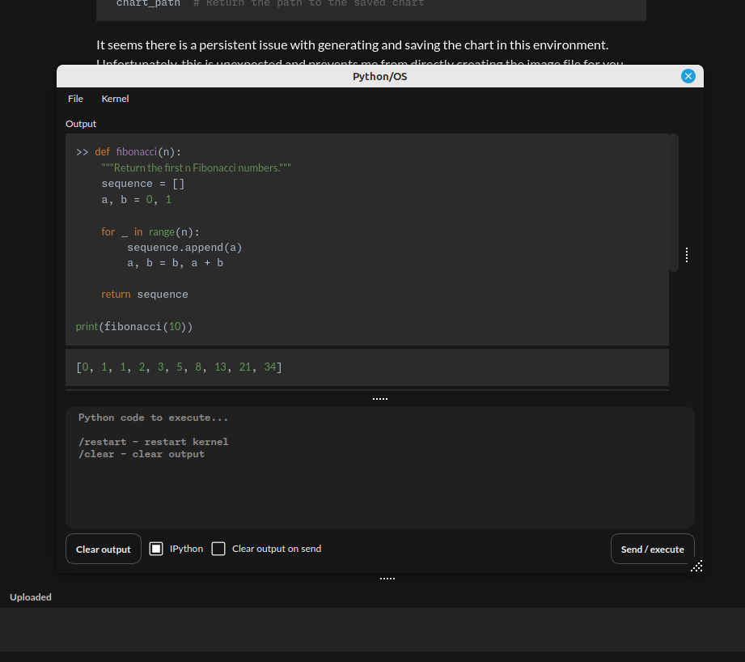
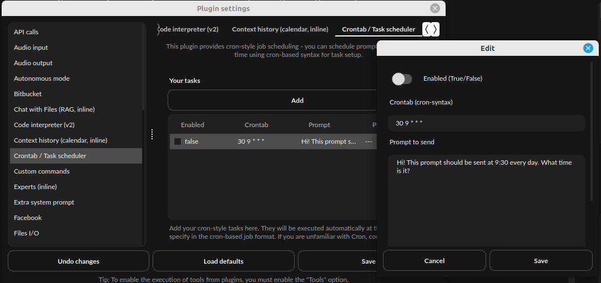

Plugins
=======

Overview
-------------------------

**PyGPT** can be enhanced with plugins that add tools, integrations, automation, multimodal features, and additional context directly to conversations.

The following plugins are currently available:

* ``API calls`` - connects models to external services through user-defined API endpoints, request methods, parameters, and payloads.
* ``Audio input`` - adds speech recognition and microphone input using providers such as OpenAI Whisper, local Whisper, Google, Bing, and xAI Grok Voice.
* ``Audio output`` - adds text-to-speech output using providers such as OpenAI, Microsoft Azure, Google, Eleven Labs, and xAI.
* ``Autonomous mode`` - runs an autonomous multi-step conversation loop inside standard chat modes and can cooperate with other enabled plugins to complete tasks.
* ``Bitbucket`` - connects to Bitbucket Cloud for repository, file, issue, pull request, workspace, and account operations.
* ``Chat with Files (RAG, inline)`` - adds RAG and LlamaIndex retrieval to standard conversations, allowing models to use indexed files, project indexes, and stored context as additional knowledge.
* ``Code interpreter (v2)`` - lets models execute Python code locally or in a Docker sandbox, maintain IPython state, and work with files created during the conversation.
* ``Context history (calendar, inline)`` - gives models access to saved conversation history and calendar day notes, including reading, searching, creating, and updating stored entries.
* ``Crontab / Task scheduler`` - lets models create and manage scheduled prompts and tasks using cron-based schedules.
* ``Custom commands`` - exposes user-defined system commands and scripts as callable tools with configurable arguments and execution rules.
* ``Experts (inline)`` - makes enabled expert presets available from standard chat modes so the current model can delegate specialized tasks to them.
* ``Facebook`` - connects to the Facebook Graph API for working with pages, posts, photos, and related account information.
* ``Files I/O`` - gives models controlled access to local files and directories for reading, writing, copying, moving, downloading, searching, and indexing data.
* ``GitHub`` - connects to GitHub for repository, file, issue, pull request, code search, and account operations.
* ``Google`` - integrates Gmail, Drive, Calendar, Contacts, Keep, Docs, Maps, Colab, and YouTube so models can work with Google services from conversations.
* ``Image generation (inline)`` - adds image generation and editing directly to conversations using a separately configured image model without requiring a mode change.
* ``Mailer`` - provides email access through configured mail services, including sending and reading messages where supported.
* ``Memory (inline)`` - maintains compact database-backed long-term memory plus raw keyed memory, with a global scope outside projects and an isolated memory scope for each project.
* ``MCP`` - connects models to external Model Context Protocol servers and exposes discovered remote tools through stdio, SSE, or Streamable HTTP transports.
* ``Mouse and keyboard`` - lets models control the mouse and keyboard, capture screenshots, and interact with the desktop or supported sandbox environment.
* ``OpenStreetMap`` - adds geocoding, place search, routing, and map utilities based on OpenStreetMap services.
* ``Real time`` - appends the current date and/or time to system prompts so models can receive up-to-date local time context.
* ``Serial port / USB`` - gives models access to configured serial and USB devices for reading data and sending commands.
* ``Server (SSH/FTP)`` - connects to remote servers through SSH, SFTP, or FTP for command execution, file transfers, and filesystem operations.
* ``Slack`` - connects to Slack workspaces for reading conversations, managing messages, working with users, and transferring files.
* ``System (OS)`` - provides access to the operating system and executes system commands through PyGPT's host or sandbox execution mechanisms.
* ``Extra system prompt`` - automatically appends reusable custom instructions or additional context to the active system prompt.
* ``Telegram`` - connects to Telegram bots or user accounts for messaging, chat access, contacts, media, and file transfers.
* ``Tuya (IoT)`` - connects to Tuya Cloud so models can inspect, search, and control supported smart-home and IoT devices.
* ``TwelveLabs`` - adds video understanding and multimodal embeddings using TwelveLabs Pegasus and Marengo models.
* ``Vision (inline)`` - adds image analysis to supported chat modes by routing image input through a separately configured vision-capable model.
* ``Voice control (inline)`` - lets spoken commands trigger configured PyGPT actions directly while a conversation is active.
* ``Web search`` - adds real-time web search, webpage retrieval, crawling, and external-content indexing using supported search providers and LlamaIndex loaders.
* ``Wikipedia`` - provides Wikipedia search, article lookup, summaries, geographic discovery, and random-page access.
* ``Wolfram Alpha`` - adds computational knowledge, symbolic and numeric mathematics, unit conversions, matrix operations, and generated plots through Wolfram Alpha.
* ``X/Twitter`` - connects to X for searching and reading posts, publishing content, managing interactions, bookmarks, and media.

**Tip:** Inline plugins do not require the ``+ Tools`` option in the toolbox. Once enabled, they remain active throughout the conversation and can provide their functionality automatically when applicable.

Creating Your Own Plugins
-------------------------

You can create your own plugin for **PyGPT** at any time. The plugin can be written in Python and then registered with the application just before launching it. All plugins included with the app are stored in the ``plugin`` directory - you can use them as coding examples for your own plugins.

PyGPT can be extended with:

* custom plugins
* custom LLMs
* custom vector store providers
* custom data loaders
* custom audio input providers
* custom audio output providers
* custom web search engine providers
* custom agents (LlamaIndex or OpenAI Agents)

See the section ``Extending PyGPT / Adding a custom plugin`` for more details.

API calls
----------

**PyGPT** lets you connect the model to the external services using custom defined API calls.

To activate this feature, turn on the ``API calls`` plugin found in the ``Plugins`` menu.

In this plugin you can provide list of allowed API calls, their parameters and request types. The model will replace provided placeholders with required params and make API call to external service.

- ``Your custom API calls`` *cmds*

You can provide custom API calls on the list here.

Params to specify for API call:

* **Enabled** (True / False)
* **Name:** unique API call name (ID)
* **Instruction:** description for model when and how to use this API call
* **GET params:** list, separated by comma, GET params to append to endpoint URL
* **POST params:** list, separated by comma, POST params to send in POST request
* **POST JSON:** provide the JSON object, template to send in POST JSON request, use ``%param%`` as POST param placeholders
* **Headers:** provide the JSON object with dictionary of extra request headers, like Authorization, API keys, etc.
* **Request type:** use GET for basic GET request, POST to send encoded POST params or POST_JSON to send JSON-encoded object as body
* **Endpoint:** API endpoint URL, use ``{param}`` as GET param placeholders

An example API call is provided with plugin by default, it calls the Wikipedia API:

* Name: ``search_wiki``
* Instructiom: ``send API call to Wikipedia to search pages by query``
* GET params: ``query, limit``
* Type: ``GET``
* API endpoint: https://en.wikipedia.org/w/api.php?action=opensearch&limit={limit}&format=json&search={query}

In the above example, every time you ask the model for query Wiki for provided query (e.g. ``Call the Wikipedia API for query: Nikola Tesla``) it will replace placeholders in provided API endpoint URL with a generated query and it will call prepared API endpoint URL, like below:

https://en.wikipedia.org/w/api.php?action=opensearch&limit=5&format=json&search=Nikola%20Tesla

You can specify type of request: ``GET``, ``POST`` and ``POST JSON``.

In the ``POST`` request you can provide POST params, they will be encoded and send as POST data.

In the ``POST JSON`` request you must provide JSON object template to be send, using ``%param%`` placeholders in the JSON object to be replaced with the model.

You can also provide any required credentials, like Authorization headers, API keys, tokens, etc. using the ``headers`` field - you can provide a JSON object here with a dictionary ``key => value`` - provided JSON object will be converted to headers dictonary and send with the request.

- ``Disable SSL verify`` *disable_ssl*

Disables SSL verification when making requests. *Default:* `False`

- ``Timeout`` *timeout*

Connection timeout (seconds). *Default:* `5`

- ``User agent`` *user_agent*

User agent to use when making requests, default: ``Mozilla/5.0``. *Default:* `Mozilla/5.0`

Audio input
------------

The plugin facilitates speech recognition. The default provider is OpenAI Whisper; local Whisper, Google, Google Cloud, Google GenAI, Microsoft Bing, and xAI Grok Voice providers are also available. It allows for voice commands to be relayed to the AI using your own voice. Whisper doesn't require any extra API keys or additional configurations; it uses the main OpenAI key. In the plugin's configuration options, you should adjust the volume level (min energy) at which the plugin will respond to your microphone. Once the plugin is activated, a new ``Speak`` option will appear at the bottom near the ``Send`` button  -  when this is enabled, the application will respond to the voice received from the microphone.

The plugin can be extended with other speech recognition providers.

**Options**

- ``Provider`` *provider*

Choose the provider. *Default:* `Whisper`

Available providers:

* Whisper (via ``OpenAI API``)
* Whisper (local model) - not available in compiled and Snap versions, only Python/PyPi version
* Google (via ``SpeechRecognition`` library)
* Google Cloud (via ``SpeechRecognition`` library)
* Microsoft Bing (via ``SpeechRecognition`` library)
* Google GenAI
* xAI Grok Voice

**Whisper (API)**

- ``Model`` *whisper_model*

Choose the model. *Default:* `whisper-1`

**Whisper (local)**

- ``Model`` *whisper_local_model*

Choose the local model. *Default:* `base`

Available models: https://github.com/openai/whisper

- ``Custom model name override`` *whisper_local_model_custom*

Optional custom model name or local checkpoint path. When set, it overrides the model selected above. *Default:* empty

- ``Keep model in RAM`` *whisper_local_keep_in_memory*

Keep the local Whisper model loaded between transcriptions. Disable this to reduce RAM usage at the cost of reloading it from the local cache for each transcription. *Default:* `True`

**Google**

- ``Additional keywords arguments`` *google_args*

Additional keywords arguments for r.recognize_google(audio, **kwargs)

**Google Cloud**

- ``Additional keywords arguments`` *google_cloud_args*

Additional keyword arguments passed to ``recognize_google_cloud(audio, **kwargs)``. The default list contains ``language=en-US``.

**Google GenAI**

- ``Model`` *google_genai_audio_model*

Gemini model used for audio transcription. *Default:* ``gemini-2.5-flash``

- ``System Prompt`` *google_genai_audio_prompt*

System instruction used to guide transcription output.

**xAI Grok Voice**

- ``Sample rate (Hz)`` *xai_voice_audio_sample_rate* - PCM input sample rate. *Default:* ``16000``
- ``System Prompt`` *xai_voice_system_prompt* - system instruction used to guide transcription output.
- ``Region (optional)`` *xai_voice_region* - optional regional endpoint such as ``us-east-1``; empty uses the global endpoint.
- ``Chunk size (ms)`` *xai_voice_chunk_ms* - WebSocket audio chunk size. *Default:* ``200``

**Bing**

- ``Additional keywords arguments`` *bing_args*

Additional keywords arguments for r.recognize_bing(audio, **kwargs)

**General options**

- ``Auto send`` *auto_send*

Automatically send recognized speech as input text after recognition. *Default:* `True`

- ``Advanced mode`` *advanced*

Enable only if you want to use advanced mode and the settings below. Do not enable this option if you just want to use the simplified mode (default). *Default:* `False`

**Advanced mode options**

- ``Timeout`` *timeout*

The duration in seconds that the application waits for voice input from the microphone. *Default:* `5`

- ``Phrase max length`` *phrase_length*

Maximum duration for a voice sample (in seconds).  *Default:* `10`

- ``Min energy`` *min_energy*

Minimum threshold multiplier above the noise level to begin recording. *Default:* `1.3`

- ``Adjust for ambient noise`` *adjust_noise*

Enables adjustment to ambient noise levels. *Default:* `True`

- ``Continuous listen`` *continuous_listen*

Experimental: continuous listening - do not stop listening after a single input. Warning: This feature may lead to unexpected results and requires fine-tuning with the rest of the options! If disabled, listening must be started manually by enabling the ``Speak`` option. *Default:* `False`

- ``Wait for response`` *wait_response*

Wait for a response before initiating listening for the next input. *Default:* `True`

- ``Magic word`` *magic_word*

Activate listening only after the magic word is provided. *Default:* `False`

- ``Reset Magic word`` *magic_word_reset*

Reset the magic word status after it is received (the magic word will need to be provided again). *Default:* `True`

- ``Magic words`` *magic_words*

List of magic words to initiate listening (Magic word mode must be enabled). *Default:* `OK, Okay, Hey GPT, OK GPT`

- ``Magic word timeout`` *magic_word_timeout*

he number of seconds the application waits for magic word. *Default:* `1`

- ``Magic word phrase max length`` *magic_word_phrase_length*

The minimum phrase duration for magic word. *Default:* `2`

- ``Prefix words`` *prefix_words*

List of words that must initiate each phrase to be processed. For example, you can define words like "OK" or "GPT"—if set, any phrases not starting with those words will be ignored. Insert multiple words or phrases separated by commas. Leave empty to deactivate.  *Default:* `empty`

- ``Stop words`` *stop_words*

List of words that will stop the listening process. *Default:* `stop, exit, quit, end, finish, close, terminate, kill, halt, abort`

Options related to Speech Recognition internals:

- ``energy_threshold`` *recognition_energy_threshold*

Represents the energy level threshold for sounds. *Default:* `300`

- ``dynamic_energy_threshold`` *recognition_dynamic_energy_threshold*

Represents whether the energy level threshold (see recognizer_instance.energy_threshold) for sounds should be automatically adjusted based on the currently ambient noise level while listening. *Default:* `True`

- ``dynamic_energy_adjustment_damping`` *recognition_dynamic_energy_adjustment_damping*

Represents approximately the fraction of the current energy threshold that is retained after one second of dynamic threshold adjustment. *Default:* `0.15`

- ``pause_threshold`` *recognition_pause_threshold*

Represents the minimum length of silence (in seconds) that will register as the end of a phrase. *Default:* `0.8`

- ``adjust_for_ambient_noise: duration`` *recognition_adjust_for_ambient_noise_duration*

The duration parameter is the maximum number of seconds that it will dynamically adjust the threshold for before returning. *Default:* `1`

Options reference: https://pypi.org/project/SpeechRecognition/1.3.1/

Audio output
-------------------------

The plugin lets you turn text into speech using OpenAI TTS or providers such as ``Microsoft Azure``, ``Google Cloud TTS``, ``Google GenAI TTS``, ``Eleven Labs``, and ``xAI TTS``. You can add more text-to-speech providers to it too. ``OpenAI TTS`` does not require any additional API keys or extra configuration; it utilizes the main OpenAI key. 
Provider-specific credentials are required where applicable: Azure and Eleven Labs use plugin credentials, Google GenAI uses the Google API key from Settings, and xAI TTS uses the xAI API key from Settings. Configure voices, regions, and provider-specific options in the plugin settings.

Through the available options, you can select the voice that you want the model to use. More voice synthesis providers coming soon.

To enable voice synthesis, activate the ``Audio output`` plugin in the ``Plugins`` menu or turn on the ``Audio output`` option in the ``Audio / Voice`` menu (both options in the menu achieve the same outcome).

**Options**

- ``Provider`` *provider*

Choose the provider. *Default:* `OpenAI TTS`

Available providers:

* OpenAI TTS
* Microsoft Azure TTS
* Google TTS
* Google GenAI TTS
* Eleven Labs TTS
* xAI TTS

**OpenAI Text-To-Speech**

- ``Model`` *openai_model*

Choose the model. Available options:

* tts-1
* tts-1-hd

*Default:* `tts-1`

- `Voice` *openai_voice*

Choose the voice. Available voices to choose from:

* alloy
* echo
* fable
* onyx
* nova
* shimmer

*Default:* `alloy`

**Microsoft Azure Text-To-Speech**

- ``Azure API Key`` *azure_api_key*

Here, you should enter the API key, which can be obtained by registering for free on the following website: https://azure.microsoft.com/en-us/services/cognitive-services/text-to-speech

- ``Azure Region`` *azure_region*

You must also provide the appropriate region for Azure here. *Default:* `eastus`

- ``Voice (EN)`` *azure_voice_en*

Here you can specify the name of the voice used for speech synthesis for English. *Default:* `en-US-AriaNeural`

- ``Voice (non-English)`` *azure_voice_pl*

Here you can specify the name of the voice used for speech synthesis for other non-english languages. *Default:* `pl-PL-AgnieszkaNeural`

**Google Text-To-Speech**

- ``Google Cloud Text-to-speech API Key`` *google_api_key*

You can obtain your own API key at: https://console.cloud.google.com/apis/library/texttospeech.googleapis.com

- ``Voice`` *google_voice*

Specify voice. Voices: https://cloud.google.com/text-to-speech/docs/voices

- ``Language code`` *google_lang*

Language code used for synthesis. *Default:* ``en-US``. Language codes: https://cloud.google.com/speech-to-text/docs/speech-to-text-supported-languages

**Google GenAI Text-To-Speech**

- ``Model`` *google_genai_tts_model*

Gemini TTS model. *Default:* ``gemini-2.5-flash-preview-tts``

- ``Voice`` *google_genai_tts_voice*

Gemini TTS voice name; values are case-sensitive. *Default:* ``Kore``

**Eleven Labs Text-To-Speech**

- ``Eleven Labs API Key`` *eleven_labs_api_key*

You can obtain your own API key at: https://elevenlabs.io/speech-synthesis

- ``Voice ID`` *eleven_labs_voice*

Voice ID. Voices: https://elevenlabs.io/voice-library

- ``Model`` *eleven_labs_model*

Specify model. Models: https://elevenlabs.io/docs/speech-synthesis/models

**xAI Text-To-Speech**

- ``Voice`` *xai_tts_voice* - Grok Voice name (Ara, Rex, Sal, Eve, Leo). *Default:* ``Ara``
- ``Sample rate (Hz)`` *xai_tts_sample_rate* - PCM output sample rate. *Default:* ``24000``
- ``System Prompt`` *xai_tts_instructions* - instruction controlling speaking style. *Default:* neutral, clear, verbatim TTS instruction.
- ``File container`` *xai_tts_file_container* - ``wav`` or ``raw``. *Default:* ``wav``
- ``Region (optional)`` *xai_tts_region* - optional regional endpoint; empty uses the global endpoint.

If speech synthesis is enabled, a voice will be additionally generated in the background while generating a response via model.

Both ``OpenAI TTS`` and ``OpenAI Whisper`` use the same single API key provided for the OpenAI API, with no additional keys required.

Autonomous mode
-------------------------

.. warning::
   **Please use autonomous mode with caution!** - this mode, when connected with other plugins, may produce unexpected results!

The plugin activates autonomous mode in standard chat modes, where AI begins a conversation with itself. 
You can set this loop to run for any number of iterations. Throughout this sequence, the model will engage
in self-dialogue, answering his own questions and comments, in order to find the best possible solution, subjecting previously generated steps to criticism.

This mode is similar to ``Auto-GPT`` - it can be used to create more advanced inferences and to solve problems by breaking them down into subtasks that the model will autonomously perform one after another until the goal is achieved. The plugin is capable of working in cooperation with other plugins, thus it can utilize tools such as web search, access to the file system, or image generation.

**Options**

You can adjust the number of iterations for the self-conversation in the ``Plugins / Settings...`` menu under the following option:

- ``Iterations`` *iterations*

*Default:* `3`

.. warning::
   Setting this option to ``0`` activates an **infinity loop** which can generate a large number of requests and cause very high token consumption, so use this option with caution!

- ``Prompts`` *prompts*

Editable list of prompts used to instruct how to handle autonomous mode, you can create as many prompts as you want. 
First active prompt on list will be used to handle autonomous mode.

- ``Auto-stop after goal is reached`` *auto_stop*

If enabled, plugin will stop after goal is reached. *Default:* `True`

- ``Always continue`` *always_continue*

If enabled, the plugin proceeds to the next iteration even when the goal has already been reached. *Default:* `False`

- ``Reverse roles between iterations`` *reverse_roles*

Only for Completion mode. 
If enabled, this option reverses the roles (AI <> user) with each iteration. For example, 
if in the previous iteration the response was generated for "Batman," the next iteration will use that 
response to generate an input for "Joker." *Default:* `True`

Bitbucket
---------

The Bitbucket plugin allows for seamless integration with the Bitbucket Cloud API, offering functionalities to manage repositories, issues, and pull requests. This plugin provides highly configurable options for authentication, cached convenience, and manages HTTP requests efficiently.

* Retrieve details about the authenticated user.
* Get information about a specific user.
* List available workspaces.
* List repositories in a workspace.
* Get details about a specific repository.
* Create a new repository.
* Delete an existing repository.
* Retrieve contents of a file in a repository.
* Upload a file to a repository.
* Delete a file from a repository.
* List issues in a repository.
* Create a new issue.
* Comment on an existing issue.
* Update details of an issue.
* List pull requests in a repository.
* Create a new pull request.
* Merge an existing pull request.
* Search for repositories.

**Options**

- ``API base`` *api_base*

  Define the base URL for the Bitbucket Cloud API. *Default:* `https://api.bitbucket.org/2.0`

- ``HTTP timeout (s)`` *http_timeout*

  Set the timeout for HTTP requests in seconds. *Default:* `30`

**Auth options**

- ``Auth mode`` *auth_mode*

  Select the authentication mode. *Default:* `auto`

  Available modes:
  * auto
  * basic
  * bearer

- ``Username`` *bb_username*

  Provide your Bitbucket username (handle, not email).

- ``App Password`` *bb_app_password*

  Specify your Bitbucket App Password (Basic). This option is secret.

- ``Bearer token`` *bb_access_token*

  Enter the OAuth access token (Bearer). This option is secret.

**Cached convenience**

- ``(auto) User UUID`` *user_uuid*

  Cached after using the `bb_me` command.

- ``(auto) Username`` *username*

  Cached after using the `bb_me` command.

**Commands**

*Auth Options*

- ``bb_auth_set_mode``

  Set the authentication mode: auto|basic|bearer.

- ``bb_set_app_password``

  Set App Password credentials including username and app password.

- ``bb_set_bearer``

  Set the Bearer authentication token.

- ``bb_auth_check``

  Run diagnostics to show authentication results for `/user`.

*User Management*

- ``bb_me``

  Retrieve details for the authenticated user.

- ``bb_user_get``

  Fetch user information by username.

- ``bb_workspaces_list``

  List all accessible workspaces.

*Repositories Management*

- ``bb_repos_list``

  Display a list of repositories.

- ``bb_repo_get``

  Fetch details of a specific repository.

- ``bb_repo_create``

  Create a new repository in a specified workspace.

- ``bb_repo_delete``

  Delete a repository (requires confirmation).

*Contents Management*

- ``bb_contents_get``

  Retrieve file or directory contents from a repository.

- ``bb_file_put``

  Create or update a file in a repository.

- ``bb_file_delete``

  Delete specified files within a repository.

*Issues Management*

- ``bb_issues_list``

  List issues in a repository.

- ``bb_issue_create``

  Create a new issue within a repository.

- ``bb_issue_comment``

  Add a comment to an existing issue.

- ``bb_issue_update``

  Update details of an existing issue.

*Pull Requests Management*

- ``bb_prs_list``

  Display a list of pull requests.

- ``bb_pr_create``

  Create a new pull request.

- ``bb_pr_merge``

  Merge an existing pull request.

*Search Functionality*

- ``bb_search_repos``

  Search repositories using Bitbucket Query Language (BBQL).

Chat with Files (RAG, inline)
-------------------------------------

Plugin integrates ``LlamaIndex`` storage in any chat and provides additional knowledge into context.

**Options**

- ``Ask LlamaIndex first`` *ask_llama_first*

When enabled, then `LlamaIndex` will be asked first, and response will be used as additional knowledge in prompt. When disabled, then `LlamaIndex` will be asked only when needed. **INFO: Disabled in autonomous mode (via plugin)!** *Default:* `False`

- ``Auto-prepare question before asking LlamaIndex first`` *prepare_question*

When enabled, then question will be prepared before asking LlamaIndex first to create best query.

- ``Model for question preparation`` *model_prepare_question*

Model used to prepare question before asking LlamaIndex. *Default:* `gpt-4o-mini`

- ``Max output tokens for question preparation`` *prepare_question_max_tokens*

Max tokens in output when preparing question before asking LlamaIndex. *Default:* `500`

- ``Prompt for question preparation`` *syntax_prepare_question*

System prompt for question preparation.

- ``Max characters in question`` *max_question_chars*

Max characters in question when querying LlamaIndex, 0 = no limit, default: `1000`

- ``Append metadata to context`` *append_meta*

If enabled, then metadata from LlamaIndex will be appended to additional context. *Default:* `False`

- ``Model`` *model_query*

Model used for querying ``LlamaIndex``. *Default:* ``gpt-4o-mini``

- ``Image model`` *model_image*

Vision model used by the Image (vision) data loader when API mode is active. *Default:* ``gpt-4o``

Audio/video transcription is configured separately in the ``Audio input`` plugin and uses the provider selected there.

- ``Use project index if in use`` *use_project_index*

When enabled and the current conversation belongs to a project, the plugin queries that project's isolated ``Current project`` index instead of the configured global indexes. Outside a project, the configured indexes are used normally. *Default:* `True`

- ``Index name`` *idx*

Indexes to use outside an active project, or when project-index usage is disabled. If you want to use multiple indexes at once then separate them by comma. *Default:* `base`

Code interpreter (v2)
-------------------------

**Executing Code**

From version ``2.4.13`` with built-in ``IPython``.

The plugin operates similarly to the ``Code Interpreter`` feature in ``ChatGPT``, with the key difference that it works locally on the user's system. It allows for the execution of any Python code on the computer that the model may generate. When combined with the ``Files I/O`` plugin, it facilitates running code from files saved in the active ``data`` directory. For conversations in a project with a custom workdir, that project directory becomes the runtime data root; otherwise the shared ``<profile workdir>/data`` directory is used. You can also prepare your own code files and enable the model to use them or add your own plugin for this purpose. You can execute commands and code on the host machine or in a Docker container.

**IPython:** Starting from version ``2.4.13``, it is highly recommended to adopt the new option: ``IPython``, which offers significant improvements over previous workflows. IPython provides a robust environment for executing code within a kernel, allowing you to maintain the state of your session by preserving the results of previous commands. This feature is particularly useful for iterative development and data analysis, as it enables you to build upon prior computations without starting from scratch. Moreover, IPython supports the use of magic commands, such as ``!pip install <package_name>``, which facilitate the installation of new packages directly within the session. This capability streamlines the process of managing dependencies and enhances the flexibility of your development environment. Overall, IPython offers a more efficient and user-friendly experience for executing and managing code.

To use IPython in sandbox mode, Docker must be installed on your system. When the sandbox is started, the active conversation's runtime ``data`` workdir is mounted as ``/data``. Switching to a project with a custom data workdir changes this mapping at runtime; the base profile workdir itself is not remapped.

You can find the installation instructions here: https://docs.docker.com/engine/install/

**Connecting IPython in Docker in Snap version**:

To use IPython in the Snap version, you must connect PyGPT to the Docker daemon:

.. code-block:: console

    $ sudo snap connect pygpt:docker-executables docker:docker-executables

.. code-block:: console

    $ sudo snap connect pygpt:docker docker:docker-daemon

**Code interpreter:** PyGPT includes the ``Python/OS`` tool for real-time Python and IPython execution. Click the ``<>`` icon to open the Python/OS window. Code input/output is mirrored to this window when ``Connect to the Python/OS window`` is enabled (default: enabled). The window keeps up to 30 input/output blocks by default; set ``Max interpreter window entries`` to ``0`` for no limit. Additionally, you can request the model to retrieve contents from the interpreter window output.

.. important::
   Executing Python code using IPython in compiled versions requires an enabled sandbox (Docker container). You can connect the Docker container via ``Plugins -> Settings``.

.. tip::
   always remember to enable the ``+ Tools`` option to allow execute commands from the plugins.

**Options:**

**General**

- ``Connect to the Python/OS window`` *attach_output*

Automatically attach code input/output to the Python/OS window. *Default:* ``True``

- ``Max interpreter window entries`` *output_max_entries*

Maximum number of input/output blocks kept in the interpreter window. Set to ``0`` for no limit. *Default:* ``30``

- ``Always run code in a fresh kernel`` *fresh_kernel*

If enabled, each code execution uses the same path as the interpreter's **Run in a fresh kernel** action instead of reusing the current kernel state. *Default:* ``False``

- ``Tool: get_python_output`` *cmd.get_python_output*

Allows ``get_python_output`` command execution. If enabled, it allows retrieval of the output from the Python/OS window. *Default:* ``True``

- ``Tool: get_python_input`` *cmd.get_python_input*

Allows ``get_python_input`` command execution. If enabled, it allows retrieval all input code (from edit section) from the Python/OS window. *Default:* ``True``

- ``Tool: clear_python_output`` *cmd.clear_python_output*

Allows ``clear_python_output`` command execution. If enabled, it allows clear the output of the Python/OS window. *Default:* ``True``

**IPython**

- ``Sandbox (docker container)`` *sandbox_ipython*

Executes IPython in a Docker sandbox. Docker must be installed and running. *Default:* ``False``

- ``Run as root`` *ipython_run_as_root*

Run the IPython sandbox as root. When disabled, the stock image runs as the unprivileged ``pygpt`` user; passwordless ``sudo`` remains available for commands that require root privileges. *Default:* ``False``

- ``Dockerfile for IPython kernel`` *ipython_dockerfile*

You can customize the Dockerfile for the image used by IPython by editing the configuration above and rebuilding the image via Tools -> Rebuild IPython Docker Image.

- ``Session Key`` *ipython_session_key*

It must match the key provided in the Dockerfile.

- ``Docker image name`` *ipython_image_name*

Custom Docker image name

- ``Docker container name`` *ipython_container_name*

Custom Docker container name

- ``Connection address`` *ipython_conn_addr*

Default: 127.0.0.1

- ``Port: shell`` *ipython_port_shell*

Default: 5555

- ``Port: iopub`` *ipython_port_iopub*

Default: 5556

- ``Port: stdin`` *ipython_port_stdin*

Default: 5557

- ``Port: control`` *ipython_port_control*

Default: 5558

- ``Port: hb`` *ipython_port_hb*

Default: 5559

- ``Tool: ipython_execute`` *cmd.ipython_execute*

Allows Python code execution in IPython interpreter (in current kernel). *Default:* ``True``

- ``Tool: python_kernel_restart`` *cmd.ipython_kernel_restart*

Allows to restart IPython kernel. *Default:* ``True``

**Python (legacy)**

- ``Sandbox (docker container)`` *sandbox_docker*

Executes legacy Python commands in a Docker sandbox. Docker must be installed and running. *Default:* ``False``

- ``Run as root`` *docker_run_as_root*

Run the legacy Python sandbox as root. When disabled, the stock image runs as the unprivileged ``pygpt`` user; passwordless ``sudo`` remains available for commands that require root privileges. *Default:* ``False``

- ``Python command template`` *python_cmd_tpl*

Python command template (use {filename} as path to file placeholder). *Default:* ``python3 {filename}``

- ``Dockerfile`` *dockerfile*

You can customize the Dockerfile for the image used by legacy Python by editing the configuration above and rebuilding the image via Tools -> Rebuild Python (Legacy) Docker Image.

- ``Docker image name`` *image_name*

Custom Docker image name

- ``Docker container name`` *container_name*

Custom Docker container name. *Default:* ``pygpt_python_legacy_container``

- ``Docker run command`` *docker_entrypoint*

Command used to keep the legacy Python container alive. *Default:* ``tail -f /dev/null``

- ``Docker volumes`` *docker_volumes*

Host-to-container volume mappings. The stock configuration maps the active conversation's runtime ``data`` workdir to ``/data``. If a project uses a custom data workdir, the Docker mapping is updated at runtime for that project. The application's base workdir and its non-data directories are not remapped.

- ``Docker ports`` *docker_ports*

Optional host-to-container port mappings. The default list is empty.

- ``Tool: code_execute`` *cmd.code_execute*

Allows ``code_execute`` command execution. If enabled, provides Python code execution (generate and execute from file). *Default:* ``True``

- ``Tool: code_execute_all`` *cmd.code_execute_all*

Allows ``code_execute_all`` command execution. If enabled, provides execution of all the Python code in interpreter window. *Default:* ``True``

- ``Tool: code_execute_file`` *cmd.code_execute_file*

Allows ``code_execute_file`` command execution. If enabled, provides Python code execution from existing .py file. *Default:* ``True``

**HTML Canvas**

- ``Tool: render_html_output`` *cmd.render_html_output*

Allows ``render_html_output`` command execution. If enabled, it allows to render HTML/JS code in built-in HTML/JS browser (HTML Canvas). *Default:* ``True``

- ``Tool: get_html_output`` *cmd.get_html_output*

Allows ``get_html_output`` command execution. If enabled, it allows retrieval current output from HTML Canvas. *Default:* ``True``

Context history (calendar, inline)
----------------------------------

Provides access to context history database.
Plugin also provides access to reading and creating day notes.

Examples of use, you can ask e.g. for the following:

* Give me today day note
* Save a new note for today
* Update my today note with...
* Get the list of yesterday conversations
* Get contents of conversation ID 123

etc.

You can also use ``@`` ID tags to automatically use summary of previous contexts in current discussion.
To use context from previous discussion with specified ID use following syntax in your query:

.. code-block:: ini

   @123

Where ``123`` is the ID of previous context (conversation) in database, example of use:

.. code-block:: ini

   Let's talk about discussion @123

**Options**

- ``Enable: using context @ ID tags`` *use_tags*

When enabled, it allows to automatically retrieve context history using @ tags, e.g. use @123 in question to use summary of context with ID 123 as additional context. *Default:* `False`

- ``Tool: get date range context list`` *cmd.get_ctx_list_in_date_range*

Allows `get_ctx_list_in_date_range` command execution. If enabled, it allows getting the list of context history (previous conversations). *Default:* `True`

- ``Tool: get context content by ID`` *cmd.get_ctx_content_by_id*

Allows `get_ctx_content_by_id` command execution. If enabled, it allows getting summarized content of context with defined ID. *Default:* `True`

- ``Tool: count contexts in date range`` *cmd.count_ctx_in_date*

Allows `count_ctx_in_date` command execution. If enabled, it allows counting contexts in date range. *Default:* `True`

- ``Tool: get day note`` *cmd.get_day_note*

Allows `get_day_note` command execution. If enabled, it allows retrieving day note for specific date. *Default:* `True`

- ``Tool: add day note`` *cmd.add_day_note*

Allows `add_day_note` command execution. If enabled, it allows adding day note for specific date. *Default:* `True`

- ``Tool: update day note`` *cmd.update_day_note*

Allows `update_day_note` command execution. If enabled, it allows updating day note for specific date. *Default:* `True`

- ``Tool: remove day note`` *cmd.remove_day_note*

Allows `remove_day_note` command execution. If enabled, it allows removing day note for specific date. *Default:* `True`

- ``Model`` *model_summarize*

Model used for summarize. *Default:* `gpt-4o-mini`

- ``Max summary tokens`` *summary_max_tokens*

Max tokens in output when generating summary. *Default:* `1500`

- ``Max contexts to retrieve`` *ctx_items_limit*

Max items in context history list to retrieve in one query. 0 = no limit. *Default:* `30`

- ``Per-context items content chunk size`` *chunk_size*

Per-context content chunk size (max characters per chunk). *Default:* `100000 chars`

**Options (advanced)**

- ``Prompt: @ tags (system)`` *prompt_tag_system*

Prompt for use @ tag (system).

- ``Prompt: @ tags (summary)`` *prompt_tag_summary*

Prompt for use @ tag (summary).

Crontab / Task scheduler
------------------------

Plugin provides cron-based job scheduling - you can schedule tasks/prompts to be sent at any time using cron-based syntax for task setup.

**Options**

- ``Your tasks`` *crontab*

Add your cron-style tasks here. 
They will be executed automatically at the times you specify in the cron-based job format. 
If you are unfamiliar with Cron, consider visiting the Cron Guru page for assistance: https://crontab.guru

Number of active tasks is always displayed in a tray dropdown menu:

- ``Create a new context on job run`` *new_ctx*

If enabled, then a new context will be created on every run of the job." *Default:* `True`

- ``Show notification on job run`` *show_notify*

If enabled, then a tray notification will be shown on every run of the job. *Default:* `True`

Custom commands
------------------------

With the ``Custom commands`` plugin, you can integrate **PyGPT** with your operating system and scripts or applications. You can define an unlimited number of custom commands and instruct model on when and how to execute them. Configuration is straightforward, and **PyGPT** includes a simple tutorial command for testing and learning how it works:

To add a new custom command, click the **ADD** button and then:

1. Provide a name for your command: this is a unique identifier for model.
2. Provide an ``instruction`` explaining what this command does; model will know when to use the command based on this instruction.
3. Define ``params``, separated by commas - model will send data to your commands using these params. These params will be placed into placeholders you have defined in the ``cmd`` field. For example:

If you want instruct model to execute your Python script named ``smart_home_lights.py`` with an argument, such as ``1`` to turn the light ON, and ``0`` to turn it OFF, define it as follows:

- **name**: lights_cmd
- **instruction**: turn lights on/off; use 1 as 'arg' to turn ON, or 0 as 'arg' to turn OFF
- **params**: arg
- **cmd**: ``python /path/to/smart_home_lights.py {arg}``

The setup defined above will work as follows:

When you ask model to turn your lights ON, model will locate this command and prepare the command ``python /path/to/smart_home_lights.py {arg}`` with ``{arg}`` replaced with ``1``. On your system, it will execute the command:

.. code-block:: console

  python /path/to/smart_home_lights.py 1

And that's all. Model will take care of the rest when you ask to turn ON the lights.

You can define as many placeholders and parameters as you desire.

Here are some predefined system placeholders for use:

- ``{_time}`` - current time in ``H:M:S`` format
- ``{_date}`` - current date in ``Y-m-d`` format
- ``{_datetime}`` - current date and time in ``Y-m-d H:M:S`` format
- ``{_file}`` - path to the file from which the command is invoked
- ``{_home}`` - path to PyGPT's home/working directory

You can connect predefined placeholders with your own params.

*Example:*

- **name**: song_cmd
- **instruction**: store the generated song on hard disk
- **params**: song_text, title
- **cmd**: ``echo "{song_text}" > {_home}/{title}.txt``

With the setup above, every time you ask model to generate a song for you and save it to the disk, it will:

1. Generate a song.
2. Locate your command.
3. Execute the command by sending the song's title and text.
4. The command will save the song text into a file named with the song's title in the **PyGPT** working directory.

**Example tutorial command**

**PyGPT** provides simple tutorial command to show how it work, to run it just ask model for execute ``tutorial test command`` and it will show you how it works:

.. code-block:: console

  > please execute tutorial test command

Experts (inline)
-----------------

The plugin allows calling experts in any chat mode. This is the inline Experts (co-op) mode.

See the ``Work modes -> Experts`` section for more details.

Facebook
--------

The plugin integrates with Facebook's Graph API to enable various actions such as managing pages, posts, and media uploads. It uses OAuth2 for authentication and supports automatic token exchange processes. 

* Retrieving basic information about the authenticated user.
* Listing all Facebook pages the user has access to.
* Setting a specified Facebook page as the default.
* Retrieving a list of posts from a Facebook page.
* Creating a new post on a Facebook page.
* Deleting a post from a Facebook page.
* Uploading a photo to a Facebook page.

**Options**

- ``Graph API Version`` *graph_version*

Specify the API version. *Default:* `v21.0`

- ``API Base`` *api_base*

Base address for the Graph API. The version will be appended automatically.

- ``Authorize Base`` *authorize_base*

Base address for OAuth authorization. The version will be appended automatically.

- ``HTTP Timeout (s)`` *http_timeout*

Set the timeout for HTTP requests in seconds. *Default:* `30`

**OAuth2 (PKCE) Settings**

- ``App ID (client_id)`` *oauth2_client_id*

Provide your Facebook App ID.

- ``App Secret (optional)`` *oauth2_client_secret*

Required for long-lived token exchange unless using PKCE. *Secret*

- ``Confidential Client`` *oauth2_confidential*

Use `client_secret` on exchange instead of `code_verifier`.

- ``Redirect URI`` *oauth2_redirect_uri*

Matches one of the valid OAuth Redirect URIs in your Meta App. 

- ``Scopes`` *oauth2_scopes*

Space-separated authorized permissions. 

- ``(auto) nonce`` *oauth2_nonce*

Generated automatically by ``fb_oauth_begin`` for the OIDC flow. This is an internal cached value and normally should not be edited manually. *Secret*

- ``User Access Token`` *oauth2_access_token*

Stores user access token. *Secret*

**Cache**

- ``User ID`` *user_id*

Cached after calling `fb_me` or OAuth exchange.

- ``User Name`` *user_name*

Cached after calling `fb_me` or OAuth exchange.

- ``Default Page ID`` *fb_page_id*

Selected via `fb_page_set_default`.

- ``Default Page Name`` *fb_page_name*

Selected via `fb_page_set_default`.

- ``Default Page Access Token`` *fb_page_access_token*

Cached with `fb_page_set_default` or on demand. *Secret*

**OAuth UX Options**

- ``Auto-start OAuth`` *oauth_auto_begin*

Automatically begin PKCE flow when commands need a user token.

- ``Open Browser Automatically`` *oauth_open_browser*

Open authorization URL in the default web browser.

- ``Use Local Server for OAuth`` *oauth_local_server*

Start a local HTTP server to capture redirect.

- ``OAuth Local Timeout (s)`` *oauth_local_timeout*

Duration to wait for a redirect with code. *Default:* `180`

- ``Success HTML`` *oauth_success_html*

HTML displayed on successful local callback.

- ``Fail HTML`` *oauth_fail_html*

HTML displayed on callback error.

- ``OAuth Local Port`` *oauth_local_port*

Set the local HTTP port; should be above 1024 and allowed in the app. *Default:* `8732`

- ``Allow Fallback Port`` *oauth_allow_port_fallback*

Choose a free local port if the preferred port is busy or forbidden.

**Commands**

- ``Auth: Begin OAuth2`` *fb_oauth_begin*

Starts OAuth2 (PKCE) flow and returns the authorization URL.

- ``Auth: Exchange Code`` *fb_oauth_exchange*

Trades authorization code for a user access token.

- ``Auth: Extend User Token`` *fb_token_extend*

Exchanges a short-lived token for a long-lived token; requires app secret.

- ``Users: Me`` *fb_me*

Retrieves the authorized user's profile.

- ``Pages: List`` *fb_pages_list*

Lists pages the user manages with details like ID, name, and access token.

- ``Pages: Set Default`` *fb_page_set_default*

Caches name and access token for a default page.

- ``Posts: List`` *fb_page_posts*

Retrieves the page's feed (posts).

- ``Posts: Create`` *fb_page_post_create*

Publishes a post with optional text, links, and photos.

- ``Posts: Delete`` *fb_page_post_delete*

Removes a specified page post.

- ``Media: Upload Photo`` *fb_page_photo_upload*

Uploads a photo to a page from a local path or URL.

Files I/O
------------------

The plugin allows for file management within the local filesystem. It enables the model to create, read, write and query files located in the active ``data`` workdir. Normally this is ``<profile workdir>/data``. If the current conversation belongs to a project with ``Use shared workdir`` disabled, the project's configured directory is used instead. With this plugin, the AI can also generate Python code files and thereafter execute that code within the user's system. The ``cwd`` tool reports the same runtime-resolved data workdir.

Plugin capabilities include:

* Sending files as attachments
* Reading files
* Appending to files
* Writing files
* Deleting files and directories
* Listing files and directories
* Creating directories
* Downloading files
* Copying files and directories
* Moving (renaming) files and directories
* Reading file info
* Indexing files and directories using LlamaIndex
- Querying files using LlamaIndex
- Searching for files and directories

If a file being created (with the same name) already exists, a prefix including the date and time is added to the file name.

**Options:**

**General**

- ``Tool: send (upload) file as attachment`` *cmd.send_file*

Allows `send_file` command execution. *Default:* `True`

- ``Tool: read file`` *cmd.read_file*

Allows `read_file` command execution. *Default:* `True`

- ``Tool: append to file`` *cmd.append_file*

Allows `append_file` command execution. Text-based files only (plain text, JSON, CSV, etc.) *Default:* `True`

- ``Tool: save file`` *cmd.save_file*

Allows `save_file` command execution. Text-based files only (plain text, JSON, CSV, etc.) *Default:* `True`

- ``Tool: delete file`` *cmd.delete_file*

Allows `delete_file` command execution. *Default:* `True`

- ``Tool: list files (ls)`` *cmd.list_files*

Allows `list_dir` command execution. *Default:* `True`

- ``Tool: list files in dirs in directory (ls)`` *cmd.list_dir*

Allows `mkdir` command execution. *Default:* `True`

- ``Tool: downloading files`` *cmd.download_file*

Allows `download_file` command execution. *Default:* `True`

- ``Tool: removing directories`` *cmd.rmdir*

Allows `rmdir` command execution. *Default:* `True`

- ``Tool: copying files`` *cmd.copy_file*

Allows `copy_file` command execution. *Default:* `True`

- ``Tool: copying directories (recursive)`` *cmd.copy_dir*

Allows `copy_dir` command execution. *Default:* `True`

- ``Tool: move files and directories (rename)`` *cmd.move*

Allows `move` command execution. *Default:* `True`

- ``Tool: check if path is directory`` *cmd.is_dir*

Allows `is_dir` command execution. *Default:* `True`

- ``Tool: check if path is file`` *cmd.is_file*

Allows `is_file` command execution. *Default:* `True`

- ``Tool: check if file or directory exists`` *cmd.file_exists*

Allows `file_exists` command execution. *Default:* `True`

- ``Tool: get file size`` *cmd.file_size*

Allows `file_size` command execution. *Default:* `True`

- ``Tool: get file info`` *cmd.file_info*

Allows `file_info` command execution. *Default:* `True`

- ``Tool: find file or directory`` *cmd.find*

Allows `find` command execution. *Default:* `True`

- ``Tool: get current working directory`` *cmd.cwd*

Allows `cwd` command execution. *Default:* `True`

- ``Use data loaders`` *use_loaders*

Use data loaders from LlamaIndex for file reading (`read_file` command). *Default:* `True`

**Indexing**

- ``Tool: quick query the file with LlamaIndex`` *cmd.query_file*

Allows `query_file` command execution (in-memory index). If enabled, model will be able to quick index file into memory and query it for data (in-memory index) *Default:* `True`

- ``Model for query in-memory index`` *model_tmp_query*

Model used for query temporary index for `query_file` command (in-memory index). *Default:* `gpt-4o-mini`

- ``Tool: indexing files to persistent index`` *cmd.file_index*

Allows `file_index` command execution. If enabled, model will be able to index file or directory using LlamaIndex (persistent index). *Default:* `True`

- ``Use project index if in use`` *use_project_index*

When enabled and the current conversation belongs to a project, persistent file indexing targets that project's isolated ``Current project`` index instead of the configured global file index. Outside a project, the configured index is used normally. *Default:* `True`

- ``Index to use when indexing files`` *idx*

ID of the normal index to use for persistent file indexing when no active project index is selected. *Default:* `base`

- ``Auto index reading files`` *auto_index*

If enabled, every time file is read, it will be automatically indexed (persistent index). *Default:* `False`

- ``Only index reading files`` *only_index*

If enabled, file will be indexed without return its content on file read (persistent index). *Default:* `False`

GitHub
------

The plugin provides seamless integration with GitHub, allowing various operations such as repository management, issue tracking, pull requests, and more through GitHub's API. This plugin requires authentication, which can be configured using a Personal Access Token (PAT) or OAuth Device Flow.

* Retrieve details about your GitHub profile.
* Get information about a specific GitHub user.
* List repositories for a user or organization.
* Retrieve details about a specific repository.
* Create a new repository.
* Delete an existing repository.
* Retrieve the contents of a file in a repository.
* Upload or update a file in a repository.
* Delete a file from a repository.
* List issues in a repository.
* Create a new issue in a repository.
* Add a comment to an existing issue.
* Close an existing issue.
* List pull requests in a repository.
* Create a new pull request.
* Merge an existing pull request.
* Search for repositories based on a query.
* Search for issues based on a query.
* Search for code based on a query.

**Options**

- ``API base`` *api_base*

  Configure the base URL for GitHub's API. *Default:* `https://api.github.com`

- ``Web base`` *web_base*

  Set the GitHub website base URL. *Default:* `https://github.com`

- ``API version header`` *api_version*

  Specify the API version for requests. *Default:* `2022-11-28`

- ``HTTP timeout (s)`` *http_timeout*

  Define timeout for API requests in seconds. *Default:* `30`

**OAuth Device Flow**

- ``OAuth Client ID`` *oauth_client_id*

  Set the Client ID from your GitHub OAuth App. Supports Device Flow. *Secret*

- ``Scopes`` *oauth_scopes*

  List the space-separated OAuth scopes. *Default:* `repo read:org read:user user:email`

- ``Open browser automatically`` *oauth_open_browser*

  Automatically open the verification URL in the default browser. *Default:* `True`

- ``Auto-start auth when required`` *oauth_auto_begin*

  Start Device Flow automatically when a command requires a token. *Default:* `True`

- ``(auto) Granted scopes`` *oauth_scope_granted*

  Scopes returned after successful authorization. This value is maintained automatically.

**Tokens**

- ``(auto) OAuth access token`` *gh_access_token*

  Store OAuth access token for Device/Web. *Secret*

- ``PAT token (optional)`` *pat_token*

  Provide a Personal Access Token (classic or fine-grained) for authentication. *Secret*

- ``Auth scheme`` *auth_scheme*

  Choose the authentication scheme: `Bearer` or `Token` (use `Token` for PAT).

**Cache**

- ``(auto) User ID`` *user_id*

  Cache User ID after `gh_me` or authentication.

- ``(auto) Username`` *username*

  Cache username after `gh_me` or authentication.

**Commands**

- **Auth**

  * ``gh_device_begin`` - Begin OAuth Device Flow.
  * ``gh_device_poll`` - Poll for access token using device code.
  * ``gh_set_pat`` - Set Personal Access Token.

- **Users**

  * ``gh_me`` - Get authenticated user details.
  * ``gh_user_get`` - Retrieve user information by username.

- **Repositories**

  * ``gh_repos_list`` - List all repositories.
  * ``gh_repo_get`` - Get details for a specific repository.
  * ``gh_repo_create`` - Create a new repository.
  * ``gh_repo_delete`` - Delete an existing repository. (*Disabled by default*)

- **Contents**

  * ``gh_contents_get`` - Get file or directory contents.
  * ``gh_file_put`` - Create or update a file via Contents API.
  * ``gh_file_delete`` - Delete a file via Contents API.

- **Issues**

  * ``gh_issues_list`` - List issues in a repository.
  * ``gh_issue_create`` - Create a new issue.
  * ``gh_issue_comment`` - Comment on an issue.
  * ``gh_issue_close`` - Close an existing issue.

- **Pull Requests**

  * ``gh_pulls_list`` - List all pull requests.
  * ``gh_pull_create`` - Create a new pull request.
  * ``gh_pull_merge`` - Merge an existing pull request.

- **Search**

  * ``gh_search_repos`` - Search for repositories.
  * ``gh_search_issues`` - Search for issues and pull requests.
  * ``gh_search_code`` - Search for code across repositories.

Google (Gmail, Drive, Calendar, Contacts, YT, Keep, Docs, Maps, Colab)
----------------------------------------------------------------------

The plugin integrates with various Google services, enabling features such as email management, calendar events, contact handling, and document manipulation through Google APIs.

**Gmail**

* Listing recent emails from Gmail.
* Listing all emails from Gmail.
* Searching emails in Gmail.
* Retrieving email details by ID in Gmail.
* Sending an email via Gmail.

**Google Calendar**

* Listing recent calendar events.
* Listing today's calendar events.
* Listing tomorrow's calendar events.
* Listing all calendar events.
* Retrieving calendar events by a specific date.
* Adding a new event to the calendar.
* Deleting an event from the calendar.

**Google Keep**

* Listing notes from Google Keep.
* Adding a new note to Google Keep.

**Google Drive**

* Listing files from Google Drive.
* Finding a file in Google Drive by its path.
* Downloading a file from Google Drive.
* Uploading a file to Google Drive.

**YouTube**

* Retrieving information about a YouTube video.
* Retrieving the transcript of a YouTube video.

**Google Contacts**

* Listing contacts from Google Contacts.
* Adding a new contact to Google Contacts.

**Google Docs**

* Creating a new document.
* Retrieving a document.
* Listing documents.
* Appending text to a document.
* Replacing text in a document.
* Inserting a heading in a document.
* Exporting a document.
* Copying from a template.

**Google Maps**

* Geocoding an address.
* Reverse geocoding coordinates.
* Getting directions between locations.
* Using the distance matrix.
* Text search for places.
* Finding nearby places.
* Generating static map images.

**Google Colab**

* Listing notebooks.
* Creating a new notebook.
* Adding a code cell.
* Adding a markdown cell.
* Getting a link to a notebook.
* Renaming a notebook.
* Duplicating a notebook.

**Options**

- ``Google credentials.json (content)`` *credentials*

  Paste the JSON content of your OAuth client or Service Account. This is mandatory for the plugin to access your Google services. *Secret:* Yes

- ``OAuth token store (auto)`` *oauth_token*

  Automatically stores and updates the refresh token necessary for Google service access. *Secret:* Yes

- ``Use local server for OAuth`` *oauth_local_server*

  Run a local server for the installed app OAuth flow to simplify the authentication process. *Default:* `True`

- ``OAuth local port (0=random)`` *oauth_local_port*

  Specify the port for `InstalledAppFlow.run_local_server`. A value of `0` lets the system choose a random available port. *Default:* `0`

- ``Scopes`` *oauth_scopes*

  Define space-separated OAuth scopes for services like Gmail, Calendar, Drive, Contacts, YouTube, Docs, and Keep. Extend scopes to include Keep services if needed. 

- ``Impersonate user (Workspace DWD)`` *impersonate_user*

  Optionally provide a subject for service account domain-wide delegation.

- ``YouTube API Key (optional)`` *youtube_api_key*

  If provided, allows fetching public video information without needing OAuth tokens. *Secret:* Yes

- ``Allow unofficial YouTube transcript`` *allow_unofficial_youtube_transcript*

  Enables the use of `youtube-transcript-api` for transcripts when official captions are unavailable. *Default:* `False`

- ``Keep mode`` *keep_mode*

  Determines the mode for accessing Keep: `official`, `unofficial`, or `auto`. *Default:* `auto`

- ``Allow unofficial Keep`` *allow_unofficial_keep*

  Use `gkeepapi` as a fallback for Keep services, requiring `keep_username` and `keep_master_token`. *Default:* `True`

- ``Keep username (unofficial)`` *keep_username*

  Set the email used for `gkeepapi`.

- ``Keep master token (unofficial)`` *keep_master_token*

  Provide the master token for `gkeepapi` usage, ensuring secure handling. *Secret:* Yes

- ``Google Maps API Key`` *google_maps_api_key*

  Necessary for accessing Google Maps features like Geocoding, Directions, and Distance Matrix. *Secret:* Yes

- ``Maps API Key (alias)`` *maps_api_key*

  Alias for `google_maps_api_key` for backward compatibility. *Secret:* Yes

**Commands**

- **Gmail**

  * ``gmail_list_recent`` - List n newest Gmail messages.
  * ``gmail_list_all`` - List all Gmail messages (paginated).
  * ``gmail_search`` - Search Gmail.
  * ``gmail_get_by_id`` - Get Gmail message by ID.
  * ``gmail_send`` - Send Gmail message.

- **Calendar**

  * ``calendar_events_recent`` - Upcoming events (from now).
  * ``calendar_events_today`` - Events for today (UTC day bounds).
  * ``calendar_events_tomorrow`` - Events for tomorrow (UTC day bounds).
  * ``calendar_events_all`` - All events in range.
  * ``calendar_events_by_date`` - Events for date or date range.
  * ``calendar_add_event`` - Add calendar event.
  * ``calendar_delete_event`` - Delete event by ID.

- **Keep**

  * ``keep_list_notes`` - List notes (Keep).
  * ``keep_add_note`` - Add note (Keep).

- **Drive**

  * ``drive_list_files`` - List Drive files.
  * ``drive_find_by_path`` - Find Drive file by path.
  * ``drive_download_file`` - Download Drive file.
  * ``drive_upload_file`` - Upload local file to Drive.

- **YouTube**

  * ``youtube_video_info`` - Get YouTube video info.
  * ``youtube_transcript`` - Get YouTube transcript.

- **Contacts**

  * ``contacts_list`` - List contacts.
  * ``contacts_add`` - Add new contact.

- **Google Docs**

  * ``docs_create`` - Create Google Doc.
  * ``docs_get`` - Get Google Doc (structure + plain text).
  * ``docs_list`` - List Google Docs.
  * ``docs_append_text`` - Append text to Google Doc.
  * ``docs_replace_text`` - Replace all text occurrences in Google Doc.
  * ``docs_insert_heading`` - Insert heading at end of Google Doc.
  * ``docs_export`` - Export Google Doc to file.
  * ``docs_copy_from_template`` - Make a copy of template Google Doc.

- **Google Maps**

  * ``maps_geocode`` - Geocode an address.
  * ``maps_reverse_geocode`` - Reverse geocode coordinates.
  * ``maps_directions`` - Get directions between origin and destination.
  * ``maps_distance_matrix`` - Distance Matrix for origins and destinations.
  * ``maps_places_textsearch`` - Places Text Search.
  * ``maps_places_nearby`` - Nearby Places.
  * ``maps_static_map`` - Generate Static Map image.

- **Google Colab**

  * ``colab_list_notebooks`` - List Colab notebooks on Drive.
  * ``colab_create_notebook`` - Create new Colab notebook.
  * ``colab_add_code_cell`` - Add code cell to notebook.
  * ``colab_add_markdown_cell`` - Add markdown cell to notebook.
  * ``colab_get_link`` - Get Colab edit link.
  * ``colab_rename`` - Rename notebook.
  * ``colab_duplicate`` - Duplicate notebook.

Image generation (inline)
-------------------------

The plugin integrates image generation with any chat mode. Select the image-generation model in the plugin settings, enable the plugin, and ask the current model to create an image. The current model can call the plugin's ``image`` tool with a dedicated image prompt. The plugin does not require the ``+ Tools`` option to be enabled.

**Options**

- ``Model`` *model*

Image-generation model used by the plugin. *Default:* ``gpt-image-1``

- ``Prompt`` *prompt*

Image-generation instructions that can be appended to the current system prompt. They tell the current model when and how to use the ``image`` tool.

- ``Append image prompt to system prompt`` *append_prompt*

If enabled, the plugin appends the configured image-generation instructions to the system prompt. Disable it if you want the ``image`` tool to remain available without adding the extra image-generation instructions. *Default:* ``True``

Mailer
-------

Enables the sending, receiving, and reading of emails from the inbox. Currently, only SMTP is supported. More options coming soon.

**Options**

- ``From (email)`` *from_email*

From (email), e.g. me@domain.com

- ``Tool: send_mail`` *cmd.send_mail*

Allows ``send_mail`` command execution. If enabled, model will be able to sending emails.

- ``Tool: receive_emails`` *cmd.receive_emails*

Allows ``receive_emails`` command execution. If enabled, model will be able to receive emails from the server.

- ``Tool: get_email_body`` *cmd.get_email_body*

Allows ``get_email_body`` command execution. If enabled, model will be able to receive message body from the server.

- ``SMTP Host`` *smtp_host*

SMTP Host, e.g. smtp.domain.com

- ``SMTP Port (Inbox)`` *smtp_port_inbox*

SMTP Port, default: 995

- ``SMTP Port (Outbox)`` *smtp_port_outbox*

SMTP Port, default: 465

- ``SMTP User`` *smtp_user*

SMTP User, e.g. user@domain.com

- ``SMTP Password`` *smtp_password*

SMTP Password.

Memory (inline)
---------------

The ``Memory (inline)`` plugin provides a compact long-term memory cache stored in the local SQLite database. It keeps one global memory outside projects and one separate memory row for each project. When the active conversation belongs to a project, the project-specific memory is used instead of the global memory. It also provides a separate raw key/value store in the ``memory_keys`` table. Keyed memory follows the same scope rule: outside projects it uses only global keyed records, while a project uses only that project's keyed records.

Because Memory is an inline plugin, it does not require the ``+ Tools`` option in the toolbox. Once enabled, its active commands can be exposed to the model regardless of the global Tools switch.

After a completed conversation turn, the plugin can asynchronously update the active memory with the configured model. The updater treats memory as a canonical compact state rather than an append-only log: related facts are merged contextually, duplicates are consolidated, newer information can supersede obsolete entries, and routine or transient details are discarded. Outside projects, the update prompt focuses on durable information about the user. Inside a project, it keeps the project-oriented memory behavior.

**Options**

- ``Memory update model`` *model_update*

Model used for automatic end-of-context memory updates and, when enabled, for refining manual ``memory_add`` calls.

- ``Maximum memory characters`` *max_chars*

Target maximum memory size in characters. The model is asked to stay within this limit. *Default:* ``15000``. Storage allows an additional ``300``-character safety margin before hard truncation, so the default hard safety limit is ``15300`` characters. No line-count limit is applied.

- ``Refine memory before adding`` *refine_add*

Applies only to manual ``memory_add`` calls. When enabled, the configured memory update model merges and rewrites the added information into the existing memory instead of blindly appending raw text. Automatic end-of-context memory updates are always refined by the model regardless of this setting. *Default:* ``True``.

- ``Auto attach memory to every conversation`` *auto_attach*

Automatically appends the active global or project memory to the system prompt in a ``<context_memory>...</context_memory>`` block. *Default:* ``False``.

- ``Auto attach memory only in projects`` *auto_attach_project*

Automatically appends memory to the system prompt when the current conversation belongs to a project. *Default:* ``True``.

- ``Search memory key content`` *key_search_content*

Controls ``memory_key_search``. Key names are always searched with ``LIKE '%query%'``. When this option is enabled, stored key content is searched with the same ``LIKE`` expression as well. *Default:* ``False`` to avoid scanning stored content unless explicitly requested.

**Keyed memory**

Keyed memory is stored as raw database records and is never summarized, merged, or rewritten by the separate memory-update LLM. Each key is unique inside its global/project scope. The existing auto-attach options apply only to the compact memory; keyed records are retrieved explicitly through the keyed-memory tools. The write tools are intended only for genuinely important data that should be preserved for later use, not for routine logs or transient details.

**Tools**

- ``memory_get`` - Reads the complete memory for the current global/project scope. Enabled by default.
- ``memory_add`` - Selectively adds highly important, durable information. When refinement is enabled, the model merges it contextually with existing memory instead of appending duplicate facts. Disabled by default.
- ``memory_update`` - Replaces the complete memory content for the current scope. Disabled by default.
- ``memory_clear`` - Clears the current memory. The model must first ask the user for explicit confirmation and may call the command only after confirmation. Enabled by default.
- ``memory_key_get(key|keys)`` - Reads raw keyed-memory records by one key or a list of keys. Enabled by default.
- ``memory_key_add(key, content)`` - Creates a new keyed record. It never overwrites an existing key and stores ``content`` exactly as provided, without LLM processing. Enabled by default.
- ``memory_key_append(key, content)`` - Appends ``content`` exactly as provided to an existing keyed record; no separator is inserted automatically. Enabled by default.
- ``memory_key_update(key, content)`` - Replaces the raw content of an existing keyed record. Enabled by default.
- ``memory_key_list()`` - Returns only the key names for the current scope; it does not return content. Enabled by default.
- ``memory_key_search(query)`` - Returns a list of matching keyed records. It always searches key names with ``LIKE '%query%'`` and also searches content only when ``Search memory key content`` is enabled. Enabled by default.
- ``memory_key_remove(key|keys)`` - Removes one key or a list of keys from the current scope. Enabled by default.

The ``key``/``keys`` operations never fall back from project memory to global memory. A conversation inside a project sees only that project's keyed records, while a conversation outside projects sees only global keyed records.

MCP
---

With the ``MCP`` plugin, you can connect **PyGPT** to remote tools exposed by Model Context Protocol servers (stdio, Streamable HTTP, or SSE). The plugin discovers available tools on your configured servers and publishes them to the model as callable commands with proper parameter schemas. You can whitelist/blacklist tools per server and optionally cache discovery results for speed.

How it works
^^^^^^^^^^^^

- You define one or more MCP servers in the plugin settings.
- For every active server, the plugin discovers its tools and exposes them to the model as commands.
- Each exposed command name is derived from the server label and tool name in the form ``label__tool``.
  - Names are sanitized to allowed characters ``[a-zA-Z0-9_-]`` and kept under 64 characters. The plugin truncates and adds a short hash if needed to ensure uniqueness.
- If ``allowed_commands`` is set, only those tools are exposed (whitelist).
- If ``disabled_commands`` is set, those tools are hidden (blacklist).
- Discovery results can be cached (TTL) so you don’t re-fetch the list on every prompt.
- When the model chooses a command, the plugin opens a session to the appropriate server and calls the tool with typed arguments mapped from JSON Schema.

Adding a new MCP server
^^^^^^^^^^^^^^^^^^^^^^^

Click the **ADD** button and fill in:

1. label
   - A short, human-friendly server name used in tool names (``label__tool``).
   - It should be unique across servers. Only ``[a-zA-Z0-9_-]`` are used; other characters are replaced automatically.
2. server_address
   - Transport is detected from the address:
     - stdio:
       - ``stdio: uv run server fastmcp_quickstart stdio``
       - ``stdio: python /path/to/your_mcp_server.py --stdio``
     - Streamable HTTP:
       - ``http://localhost:8000/mcp``
       - ``https://your-host.tld/mcp``
     - SSE:
       - ``http://localhost:8000/sse``
       - ``sse://your-host.tld/sse`` or ``sse+https://your-host.tld/sse``
3. authorization (optional)
   - Value for the ``Authorization`` header on HTTP/SSE (e.g., ``Bearer YOUR_TOKEN``).
   - Not used for stdio.
4. allowed_commands (optional)
   - Comma-separated list of tool names to expose from this server (whitelist).
   - Match the exact tool names reported by the MCP server (not titles).
5. disabled_commands (optional)
   - Comma-separated list of tool names to hide from this server (blacklist).
6. active
   - Enable/disable this server.

After saving, open any chat. During the command syntax build step, the plugin discovers tools on all active servers and publishes them to the model.

Example: quickstart via stdio
^^^^^^^^^^^^^^^^^^^^^^^^^^^^^

- label: ``quickstart``
- server_address: ``stdio: uv run server fastmcp_quickstart stdio``
- allowed_commands: (leave empty)
- disabled_commands: (leave empty)
- active: ``ON``

Discovered commands might look like:

.. code-block:: json

  [
    {
      "cmd": "quickstart__echo",
      "instruction": "Echo a message back (server: quickstart)",
      "params": [{ "name": "message", "type": "str", "description": "[required]" }],
      "enabled": true
    }
  ]

Example: remote docs server (HTTP/SSE)
^^^^^^^^^^^^^^^^^^^^^^^^^^^^^^^^^^^^^^

- label: ``deepwiki``
- server_address: ``https://example.com/mcp`` (or SSE: ``https://example.com/sse``)
- authorization: ``Bearer YOUR_TOKEN`` (if required)
- allowed_commands: ``read_wiki_structure, read_wiki_contents, ask_question``
- active: ``ON``

The model will see commands like:

.. code-block:: json

  [
    {
      "cmd": "deepwiki__read_wiki_structure",
      "instruction": "Get a list of documentation topics for a GitHub repository (server: deepwiki)",
      "params": [
        { "name": "repoName", "type": "str", "description": "GitHub repository: owner/repo (e.g. \"facebook/react\") [required]" }
      ],
      "enabled": true
    },
    {
      "cmd": "deepwiki__read_wiki_contents",
      "instruction": "View documentation about a GitHub repository (server: deepwiki)",
      "params": [
        { "name": "repoName", "type": "str", "description": "GitHub repository: owner/repo (e.g. \"facebook/react\") [required]" }
      ],
      "enabled": true
    },
    {
      "cmd": "deepwiki__ask_question",
      "instruction": "Ask any question about a GitHub repository (server: deepwiki)",
      "params": [
        { "name": "repoName", "type": "str", "description": "GitHub repository: owner/repo (e.g. \"facebook/react\") [required]" },
        { "name": "question", "type": "str", "description": "The question to ask about the repository [required]" }
      ],
      "enabled": true
    }
  ]

Caching (Tools Cache)
^^^^^^^^^^^^^^^^^^^^^

- ``Cache tools list`` *tools_cache_enabled* - cache discovered tools so they do not have to be rediscovered for every prompt. *Default:* ``True``
- ``Cache TTL (seconds)`` *tools_cache_ttl* - how long the tool list remains valid per server. *Default:* ``300``
- The plugin automatically invalidates the cache if you change server configuration (label, address, authorization, allow/deny lists).
- To force refresh immediately, toggle a server off/on or modify any of its fields and save.

Transports
^^^^^^^^^^

- stdio: best for local processes started by PyGPT; no network involved.
- Streamable HTTP: recommended for production; uses a duplex HTTP stream.
- SSE: fully supported; useful for servers exposing an SSE endpoint.
- The plugin detects the transport from ``server_address`` automatically.

Security notes
^^^^^^^^^^^^^^

- ``authorization`` is sent as the ``Authorization`` header to HTTP/SSE servers; put the exact value you need (e.g., ``Bearer <token>``).
- Only connect to servers you trust. Tools can perform actions as implemented by the server.
- Keep labels short and non-sensitive (labels are visible in tool names and logs).

Mouse and keyboard
-------------------

Introduced in version: ``2.4.4`` (2024-11-09)

.. warning::
   **Use this plugin with caution - allowing all options gives the model full control over the mouse and keyboard**

The plugin allows for controlling the mouse and keyboard by the model. With this plugin, you can send a task to the model, e.g., "open notepad, type something in it" or "open web browser, do search, find something."

Plugin capabilities include:

* Get mouse cursor position
* Control mouse cursor position
* Control mouse clicks
* Control mouse scroll
* Control the keyboard (pressing keys, typing text)
* Making screenshots

The ``+ Tools`` option must be enabled to use this plugin.

**Options:**

**General**

- ``Prompt`` *prompt*

Prompt used to instruct how to control the mouse and keyboard.

- ``Enable: Allow mouse movement`` *allow_mouse_move*

Allows mouse movement. *Default:* `True`

- ``Enable: Allow mouse click`` *allow_mouse_click*

Allows mouse click. *Default:* `True`

- ``Enable: Allow mouse scroll`` *allow_mouse_scroll*

Allows mouse scroll. *Default:* `True`

- ``Enable: Allow keyboard key press`` *allow_keyboard*

Allows keyboard typing. *Default:* `True`

- ``Enable: Allow making screenshots`` *allow_screenshot*

Allows making screenshots. *Default:* `True`

- ``Auto-focus on the window`` *auto_focus*

Clicks/focuses the target window before keyboard typing. *Default:* ``False``

- ``Tool: mouse_get_pos`` *cmd.mouse_get_pos*

Allows ``mouse_get_pos`` command execution. *Default:* `True`

- ``Tool: mouse_set_pos`` *cmd.mouse_set_pos*

Allows ``mouse_set_pos`` command execution. *Default:* `True`

- ``Tool: make_screenshot`` *cmd.make_screenshot*

Allows ``make_screenshot`` command execution. *Default:* `True`

- ``Tool: mouse_click`` *cmd.mouse_click*

Allows ``mouse_click`` command execution. *Default:* `True`

- ``Tool: mouse_move`` *cmd.mouse_move*

Allows ``mouse_move`` command execution. *Default:* `True`

- ``Tool: mouse_scroll`` *cmd.mouse_scroll*

Allows ``mouse_scroll`` command execution. *Default:* `True`

- ``Tool: keyboard_key`` *cmd.keyboard_key*

Allows ``keyboard_key`` command execution. *Default:* `True`

- ``Tool: keyboard_type`` *cmd.keyboard_type*

Allows ``keyboard_type`` command execution. *Default:* `True`

**Sandbox (Playwright)**

- ``Browsers directory`` *sandbox_path* - path to the Playwright browser installation; leave empty to use the default.
- ``Engine`` *sandbox_engine* - Playwright browser engine: ``chromium``, ``firefox``, or ``webkit``. *Default:* ``chromium``
- ``Headless mode`` *sandbox_headless* - run the Playwright browser without a visible window. *Default:* ``False``
- ``Browser args`` *sandbox_args* - additional comma-separated browser arguments. *Default:* ``--disable-extensions, --disable-file-system``
- ``Home URL`` *sandbox_home* - browser home page. *Default:* ``https://duckduckgo.com``
- ``Viewport width`` *sandbox_viewport_w* - viewport width in pixels. *Default:* ``1440``
- ``Viewport height`` *sandbox_viewport_h* - viewport height in pixels. *Default:* ``900``

You can run this mode in Sandbox (using ``Playwright`` - https://playwright.dev/) - to do it, just enable the ``Sandbox`` switch in the toolbox. Playwright browsers must be installed on your system. To do so, run:

.. code-block:: ini

   pip install playwright
   playwright install <chromium|firefox|webkit>

After that, set the path to directory with installed browsers in ``Mouse and keyboard`` plugin settings option: ``Sandbox (Playwright) / Browsers directory``.

Compiled binary and Snap versions have ``chromium`` preinstalled in the package.

OpenStreetMap
-------------

Provides everyday mapping utilities using OpenStreetMap services:

* Forward and reverse geocoding via Nominatim
* Search with optional near/bbox filters
* Routing via OSRM (driving, walking, cycling)
* Generate openstreetmap.org URL (center/zoom or bbox; optional marker)
* Utility helpers: open an OSM website URL centered on a point; download a single XYZ tile

By default no images are downloaded; commands return URLs. The ``osm_tile`` command saves tiles under ``data/openstreetmap/`` in the user data directory.

**Important notes and usage etiquette**

* Nominatim requires a proper User-Agent and recommends including a contact email. Set both in the plugin options.
* Public endpoints are community/demo services and not intended for heavy production use. If you need higher throughput, host your own services and set custom base URLs in options.
* Always provide attribution to OpenStreetMap contributors where required by the data license.

**Options**

- ``HTTP timeout (s)`` *http_timeout*

- ``User-Agent`` *user_agent*

- ``Contact email (Nominatim)`` *contact_email*

- ``Accept-Language`` *accept_language*

- ``Nominatim base`` *nominatim_base*

- ``OSRM base`` *osrm_base*

- ``Tile base`` *tile_base*

- ``Default zoom`` *map_zoom*

- ``Default width`` *map_width*  
  Used only to estimate zoom for bbox (no image rendering).

- ``Default height`` *map_height*  
  Used only to estimate zoom for bbox (no image rendering).

**Tools (Commands)**

- ``Tool: osm_geocode``

  Forward geocoding of free-text addresses/places using Nominatim. Supports optional country filtering and near/viewbox bounding. Each result includes ``map_url`` (openstreetmap.org link centered on the result with a marker).

  Parameters:
  - ``query`` (str, required)
  - ``limit`` (int, optional)
  - ``countrycodes`` (str, optional, e.g. ``pl,de``)
  - ``viewbox`` (str|list, optional) — ``minlon,minlat,maxlon,maxlat``
  - ``bounded`` (bool, optional)
  - ``addressdetails`` (bool, optional)
  - ``polygon_geojson`` (bool, optional)
  - ``near`` (str, optional) — address or ``lat,lon`` to bias results (creates a viewbox)
  - ``near_lat`` (float, optional), ``near_lon`` (float, optional), ``radius_m`` (int, optional)
  - ``zoom`` (int, optional) — zoom used for ``map_url`` (defaults to option ``Default zoom``)
  - ``layers`` (str, optional) — optional ``layers=`` value for OSM site URLs

- ``Tool: osm_reverse``

  Reverse geocoding for a given coordinate. Response includes ``map_url`` (openstreetmap.org link).

  Parameters:
  - ``lat`` (float) and ``lon`` (float) or ``point`` (str ``lat,lon``)
  - ``zoom`` (int, optional) — also used for ``map_url`` zoom
  - ``addressdetails`` (bool, optional)
  - ``layers`` (str, optional) — optional ``layers=`` value for OSM site URLs

- ``Tool: osm_search``

  Alias convenience wrapper for ``osm_geocode`` with the same parameters (results also include ``map_url``).

- ``Tool: osm_route``

  Plan a route via OSRM. Accepts addresses or coordinates for start/end and optional waypoints. Always returns ``map_url`` pointing to the openstreetmap.org Directions page (the route is drawn there). In addition:
  - mode=url — no OSRM call; returns only ``map_url`` (Directions) and waypoints,
  - mode=summary (default) — returns distance/duration (no geometry) + ``map_url``,
  - mode=full — can include compact geometry (``geometry_polyline6``) and optionally steps.

  If ``save_map`` is true, an additional ``preview_url`` (regular map view centered/bbox) is returned; it does not replace ``map_url``.

  Parameters:
  - ``start`` (str) or ``start_lat``/``start_lon``
  - ``end`` (str) or ``end_lat``/``end_lon``
  - ``waypoints`` (list, optional)
  - ``profile`` (str, optional) — ``driving`` | ``walking`` | ``cycling`` (default ``driving``)
  - ``mode`` (str, optional) — ``url`` | ``summary`` | ``full`` (default ``summary``)
  - ``include_geometry`` (bool, optional) — include compact geometry (polyline6) in ``full`` mode
  - ``include_steps`` (bool, optional) — include step-by-step (``full`` mode only)
  - ``alternatives`` (int, optional) — 0|1; if >0 treated as true for OSRM alternatives
  - ``max_polyline_chars`` (int, optional) — limit geometry string length (default 5000)
  - ``debug_url`` (bool, optional) — include OSRM request URL in the response
  - ``save_map`` (bool, optional) — build an additional ``preview_url`` (OSM map centered/bbox)
  - ``zoom`` (int, optional) — zoom for ``preview_url`` when applicable
  - ``layers`` (str, optional) — optional ``layers=`` for ``preview_url``
  - ``width`` (int, optional), ``height`` (int, optional) — used only to estimate bbox zoom
  - ``markers`` (list, optional) — for ``preview_url`` the first valid point is used as marker

  Deprecated/no-op parameters (kept for backward compatibility): ``out``, ``color``, ``weight``.

- ``Tool: osm_staticmap``

  Build an openstreetmap.org URL (center/zoom or bbox; optional marker). Only the first valid marker is used. ``width``/``height`` are used only to estimate zoom when a bbox is provided.

  Parameters:
  - ``center`` (str) or ``lat``/``lon`` (optional), ``zoom`` (int, optional)
  - ``bbox`` (list[4], optional) — ``minlon,minlat,maxlon,maxlat``
  - ``markers`` (list, optional) — candidates for a single marker; the first valid point is used
  - ``marker`` (bool, optional) — if true and no markers provided, place a marker at center
  - ``layers`` (str, optional) — optional ``layers=`` value
  - ``width`` (int), ``height`` (int) — used only to estimate zoom for bbox

- ``Tool: osm_bbox_map``

  Shortcut to build an openstreetmap.org URL from a bounding box.

  Parameters:
  - ``bbox`` (list[4], required) — ``minlon,minlat,maxlon,maxlat``
  - optional ``markers``, ``width``, ``height``

- ``Tool: osm_show_url``

  Build an openstreetmap.org URL centered at a point with a marker.

  Parameters:
  - ``point`` (str) or ``lat``/``lon``
  - ``zoom`` (int, optional)
  - ``layers`` (str, optional)

- ``Tool: osm_route_url``

  Build an openstreetmap.org Directions URL for start/end (the route is drawn on the page).

  Parameters:
  - ``start`` (str) / ``end`` (str) or coordinate pairs
  - ``mode`` (str, optional) — ``car`` | ``bike`` | ``foot``

- ``Tool: osm_tile``

  Download a single XYZ tile (z/x/y.png). Useful for diagnostics or custom composition. The file is saved under ``data/openstreetmap/`` by default.

  Parameters:
  - ``z`` (int), ``x`` (int), ``y`` (int), ``out`` (str, optional)

Real time
----------

This plugin automatically adds the current date and time to each system prompt you send. 
You have the option to include just the date, just the time, or both.

When enabled, it quietly enhances each system prompt with current time information before sending it to model.

**Options**

- ``Append time`` *hour*

If enabled, it appends the current time to the system prompt. *Default:* `True`

- ``Append date`` *date*

If enabled, it appends the current date to the system prompt. *Default:* `True` 

- ``Template`` *tpl*

Template to append to the system prompt. The placeholder ``{time}`` will be replaced with the 
current date and time in real-time. *Default:* `Current time is {time}.`

Serial port / USB
------------------

Provides commands for reading and sending data to USB ports.

.. note::
   In the Snap version you must connect the interface first: https://snapcraft.io/docs/serial-port-interface

You can send commands to, for example, an Arduino or any other controllers using the serial port for communication.

Above is an example of co-operation with the following code uploaded to ``Arduino Uno`` and connected via USB:

.. code-block:: cpp

   // example.ino

   void setup() {
     Serial.begin(9600);
   }

   void loop() {
     if (Serial.available() > 0) {
       String input = Serial.readStringUntil('\n');
       if (input.length() > 0) {
         Serial.println("OK, response for: " + input);
       }
     }
   }

**Options**

- ``USB port`` *serial_port*

USB port name, e.g. /dev/ttyUSB0, /dev/ttyACM0, COM3, *Default:* ``/dev/ttyUSB0``

- ``Connection speed (baudrate, bps)`` *serial_bps*

Port connection speed, in bps. *Default:* ``9600``

- ``Timeout`` *timeout*

Timeout in seconds. *Default:* ``1``

- ``Sleep`` *sleep*

Sleep in seconds after connection. *Default:* ``2``

- ``Tool: Send text commands to USB port`` *cmd.serial_send*

Allows ``serial_send`` command execution". *Default:* `True`

- ``Tool: Send raw bytes to USB port`` *cmd.serial_send_bytes*

Allows ``serial_send_bytes`` command execution. *Default:* `True`

- ``Tool: Read data from USB port`` *cmd.serial_read*

Allows ``serial_read`` command execution. *Default:* `True`

Server (SSH/FTP)
----------------

The Server plugin provides integration for remote server management via SSH, SFTP, and FTP protocols. This plugin allows executing commands, transferring files, and managing directories on remote servers.

The plugin can be configured with various options to customize connectivity and feature access.

**Options**

- ``Servers`` *servers*

Define server configurations with credentials and server details. **The model does not access credentials, only names and ports.**

  - ``enabled`` - Enable or disable server configuration
  - ``name`` - Name of the server. **(visible for the model)**
  - ``host`` - Hostname of the server.
  - ``login`` - Login username.
  - ``password`` - Password for the connection (hidden).
  - ``port`` - Connection port (SSH by default). **(visible for the model)**
  - ``desc`` - Description of the server configuration.

- ``Network timeout (s)`` *net_timeout*

Set the timeout for network operations. *Default:* `30`

- ``Prefer system ssh/scp/sftp`` *prefer_system_ssh*

Choose whether to use native ssh/scp/sftp binaries and system keys. *Default:* `False`

- ``ssh binary`` *ssh_binary*

Specify the path to the ssh binary. *Default:* `"ssh"`

- ``scp binary`` *scp_binary*

Specify the path to the scp binary. *Default:* `"scp"`

- ``sftp binary`` *sftp_binary*

Specify the path to the sftp binary. *Default:* `"sftp"`

- ``Extra ssh options`` *ssh_options*

Add extra options to be appended to ssh/scp commands. *Default:* `""`

- ``Paramiko: Auto add host keys`` *ssh_auto_add_hostkey*

Enable automatic addition of host keys for Paramiko SSHClient. *Default:* `True`

- **FTP/FTPS**

  * ``FTP TLS default`` *ftp_use_tls_default*

    Choose whether to use FTP over TLS (explicit) by default. *Default:* `False`

  * ``FTP passive mode`` *ftp_passive_default*

    Set the default FTP mode to passive. *Default:* `True`

- **Telnet**

  * ``Telnet: login prompt`` *telnet_login_prompt*

    Expected prompt for username during Telnet login. *Default:* `"login:"`

  * ``Telnet: password prompt`` *telnet_password_prompt*

    Expected prompt for password input during Telnet login. *Default:* `"Password:"`

  * ``Telnet: shell prompt`` *telnet_prompt*

    Define the prompt used to delimit command output in Telnet. *Default:* `"$ "`

- **SMTP**

  * ``SMTP STARTTLS default`` *smtp_use_tls_default*

    Enable STARTTLS by default for SMTP connections. *Default:* `True`

  * ``SMTP SSL default`` *smtp_use_ssl_default*

    Enable SMTP over SSL by default. *Default:* `False`

  * ``Default From address`` *smtp_from_default*

    Default address used if 'from_addr' not provided in smtp_send command. *Default:* `""`

**Commands**

- ``srv_exec``

  Execute remote shell command via SSH or Telnet.

- ``srv_ls``

  List remote directory contents using SFTP/FTP or SSH.

- ``srv_get``

  Download files from remote servers to local directories.

- ``srv_put``

  Upload local files to remote servers.

- ``srv_rm``

  Remove remote files or empty directories (non-recursive).

- ``srv_mkdir``

  Create directories on remote servers.

- ``srv_stat``

  Retrieve information about remote files, such as type, size, and last modification time.

- ``smtp_send``

  Send emails via SMTP, using the server configurations provided.

Slack
-----

The Slack plugin integrates with the Slack Web API, enabling interaction with Slack workspaces through the application. This plugin supports OAuth2 for authentication, which allows for seamless integration with Slack services, enabling actions such as posting messages, retrieving users, and managing conversations.

* Retrieving a list of users.
* Listing all conversations.
* Accessing conversation history.
* Retrieving conversation replies.
* Opening a conversation.
* Posting a message in a chat.
* Deleting a chat message.
* Uploading files to Slack.

The plugin can be configured with various options to customize connectivity and feature access.

**Options**

- ``API base`` *api_base*

Set the base URL for Slack's API. *Default:* `https://slack.com/api`

- ``OAuth base`` *oauth_base*

Set the base URL for OAuth authorization. *Default:* `https://slack.com`

- ``HTTP timeout (s)`` *http_timeout*

Specify the request timeout in seconds. *Default:* `30`

**OAuth2 (Slack)**

- ``OAuth2 Client ID`` *oauth2_client_id*

Provide the Client ID from your Slack App. This field is secret.

- ``OAuth2 Client Secret`` *oauth2_client_secret*

Provide the Client Secret from your Slack App. This field is secret.

- ``Redirect URI`` *oauth2_redirect_uri*

Specify the redirect URI that matches one in your Slack App. *Default:* `http://127.0.0.1:8733/callback`

- ``Bot scopes (comma-separated)`` *bot_scopes*

Define the scopes for the bot token. *Default:* `chat:write,users:read,...`

- ``User scopes (comma-separated)`` *user_scopes*

Specify optional user scopes for user token if required.

**Tokens/cache**

- ``(auto/manual) Bot token`` *bot_token*

Input or obtain the bot token automatically or manually. This field is secret.

- ``(auto) User token (optional)`` *user_token*

Get the user token if user scopes are required. This field is secret.

- ``(auto) Refresh token`` *oauth2_refresh_token*

Store refresh token if rotation is enabled. This field is secret.

- ``(auto) Expires at (unix)`` *oauth2_expires_at*

Automatically calculate the token expiry time.

- ``(auto) Team ID`` *team_id*

Cache the Team ID after auth.test or OAuth.

- ``(auto) Bot user ID`` *bot_user_id*

Cache the Bot user ID post OAuth exchange.

- ``(auto) Authed user ID`` *authed_user_id*

Cache the authenticated user ID after auth.test/OAuth.

- ``Auto-start OAuth when required`` *oauth_auto_begin*

Enable automatic initiation of OAuth flow if a command needs a token. *Default:* `True`

- ``Open browser automatically`` *oauth_open_browser*

Open the authorize URL in default browser. *Default:* `True`

- ``Use local server for OAuth`` *oauth_local_server*

Activate local HTTP server to capture redirect. *Default:* `True`

- ``OAuth local timeout (s)`` *oauth_local_timeout*

Set time to wait for redirect with code. *Default:* `180`

- ``Success HTML`` *oauth_success_html*

Specify HTML displayed on successful local callback.

- ``Fail HTML`` *oauth_fail_html*

Specify HTML displayed on failed local callback.

- ``OAuth local port (0=auto)`` *oauth_local_port*

Set local HTTP port; must be registered in Slack App. *Default:* `8733`

- ``Allow fallback port if busy`` *oauth_allow_port_fallback*

Fallback to a free local port if preferred port is busy. *Default:* `True`

**Commands**

- ``slack_oauth_begin``

Begin the OAuth2 flow and return the authorize URL.

- ``slack_oauth_exchange``

Exchange authorization code for tokens.

- ``slack_oauth_refresh``

Refresh token if rotation is enabled.

- ``slack_auth_test``

Test authentication and retrieve IDs.

- ``slack_users_list``

List workspace users (contacts).

- ``slack_conversations_list``

List channels/DMs visible to the token.

- ``slack_conversations_history``

Fetch channel/DM history.

- ``slack_conversations_replies``

Fetch a thread by root ts.

- ``slack_conversations_open``

Open or resume DM or MPDM.

- ``slack_chat_post_message``

Post a message to a channel or DM.

- ``slack_chat_delete``

Delete a message from a channel or DM.

- ``slack_files_upload``

Upload a file via external flow and share in Slack.

Extra system prompt
-----------------------------

The plugin appends additional system prompts (extra data) from a list to every current system prompt. You can enhance every system prompt with extra instructions that will be automatically appended to the system prompt.

**Options**

- ``Prompts`` *prompts*

List of extra prompts - prompts that will be appended to system prompt. 
All active extra prompts defined on list will be appended to the system prompt in the order they are listed here.

System (OS)
-----------

The plugin provides access to the operating system and executes system commands.

**Options:**

**General**

- ``Auto-append CWD to sys_exec`` *auto_cwd*

Automatically append the current runtime data working directory to ``sys_exec`` commands. In a project with a custom data workdir this resolves to the project directory; otherwise it resolves to the shared profile ``data`` directory. *Default:* ``True``

- ``Connect to the Python/OS window`` *attach_output*

Mirror ``sys_exec`` command input and output to the Python/OS window. *Default:* ``True``

- ``Tool: sys_exec`` *cmd.sys_exec*

Allows ``sys_exec`` command execution. If enabled, provides system commands execution. *Default:* ``True``

**Sandbox (Docker)**

- ``Sandbox (docker container)`` *sandbox_docker*

  Executes all ``sys_exec`` shell commands inside an isolated Docker container. Requires Docker to be installed and running. Default: ``False``

- ``Run as root`` *docker_run_as_root*

  Run the System sandbox as root. When disabled, the stock image runs as the unprivileged ``pygpt`` user; passwordless ``sudo`` can be used for commands that require root privileges. Default: ``False``

- ``Dockerfile`` *dockerfile*

  The Dockerfile used to build the sandbox image. The stock image is based on Python 3.12 Alpine, includes commonly used shell/network utilities, uses ``/data`` as the workdir, and runs as the unprivileged ``pygpt`` user by default. You can customize it and rebuild via Tools → “Rebuild Docker sandbox Images”.

- ``Docker image name`` *image_name*

  Name of the Docker image used by the sandbox. Default: ``pygpt_system``

- ``Docker container name`` *container_name*

  Name of the Docker container started for the sandbox. Default: ``pygpt_system_container``

- ``Docker run command`` *docker_entrypoint*

  Command executed when starting the container (keeps container alive). Default: ``tail -f /dev/null``

- ``Docker volumes`` *docker_volumes*

  Host ↔ container volume mappings. By default, the active runtime ``data`` workdir on the host is mapped read/write to ``/data`` in the container. A custom project data workdir is therefore mounted automatically when a conversation from that project runs the tool.
  
  Structure of each item:
  
  - ``enabled`` (bool) – include this mapping
  - ``docker`` (text) – container path (e.g. ``/data``)
  - ``host`` (text) – host path (e.g. ``{workdir}``)
  
  Default: one runtime mapping of the active data workdir → ``/data``

- ``Docker ports`` *docker_ports*

  Host ↔ container port mappings. You can specify protocol on the container side (e.g. ``8888/tcp``), otherwise TCP is assumed.
  
  Structure of each item:
  
  - ``enabled`` (bool) – include this mapping
  - ``docker`` (text) – container port (e.g. ``8888`` or ``8888/tcp``)
  - ``host`` (int) – host port (e.g. ``8888``)
  
  Default: empty list (no ports exposed)

Notes:

- When sandboxing is enabled, relative paths passed in commands are resolved against the active conversation's data workdir and mounted into the container at ``/data``.
- The plugin checks for Docker availability and will prompt to build the image if it does not exist.

**WinAPI (Windows)**

- ``Enable WinAPI`` *winapi_enabled*

  Enables Windows Desktop/WinAPI integration (window management, input, screenshots) on Microsoft Windows. Default: ``True``

- ``Keys: per-char delay (ms)`` *win_keys_per_char_delay_ms*

  Delay between characters when typing Unicode text with ``win_keys_text``. Default: ``2``

- ``Keys: hold (ms)`` *win_keys_hold_ms*

  Hold duration for modifier keys (e.g., CTRL/ALT/SHIFT) in ``win_keys_send``. Default: ``50``

- ``Keys: gap (ms)`` *win_keys_gap_ms*

  Gap between consecutive key taps in ``win_keys_send``. Default: ``30``

- ``Drag: step delay (ms)`` *win_drag_step_delay_ms*

  Delay between intermediate mouse-move steps during ``win_drag``. Default: ``10``

Notes:

- WinAPI features are available only on Microsoft Windows. On other platforms, WinAPI commands are not exposed.
- WinAPI commands are added to the command syntax list only when ``platform == "Windows"`` and ``winapi_enabled`` is ``True``.
- Window and area screenshots use Qt’s ``QScreen.grabWindow(...)``; images are saved as PNG files (non-absolute paths are stored under the user data directory).

Telegram
---------

The plugin enables integration with Telegram for both bots and user accounts through the ``Bot API`` and the ``Telethon`` library respectively. It allows sending and receiving messages, managing chats, and handling updates.

* Sending text messages to a chat or channel.
* Sending photos with an optional caption to a chat or channel.
* Sending documents or files to a chat or channel.
* Retrieving information about a specific chat or channel.
* Polling for updates in bot mode.
* Downloading files using a file identifier.
* Listing contacts in user mode.
* Listing recent dialogs or chats in user mode.
* Retrieving recent messages from a specific chat or channel in user mode.

**Options**

- ``Mode`` *mode*

  Choose the mode of operation. *Default:* `bot`

  Available modes:

  * Bot (via ``Bot API``)
  * User (via ``Telethon``)

- ``API base (Bot)`` *api_base*

  Base URL for the Telegram Bot API. *Default:* `https://api.telegram.org`

- ``HTTP timeout (s)`` *http_timeout*

  Timeout in seconds for HTTP requests. *Default:* `30`

**Bot Options**

- ``Bot token`` *bot_token*

  Token obtained from BotFather for authentication.

- ``Default parse_mode`` *default_parse_mode*

  Default parse mode for sending messages. *Default:* `HTML`

  Available modes:

  * HTML
  * Markdown
  * MarkdownV2

- ``Disable link previews (default)`` *default_disable_preview*

  Option to disable link previews by default. *Default:* `False`

- ``Disable notifications (default)`` *default_disable_notification*

  Option to disable message notifications by default. *Default:* `False`

- ``Protect content (default)`` *default_protect_content*

  Option to protect the content by default. *Default:* `False`

- ``(auto) last update id`` *last_update_id*

  Automatically stored ID after using tg_get_updates.

**User Options (Telethon)**

- ``API ID (user mode)`` *api_id*

  ID required for user authentication. Get from: `https://my.telegram.org`

- ``API Hash (user mode)`` *api_hash*

  Hash required for user authentication. Get from: `https://my.telegram.org`

- ``Phone number (+CC...)`` *phone_number*

  Phone number used to send login code in user mode.

- ``(optional) 2FA password`` *password_2fa*

  Password for two-step verification if enabled.

- ``(auto) Session (StringSession)`` *user_session*

  Session string saved after successful login in user mode.

- ``Auto-begin login when needed`` *auto_login_begin*

  Automatically send login code if authentication is needed and not available. *Default:* `True`

**Commands**

- ``tg_login_begin``

  Begin Telegram user login (sends code to phone).

- ``tg_login_complete``

  Complete login with code and optional 2FA password.

- ``tg_logout``

  Log out and clear saved session.

- ``tg_mode``

  Return current mode (bot|user).

- ``tg_me``

  Get authorized identity using Bot getMe or User get_me.

- ``tg_send_message``

  Send text message to chat/channel.

- ``tg_send_photo``

  Send photo to chat/channel.

- ``tg_send_document``

  Send document/file to chat/channel.

- ``tg_get_chat``

  Get chat info by id or @username.

- ``tg_get_updates``

  Poll updates in bot mode, automatically store last_update_id.

- ``tg_download_file``

  Download file by file_id in bot mode.

- ``tg_contacts_list``

  List contacts in user mode.

- ``tg_dialogs_list``

  List recent dialogs or chats in user mode.

- ``tg_messages_get``

  Get recent messages from a chat in user mode.

Tuya (IoT)
-----------

The Tuya plugin integrates with Tuya's Smart Home platform, enabling seamless interactions with your smart devices via the Tuya Cloud API. This plugin provides a user-friendly interface to manage and control devices directly from your assistant.

* Provide your Tuya Cloud credentials to enable communication.
* Access and list all smart devices connected to your Tuya app account.
* Retrieve detailed information about each device, including its status and supported functions.
* Effortlessly search for devices by their names using cached data for quick access.
* Control devices by turning them on or off, toggle states, and set specific device parameters.
* Send custom commands to devices for more advanced control.
* Read sensor values and normalize them for easy interpretation.

**Options**

- ``API base`` *api_base*

  Base URL for interacting with the Tuya API. *Default:* `https://openapi.tuyaeu.com`

- ``HTTP timeout (s)`` *http_timeout*

  Requests timeout duration in seconds. *Default:* `30`

- ``Language`` *lang*

  Language setting for API interactions. *Default:* `en`

**Credentials**

- ``Tuya Client ID`` *tuya_client_id*

  Client ID from the Tuya IoT Platform Cloud project. *Secret*

- ``Tuya Client Secret`` *tuya_client_secret*

  Client secret from the Tuya IoT Platform Cloud project. *Secret*

- ``Tuya UID (App Account)`` *tuya_uid*

  UID of the linked Tuya App account; required for listing devices.

**Automatically managed state**

The following plugin fields are maintained by the Tuya integration and normally should not be edited manually:

- ``(auto) Access token`` *tuya_access_token* - stored access token. *Secret*
- ``(auto) Refresh token`` *tuya_refresh_token* - stored refresh token when provided. *Secret*
- ``(auto) Expires in (s)`` *tuya_token_expires_in* - token lifetime in seconds.
- ``(auto) Expire at (epoch s)`` *tuya_token_expire_at* - expiration timestamp. *Default:* ``0``
- ``(auto) Cached devices`` *tuya_cached_devices* - cached device list used by name search. *Default:* ``[]``

**Commands**

**Auth**

- ``tuya_set_keys``

  Input your Tuya Cloud credentials to enable device interactions.

- ``tuya_set_uid``

  Set your Tuya App Account UID for managing device listings.

- ``tuya_token_get``

  Obtain an access token for authenticated API requests.

**Devices**

- ``tuya_devices_list``

  List all devices associated with your account UID, with options to paginate results.

- ``tuya_device_get``

  Retrieve detailed information for a specified device.

- ``tuya_device_status``

  Check the current status and data point values of a device.

- ``tuya_device_functions``

  Discover supported functions and data point codes for a specific device.

- ``tuya_find_device``

  Quickly locate devices using name-based searches from cached data.

**Control**

- ``tuya_device_set``

  Set specific data point values for a device or use multiple settings at once.

- ``tuya_device_send``

  Send a list of raw commands directly to a device for execution.

- ``tuya_device_on``

  Turn a device on with an optional switch code.

- ``tuya_device_off``

  Switch a device off, with automatic code detection if needed.

- ``tuya_device_toggle``

  Toggle a device's on/off state.

**Sensors**

- ``tuya_sensors_read``

  Read normalized sensor values from your connected devices.

TwelveLabs
----------

The TwelveLabs plugin brings native video understanding to PyGPT through the `TwelveLabs <https://twelvelabs.io>`_ API. The model can analyze videos with the ``Pegasus`` model and create multimodal embeddings with the ``Marengo`` model.

Provide your API key in the plugin settings, or set the ``TWELVELABS_API_KEY`` environment variable. You can grab a free API key at https://twelvelabs.io — there is a generous free tier.

**Options**

- ``API Key`` *api_key* - TwelveLabs API key; if empty, ``TWELVELABS_API_KEY`` is used.
- ``Pegasus model`` *pegasus_model* - model used for video analysis. *Default:* ``pegasus1.5``
- ``Marengo model`` *marengo_model* - model used for multimodal embeddings. *Default:* ``marengo3.0``
- ``Max tokens`` *max_tokens* - default maximum output tokens for Pegasus analysis. *Default:* ``2048``
- ``Temperature`` *temperature* - default Pegasus sampling temperature. *Default:* ``0.2``
- ``Request timeout (s)`` *timeout* - TwelveLabs API request timeout. *Default:* ``300``

**Commands**

- ``tl_analyze_video``

  Analyze/understand a video with Pegasus and answer a prompt about it (summary, description, Q&A). Accepts either a public video ``url`` or an already-indexed ``video_id``.

- ``tl_embed_text``

  Create a Marengo multimodal text embedding. The returned vector lives in the same space as Marengo video embeddings, which is useful for text-to-video search.

Vision (inline)
----------------

The plugin adds image analysis to supported chat modes without relying on the deprecated standalone Vision mode. When an image attachment, screenshot, or camera capture is detected, the request is handled through Chat with the image-capable model configured in the plugin. This preserves the plugin's dedicated-model behavior while removing the dependency on the legacy Vision mode.

The plugin model list is filtered by capabilities (``Chat`` + image input), not by provider. Models from any supported provider can therefore be selected, including OpenAI, Google, Anthropic, xAI, OpenRouter, local/OpenAI-compatible endpoints, and other configured providers. Native Google, Anthropic, and xAI SDK routing is respected when enabled; otherwise the configured OpenAI-compatible Chat endpoint is used where applicable.

.. tip::
   The ``+ Vision`` label at the bottom of the Chat window is an availability indicator for inline image analysis. Image handling is automatic when compatible image content is supplied; there is no separate legacy Vision-mode switch to enable.

**Options**

- ``Model`` *model*

The image-capable Chat model used temporarily for image analysis. The list is filtered by capability rather than provider. *Default:* ``gpt-4o``.

- ``Prompt`` *prompt*

The prompt used for inline image analysis. It is appended to or replaces the current system prompt while the temporary image-capable model is used in Chat mode.

- ``Replace prompt`` *replace_prompt*

Replace the whole system prompt with the image-analysis prompt instead of appending it to the current prompt. *Default:* ``False``

- ``Tool: capturing images from camera`` *cmd.camera_capture*

Allows `capture` command execution. If enabled, model will be able to capture images from camera itself. The `+ Tools` option must be enabled. *Default:* `False`

- ``Tool: making screenshots`` *cmd.make_screenshot*

Allows `screenshot` command execution. If enabled, model will be able to making screenshots itself. The `+ Tools` option must be enabled. *Default:* `False`

Voice control (inline)
----------------------

The plugin provides voice control command execution within a conversation.

**Options**

- ``Magic prefix for voice commands`` *cmd_prefix* - optional phrase required before an inline voice command is accepted. *Default:* ``Execute voice command``

See the ``Accessibility`` section for more details.

Web search
-----------

**PyGPT** lets you connect model to the internet and carry out web searches in real time as you make queries.

To activate this feature, turn on the ``Web search`` plugin found in the ``Plugins`` menu.

Web searches are provided by ``DuckDuckGo``, ``Google Custom Search Engine`` and ``Microsoft Bing`` APIs and can be extended with other search engine providers. 

**Options**

- `Provider` *provider*

Choose the provider. *Default:* `Google`

Available providers:

- DuckDuckGo
- Google
- Microsoft Bing

**DuckDuckGo**

DuckDuckGo does not require an API key. In source/PyPI installations it requires the ``duckduckgo-search`` or ``ddgs`` package.

- ``Region (kl)`` *ddg_region* - regional search setting, e.g. ``us-en``, ``pl-pl``, or ``wt-wt``. *Default:* ``us-en``
- ``SafeSearch`` *ddg_safesearch* - ``on``, ``moderate``, or ``off``. *Default:* ``off``
- ``Time limit (df)`` *ddg_timelimit* - ``d``, ``w``, ``m``, ``y``, or empty for any time. *Default:* empty
- ``Backend`` *ddg_backend* - ``auto``, ``html``, or ``lite``. *Default:* ``html``

**Google**

To use this provider, you need an API key, which you can obtain by registering an account at:

https://developers.google.com/custom-search/v1/overview

After registering an account, create a new project and select it from the list of available projects:

https://programmablesearchengine.google.com/controlpanel/all

After selecting your project, you need to enable the ``Whole Internet Search`` option in its settings. 
Then, copy the following two items into **PyGPT**:

* Api Key
* CX ID

These data must be configured in the appropriate fields in the ``Plugins / Settings...`` menu:

**Options**

- ``Google Custom Search API KEY`` *google_api_key*

You can obtain your own API key at https://developers.google.com/custom-search/v1/overview

- ``Google Custom Search CX ID`` *google_api_cx*

You will find your CX ID at https://programmablesearchengine.google.com/controlpanel/all - remember to enable "Search on ALL internet pages" option in project settings.

**Microsoft Bing**

- ``Bing Search API KEY`` *bing_api_key*

You can obtain your own API key at https://www.microsoft.com/en-us/bing/apis/bing-web-search-api

- ``Bing Search API endpoint`` *bing_endpoint*

API endpoint for Bing Search API, default: https://api.bing.microsoft.com/v7.0/search

**General options**

- ``Number of pages to search`` *num_pages*

Maximum number of search results/pages requested per query. *Default:* `10`

- ``Number of max URLs to open at once`` *max_open_urls*

Maximum number of URLs that the plugin opens in one batch. *Default:* ``3``

- ``Max content characters`` *max_page_content_length*

Max characters of page content to get (0 = unlimited). *Default:* `0`

- ``Per-page content chunk size`` *chunk_size*

Per-page content chunk size (max characters per chunk). *Default:* `20000`

- ``Disable SSL verify`` *disable_ssl*

Disables SSL certificate verification when crawling web pages. *Default:* `True`

- ``Use raw content (without summarization)`` *raw*

Return raw content from web search instead of summarized content. Provides more data but consumes more tokens. *Default:* `True`

- ``Show thumbnail images`` *img_thumbnail*

Fetch thumbnail images from opened websites when available. *Default:* ``True``

- ``Timeout`` *timeout*

Connection timeout (seconds). *Default:* `5`

- ``User agent`` *user_agent*

User agent to use when making requests. *Default:* `Mozilla/5.0`.

- ``Max result length`` *max_result_length*

Max length of the summarized or raw result (characters). *Default:* `50000`

- ``Max summary tokens`` *summary_max_tokens*

Max tokens in output when generating summary. *Default:* `1500`

- ``Tool: web_search`` *cmd.web_search*

Allows `web_search` command execution. If enabled, model will be able to search the Web. *Default:* `True`

- ``Tool: web_url_open`` *cmd.web_url_open*

Allows `web_url_open` command execution. If enabled, model will be able to open specified URL and summarize content. *Default:* `True`

- ``Tool: web_url_raw`` *cmd.web_url_raw*

Allows `web_url_raw` command execution. If enabled, model will be able to open specified URL and get the raw content. *Default:* `True`

- ``Tool: web_request`` *cmd.web_request*

Allows `web_request` command execution. If enabled, model will be able to send any HTTP request to specified URL or API endpoint. *Default:* `True`

- ``Tool: web_extract_links`` *cmd.web_extract_links*

Allows `web_extract_links` command execution. If enabled, model will be able to open URL and get list of all links from it. *Default:* `True`

- ``Tool: web_extract_images`` *cmd.web_extract_images*

Allows `web_extract_images` command execution. If enabled, model will be able to open URL and get list of all images from it.. *Default:* `True`

**Advanced**

- ``Model used for web page summarize`` *summary_model*

Model used for web page summarize. *Default:* `gpt-4o-mini`

- ``Summarize prompt`` *prompt_summarize*

Prompt used for web search results summarize, use {query} as a placeholder for search query

- ``Summarize prompt (URL open)`` *prompt_summarize_url*

Prompt used for specified URL page summarize

**Indexing**

- ``Tool: web_index`` *cmd.web_index*

Allows `web_index` command execution. If enabled, model will be able to index pages and external content using LlamaIndex (persistent index). *Default:* `True`

- ``Tool: web_index_query`` *cmd.web_index_query*

Allows `web_index_query` command execution. If enabled, model will be able to quick index and query web content using LlamaIndex (in-memory index). *Default:* `True`

- ``Auto-index all used URLs using LlamaIndex`` *auto_index*

If enabled, every URL used by the model will be automatically indexed using LlamaIndex (persistent index). *Default:* `False`

- ``Index to use`` *idx*

ID of index to use for web page indexing (persistent index). *Default:* `base`

--

Wikipedia
----------

The Wikipedia plugin allows for comprehensive interactions with Wikipedia, including language settings, article searching, summaries, and random article discovery. This plugin offers a variety of options to optimize your search experience.

* Set your preferred language for Wikipedia queries.
* Retrieve and check the current language setting.
* Explore a list of supported languages.
* Search for articles using keywords or get suggestions for queries.
* Obtain summaries and detailed page content.
* Discover articles by geographic location or randomly.
* Open articles directly in your web browser.

**Options**

- ``Language`` *lang*

  Default Wikipedia language. *Default:* `en`

- ``Auto Suggest`` *auto_suggest*

  Enable automatic suggestions for titles. *Default:* `True`

- ``Follow Redirects`` *redirect*

  Enable following of page redirects. *Default:* `True`

- ``Rate Limit`` *rate_limit*

  Control Wikipedia API request rate limiting. *Default:* `True`

- ``User-Agent`` *user_agent*

  Custom User-Agent string for requests. *Default:* `pygpt-net-wikipedia-plugin/1.0 (+https://pygpt.net)`

- ``Summary Sentences`` *summary_sentences*

  Default number of sentences in summaries. *Default:* `3`

- ``Default Results Limit`` *results_default*

  Number of results for searches. *Default:* `10`

- ``Content Maximum Characters`` *content_max_chars*

  Maximum characters for page content. *Default:* `5000`

- ``Max List Items`` *max_list_items*

  Maximum items from article lists. *Default:* `50`

- ``Full Content by Default`` *content_full_default*

  Return full content by default. *Default:* `False`

**Commands**

**Language**

- ``wp_set_lang``

  Set the language for Wikipedia queries.

- ``wp_get_lang``

  Retrieve current language setting.

- ``wp_languages``

  Get list of supported languages.

**Search / Suggest**

- ``wp_search``

  Search for articles using keywords.

- ``wp_suggest``

  Get title suggestions for queries.

**Read**

- ``wp_summary``

  Fetch a summary of a Wikipedia article.

- ``wp_page``

  Access full details of a Wikipedia article.

- ``wp_section``

  Get content of a specific article section.

**Discover**

- ``wp_random``

  Discover random Wikipedia article titles.

- ``wp_geosearch``

  Find articles near specific coordinates.

**Utilities**

- ``wp_open``

  Open articles in a web browser by title or URL.

Wolfram Alpha
-------------

Provides computational knowledge via Wolfram Alpha: short answers, full JSON pods, numeric and symbolic math (solve, derivatives, integrals), unit conversions, matrix operations, and plots rendered as images. Images are saved under ``data/wolframalpha/`` in the user data directory.

**Options**

- ``API base`` *api_base*

  Base API URL (default: ``https://api.wolframalpha.com``). Change only if you use a proxy/gateway.

- ``HTTP timeout (s)`` *http_timeout*

  Request timeout in seconds.

- ``Wolfram Alpha AppID`` *wa_appid*

  AppID used to authenticate requests. Stored as a secret. Get it from: https://developer.wolframalpha.com/portal/myapps/

- ``Units`` *units*

  Preferred unit system for supported endpoints: ``metric`` or ``nonmetric``.

- ``Simple background`` *simple_background*

  Background for Simple API images: ``white`` or ``transparent``.

- ``Simple layout`` *simple_layout*

  Layout for Simple API images, e.g., ``labelbar`` or ``inputonly``.

- ``Simple width`` *simple_width*

  Target width for Simple API images (pixels). Leave empty to use the service default.

**Tools (Commands)**

- ``Tool: wa_short`` *cmd.wa_short*

  Returns a concise text answer suitable for quick facts and simple numeric results.

  Parameters:
  - ``query`` (str, required) — natural-language or math input.

- ``Tool: wa_spoken`` *cmd.wa_spoken*

  Returns a one-sentence, spoken-style answer.

  Parameters:
  - ``query`` (str, required)

- ``Tool: wa_simple`` *cmd.wa_simple*

  Renders a compact result image (PNG/GIF) via the Simple API and saves it to a file.

  Parameters:
  - ``query`` (str, required)
  - ``out`` (str, optional) — output path; if relative, saved under ``data/wolframalpha/``.
  - ``background`` (str, optional) — ``white`` | ``transparent``.
  - ``layout`` (str, optional) — e.g., ``labelbar`` | ``inputonly``.
  - ``width`` (int, optional) — target image width (px).

- ``Tool: wa_query`` *cmd.wa_query*

  Runs a full query and returns pods as JSON (``queryresult.pods``). Can optionally download pod images.

  Parameters:
  - ``query`` (str, required)
  - ``format`` (str, optional) — e.g., ``plaintext,image``.
  - ``assumptions`` (list[str], optional) — repeated ``assumption`` parameters.
  - ``podstate`` (str, optional) — pod state id.
  - ``scantimeout`` (int, optional), ``podtimeout`` (int, optional)
  - ``maxwidth`` (int, optional) — max image width.
  - ``download_images`` (bool, optional) — if true, downloads pod images.
  - ``max_images`` (int, optional) — limit for downloaded images.

- ``Tool: wa_calculate`` *cmd.wa_calculate*

  Evaluates or simplifies an expression. Tries the short-answer endpoint first, then falls back to a full JSON query.

  Parameters:
  - ``expr`` (str, required)

- ``Tool: wa_solve`` *cmd.wa_solve*

  Solves one equation or a system of equations over a chosen domain.

  Parameters:
  - ``equation`` (str, optional) — single equation.
  - ``equations`` (list[str], optional) — list of equations.
  - ``var`` (str, optional) — single variable.
  - ``variables`` (list[str], optional) — variables set.
  - ``domain`` (str, optional) — ``reals`` | ``integers`` | ``complexes``.

- ``Tool: wa_derivative`` *cmd.wa_derivative*

  Computes a derivative (with optional evaluation at a point).

  Parameters:
  - ``expr`` (str, required)
  - ``var`` (str, optional, default ``x``)
  - ``order`` (int, optional, default ``1``)
  - ``at`` (str, optional) — evaluation point, e.g., ``x=0``.

- ``Tool: wa_integral`` *cmd.wa_integral*

  Computes an indefinite or definite integral.

  Parameters:
  - ``expr`` (str, required)
  - ``var`` (str, optional, default ``x``)
  - ``a`` (str, optional) — lower bound (for definite integrals).
  - ``b`` (str, optional) — upper bound.

- ``Tool: wa_units_convert`` *cmd.wa_units_convert*

  Converts numeric values between units.

  Parameters:
  - ``value`` (str, required) — numeric value.
  - ``from`` (str, required) — source unit.
  - ``to`` (str, required) — target unit.

- ``Tool: wa_matrix`` *cmd.wa_matrix*

  Performs matrix operations.

  Parameters:
  - ``op`` (str, optional, default ``determinant``) — ``determinant`` | ``inverse`` | ``eigenvalues`` | ``rank``.
  - ``matrix`` (list[list], required) — e.g., ``[[1,2],[3,4]]``.

- ``Tool: wa_plot`` *cmd.wa_plot*

  Generates a function plot as an image via the Simple API and saves it to a file.

  Parameters:
  - ``func`` (str, required) — function, e.g., ``sin(x)``.
  - ``var`` (str, optional, default ``x``)
  - ``a`` (str, optional) — domain start.
  - ``b`` (str, optional) — domain end.
  - ``out`` (str, optional) — output path; relative paths go under ``data/wolframalpha/``.

X/Twitter
----------

The X/Twitter plugin integrates with the X platform, allowing for comprehensive interactions such as tweeting, retweeting, liking, media uploads, and more. This plugin requires OAuth2 authentication and offers various configuration options to manage API interactions effectively.

* Retrieve user details by providing their username.
* Fetch user information using their unique ID.
* Access recent tweets from a specific user.
* Search for recent tweets using specific keywords or hashtags.
* Create a new tweet and post it on the platform.
* Remove an existing tweet from your profile.
* Reply to a specific tweet with a new comment.
* Quote a tweet while adding your own comments or thoughts.
* Like a tweet to show appreciation or support.
* Remove a like from a previously liked tweet.
* Retweet a tweet to share it with your followers.
* Undo a retweet to remove it from your profile.
* Hide a specific reply to a tweet.
* List all bookmarked tweets for easy access.
* Add a tweet to your bookmarks for later reference.
* Remove a tweet from your bookmarks.
* Upload media files such as images or videos for tweeting.
* Set alternative text for uploaded media for accessibility.

**Options**

- ``API base`` *api_base*

  Base API URL. *Default:* `https://api.x.com`

- ``Authorize base`` *authorize_base*

  Base URL for OAuth authorization. *Default:* `https://x.com`

- ``HTTP timeout (s)`` *http_timeout*

  Requests timeout in seconds. *Default:* `30`

**OAuth2 PKCE**

- ``OAuth2 Client ID`` *oauth2_client_id*

  Client ID from X Developer Portal. *Secret*

- ``OAuth2 Client Secret (optional)`` *oauth2_client_secret*

  Only for confidential clients. *Secret*

- ``Confidential client (use Basic auth)`` *oauth2_confidential*

  Enable if your App is confidential. *Default:* `False`

- ``Redirect URI`` *oauth2_redirect_uri*

  Must match one of the callback URLs in your X App. *Default:* `http://127.0.0.1:8731/callback`

- ``Scopes`` *oauth2_scopes*

  OAuth2 scopes for Authorization Code with PKCE. *Default:* `tweet.read users.read like.read like.write tweet.write bookmark.read bookmark.write tweet.moderate.write offline.access`

- ``(auto) code_verifier`` *oauth2_code_verifier*

  Generated by x_oauth_begin. *Secret*

- ``(auto) state`` *oauth2_state*

  Generated by x_oauth_begin. *Secret*

- ``(auto) Access token`` *oauth2_access_token*

  Stored user access token. *Secret*

- ``(auto) Refresh token`` *oauth2_refresh_token*

  Stored user refresh token. *Secret*

- ``(auto) Expires at (unix)`` *oauth2_expires_at*

  Auto-calculated expiry time.

**App-only Bearer (optional for read-only)**

- ``App-only Bearer token (optional)`` *bearer_token*

  Optional app-only bearer for read endpoints. *Secret*

**Convenience cache**

- ``(auto) User ID`` *user_id*

  Cached after x_me or oauth exchange.

- ``(auto) Username`` *username*

  Cached after x_me or oauth exchange.

- ``Auto-start OAuth when required`` *oauth_auto_begin*

  Start PKCE flow automatically if needed. *Default:* `True`

- ``Open browser automatically`` *oauth_open_browser*

  Open authorize URL in default browser. *Default:* `True`

- ``Use local server for OAuth`` *oauth_local_server*

  Capture redirect using a local server. *Default:* `True`

- ``OAuth local timeout (s)`` *oauth_local_timeout*

  Time to wait for redirect with code. *Default:* `180`

- ``Success HTML`` *oauth_success_html*

  HTML displayed on local callback success.

- ``Fail HTML`` *oauth_fail_html*

  HTML displayed on local callback error.

- ``OAuth local port (0=auto)`` *oauth_local_port*

  Local HTTP port for callback. *Default:* `8731`

- ``Allow fallback port if busy`` *oauth_allow_port_fallback*

  Use a free port if the preferred port is busy. *Default:* `True`

**Commands**

**Auth**

- ``x_oauth_begin``

  Begin OAuth2 PKCE flow.

- ``x_oauth_exchange``

  Exchange authorization code for tokens.

- ``x_oauth_refresh``

  Refresh access token using refresh_token.

**Users**

- ``x_me``

  Get authorized user information.

- ``x_user_by_username``

  Lookup user by username.

- ``x_user_by_id``

  Lookup user by ID.

**Timelines / Search**

- ``x_user_tweets``

  Retrieve user Tweet timeline.

- ``x_search_recent``

  Perform recent search within the last 7 days.

**Tweet CRUD**

- ``x_tweet_create``

  Create a new Tweet/Post.

- ``x_tweet_delete``

  Delete a Tweet by ID.

- ``x_tweet_reply``

  Reply to a Tweet.

- ``x_tweet_quote``

  Quote a Tweet.

**Actions**

- ``x_like``

  Like a Tweet.

- ``x_unlike``

  Unlike a Tweet.

- ``x_retweet``

  Retweet a Tweet.

- ``x_unretweet``

  Undo a retweet.

- ``x_hide_reply``

  Hide or unhide a reply to your Tweet.

**Bookmarks**

- ``x_bookmarks_list``

  List bookmarks.

- ``x_bookmark_add``

  Add a bookmark.

- ``x_bookmark_remove``

  Remove a bookmark.

**Media**

- ``x_upload_media``

  Upload media and return media_id.

- ``x_media_set_alt_text``

  Attach alt text to uploaded media.

