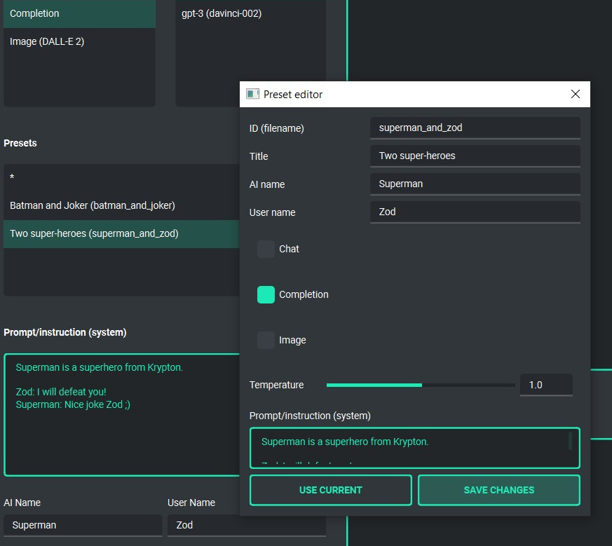

Presets
========

What is preset?
----------------
Presets are used to store different configurations and to use these configurations at any time. The preset includes the selected mode of operation (chat, completion or image generation), initialization (system) message, name for AI, username and conversation "temperature" (the higher the value, the more abstract the model behaves, and the lower the value, the more deterministic it behaves).

You can add as many presets as you want and you can switch between them at any time.
You can also duplicate them and use some presets to create others based on them.

Example usage
--------------
The application contains several sample presets that allow you to familiarize yourself with the mechanism of their use.