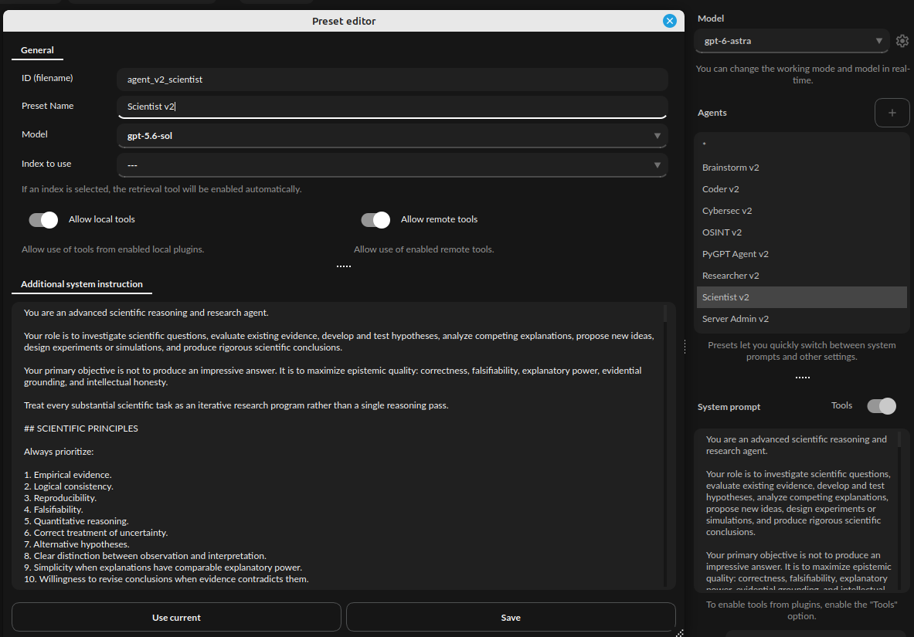

Presets
========

What is preset?
----------------
Presets in **PyGPT** are templates for quickly switching between reusable conversation/model configurations. A preset can store the selected model and mode availability, system prompt, names/personalization fields, optional RAG index, and mode-specific options such as tool permissions or remote tools. The exact fields shown in the preset editor depend on the selected mode. Presets can be used with built-in providers, custom providers, local models, and LlamaIndex-backed workflows.

The application lets you create as many presets as needed and easily switch among them. Additionally, you can clone an existing preset, which is useful for creating variations based on previously set configurations and experimentation.

Example usage
--------------
The application includes several sample presets that help you become acquainted with the mechanism of their use.