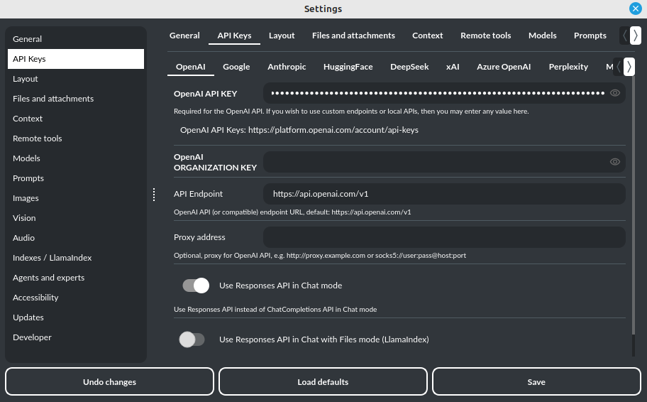

Quick Start
===========

Setting-up OpenAI API KEY
-------------------------

**Tip:** The API key is required to work with the OpenAI API. If you wish to use custom API endpoints or local API that do not require API keys, simply enter anything into the API key field to avoid a prompt about the API key being empty.

During the initial launch, you must configure your API key within the application.

To do so, navigate to the menu:

.. code-block:: ini

   Config -> Settings -> API Keys

and then paste the API key into the ``OpenAI API KEY`` field.

The API key can be obtained by registering on the OpenAI website:

https://platform.openai.com

Your API keys will be available here:

https://platform.openai.com/account/api-keys

**Note:** the ability to use models in the application depends on the API user's access to a given model!