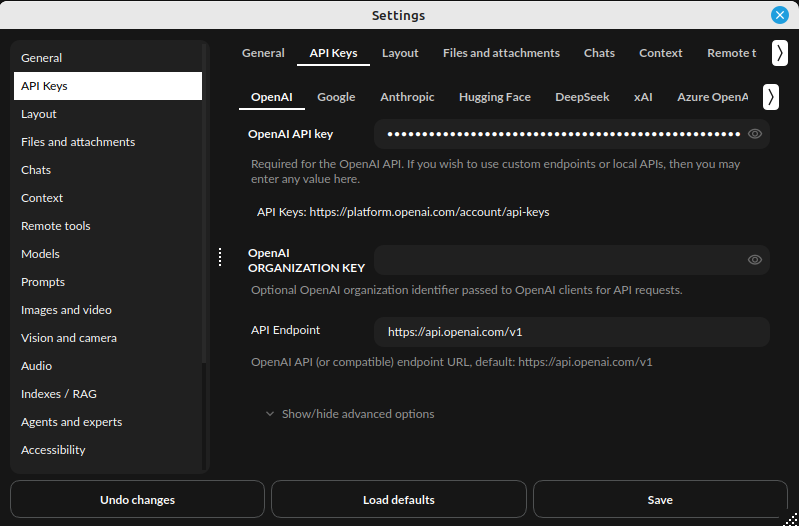

Quick Start
===========

**Setting-up API Key(s)**

You can configure API keys for various providers, such as ``OpenAI``, ``Anthropic``, ``Google``, ``xAI``, ``Perplexity``, ``OpenRouter``, and more. This flexibility allows you to use different providers based on your needs.

During the initial setup, configure your API keys within the application.

To do so, navigate to the menu:

.. code-block:: ini

   Config -> Settings -> API Keys

Here, you can add or manage API keys for any supported provider.

**Configuring Provider**

1. **Select the Provider:** Choose a tab with provider.
2. **Enter the API Key:** Paste the corresponding API key for the selected provider.

**Example**

- **OpenAI:** Obtain your API key by registering on the OpenAI website: https://platform.openai.com and navigating to https://platform.openai.com/account/api-keys.
- **Anthropic, Google, xAPI, Perplexity, OpenRouter, etc.:** Follow similar steps on their respective platforms.

For a local or other OpenAI-compatible model, you can configure credentials per model in
   ``Config -> Models -> Editor`` using ``API base`` and ``API key``. This avoids having to
   reuse the global OpenAI endpoint/API key for that model.

.. note::
   The ability to use models or services depends on your access level with the respective provider.

**Adding a custom OpenAI-compatible provider**

PyGPT includes built-in support for many popular model providers. If the provider you want to use is not available in the default provider list, you can add it manually under ``Settings -> Custom providers``. The only requirement is that it exposes an OpenAI-compatible API.

