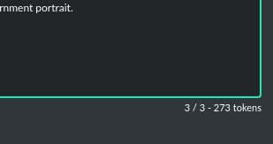
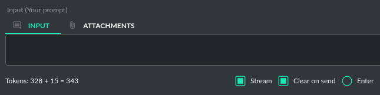

Token usage calculation
========================

Input tokens
--------------
The application features a token calculator. It attempts to forecast the number of tokens that 
a particular query will consume and displays this estimate in real time. This gives you improved 
control over your token usage. The app provides detailed information about the tokens used for the user's prompt, 
the system prompt, any additional data, and those used within the context (the memory of previous entries).

Total tokens
-------------
After receiving a response from the model, the application displays the actual total number of tokens used for the query.

