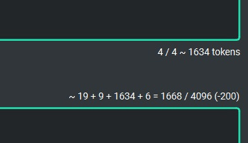
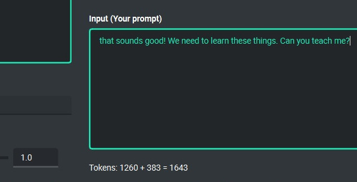

Tokens calculation
===================

Input tokens
--------------
Calculation of tokens is implemented in the application. The application tries to predict the number of tokens that will be used for a given query and shows this information in real time to the user. Thanks to this, you can get better control over the tokens used. The application shows information on how many tokens will be used for the prompt itself, how much for the system prompt, how much for additional data and how many tokens will be used in the context (memory of previous entries).

Total tokens
-------------
After receiving a response from the model, the actual amount of total tokens used to query the model is shown.

