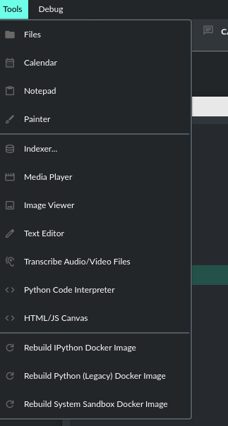
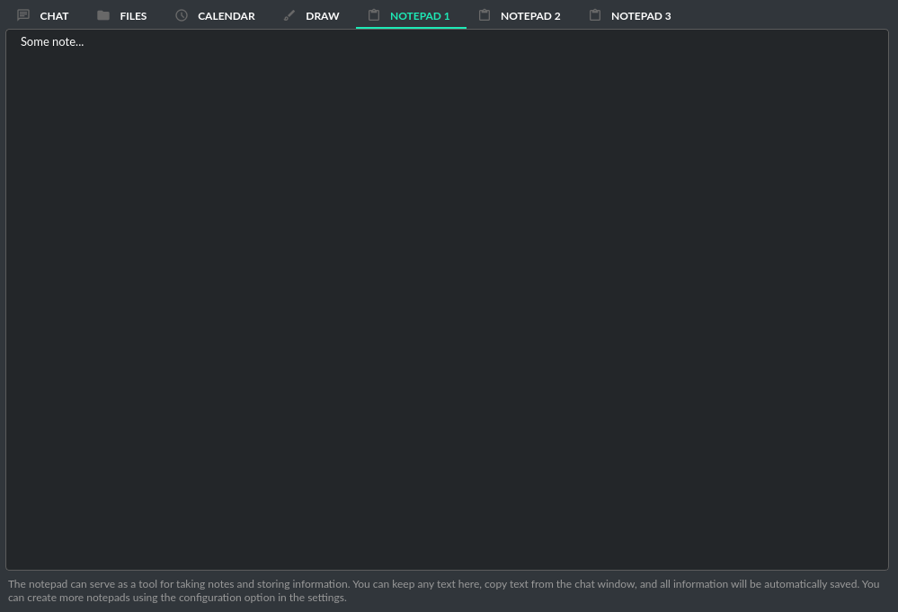
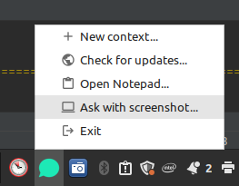
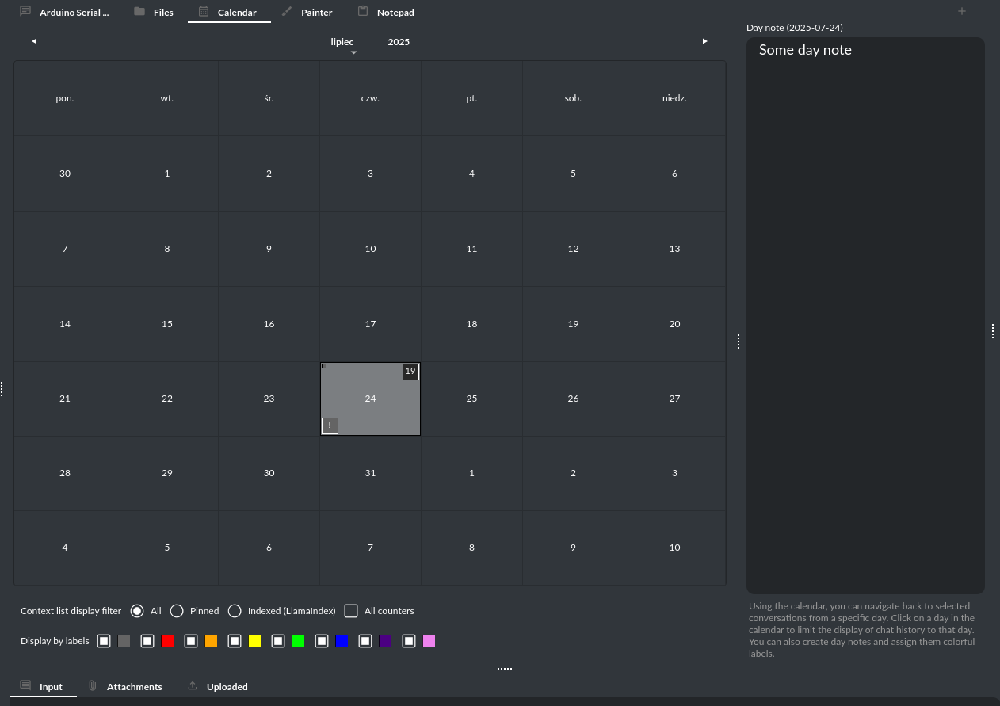
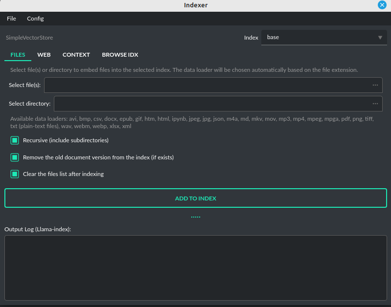
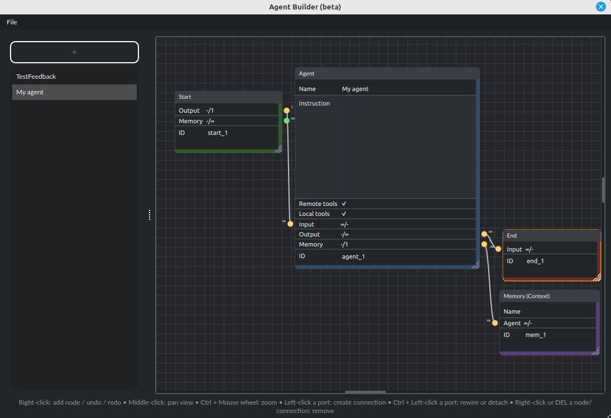

Tools
=====

PyGPT features several useful tools, including:

* Notepad
* Calendar
* Painter
* Indexer
* Media Player
* Image Viewer
* Text Eeditor
* Transcribe Audio/Video Files
* Python Code Interpreter
* HTML/JS Canvas (built-in HTML renderer)
* Translator
* Web Browser (Chromium)
* Agents Builder (beta)

Notepad
-------

The application has a built-in notepad, divided into several tabs. This can be useful for storing information in a convenient way, without the need to open an external text editor. The content of the notepad is automatically saved whenever the content changes.

Painter
-------

Using the ``Painter`` tool, you can create quick sketches and submit them to the model for analysis. You can also edit open or camera-captured images, for example, by adding elements like arrows or outlines to objects. Additionally, you can capture screenshots from the system - the captured image is placed in the drawing tool and attached to the query being sent.

.. image:: images/v2_draw.png
   :width: 800

To quick capture the screenshot click on the option ``Ask with screenshot`` in tray-icon dropdown:

Calendar
--------

Using the calendar, you can go back to selected conversations from a specific day and add daily notes. After adding a note, it will be marked on the list, and you can change the color of its label by right-clicking and selecting ``Set label color`` option. By clicking on a particular day of the week, conversations from that day will be displayed.

Indexer
-------

This tool allows indexing of local files or directories and external web content to a vector database, which can then be used with the ``Chat with Files`` mode. Using this tool, you can manage local indexes and add new data with built-in ``LlamaIndex`` integration.

Media Player
------------

A simple video/audio player that allows you to play video files directly from within the app.

Image Viewer
------------

A simple image browser that lets you preview images directly within the app.

Text Editor
-----------

A simple text editor that enables you to edit text files directly within the app.

Transcribe Audio/Video Files
-----------------------------

An audio transcription tool with which you can prepare a transcript from a video or audio file. It will use a speech recognition plugin to generate the text from the file.

Python Code Interpreter
-----------------------

This tool allows you to run Python code directly from within the app. It is integrated with the ``Code Interpreter`` plugin, ensuring that code generated by the model is automatically available from the interpreter. In the plugin settings, you can enable the execution of code in a Docker environment.

.. important::
   Executing Python code using IPython in compiled versions requires an enabled sandbox (Docker container). You can connect the Docker container via ``Plugins -> Settings``.

HTML/JS Canvas
---------------

Allows to render HTML/JS code in HTML Canvas (built-in renderer based on Chromium). To use it, just ask the model to render the HTML/JS code in built-in browser (HTML Canvas). Tool is integrated with the ``Code Interpreter`` plugin.

Translator
----------

Enables translation between multiple languages using an AI model.

Web Browser (Chromium)
----------------------

A built-in web browser based on Chromium, allowing you to open webpages directly within the app. 

.. warning::

   **SECURITY NOTICE:** For your protection, avoid using the built-in browser for sensitive or critical tasks. It is intended for basic use only.

Agents Builder (beta)
---------------------

To launch the Agent Editor, navigate to:

**Tools -> Agents Builder**

This tool allows you to create workflows for agents using a node editor, without writing any code. You can add a new agent type, and it will appear in the list of presets.

To add a new element, right-click on the editor grid and select ``Add`` to insert a new node.

**Types of Nodes:**

- **Flow/Start**: The starting point for agents (user input).
- **Flow/Agent**: A single agent with customizable default parameters, such as system instructions and tool usage. These settings can be overridden in the preset.
- **Flow/Memory**: Shared memory between agents (shared Context).
- **Flow/End**: The endpoint, returning control to the user.

Agents with connected shared memory share it among themselves. Agents without shared memory only receive the latest output from the previous agent.

The first agent in the sequence always receives the full context passed by the user.

Connecting agents and memory is done using node connections via slots. To connect slots, simply drag from the input port to the output port (Ctrl + mouse button removes a connection).

**Node Editor Navigation:**

- **Right-click**: Add node, undo, redo, clear
- **Middle-click + drag**: Pan view
- **Ctrl + Mouse wheel**: Zoom
- **Left-click a port**: Create connection
- **Ctrl + Left-click a port**: Rewire or detach connection
- **Right-click or DELETE a node/connection**: Remove node/connection

.. tip::

   Enable agent debugging in ``Settings -> Debug -> Log Agents usage to console`` to log the full workflow to the console.

Agents built using this tool are compatible with both OpenAI Agents and LlamaIndex.

**Notes:**

Routing and system instruction: for every agent that has more than one connection leading to the next agent, a routing instruction is automatically injected just before your system prompt:

.. code-block:: console

   You are a routing-capable agent in a multi-agent flow.
   Your id is: <current_id>, name: <agent_name>.
   You MUST respond ONLY with a single JSON object and nothing else.
   Schema:
   {
     "route": "<ID of the next agent from allowed_routes OR the string 'end'>",
     "content": "<final response text for the user (or tool result)>"
   }
   Rules:
   - allowed_routes: [<allowed>]
   - If you want to finish the flow, set route to "end".
   - content must contain the user-facing answer (you may include structured data as JSON or Markdown inside content).
   - Do NOT add any commentary outside of the JSON. No leading or trailing text.
   - If using tools, still return the final JSON with tool results summarized in content.
   - Human-friendly route names: <names>
   - Human-friendly route roles (optional): <roles>

   <here begins your system instruction>

**INFO:** Agents Builder is in beta.