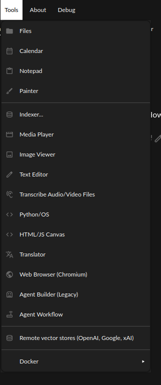
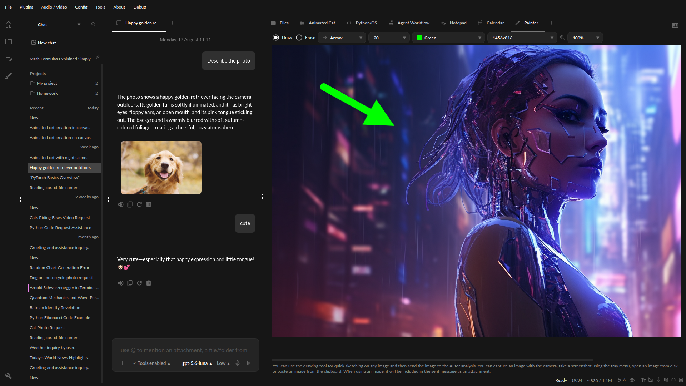
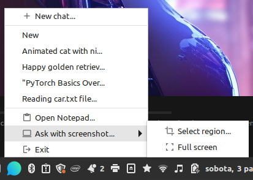
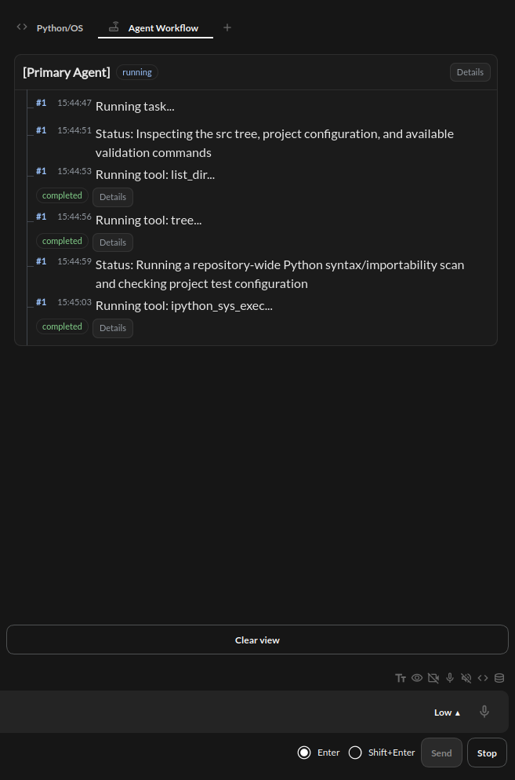
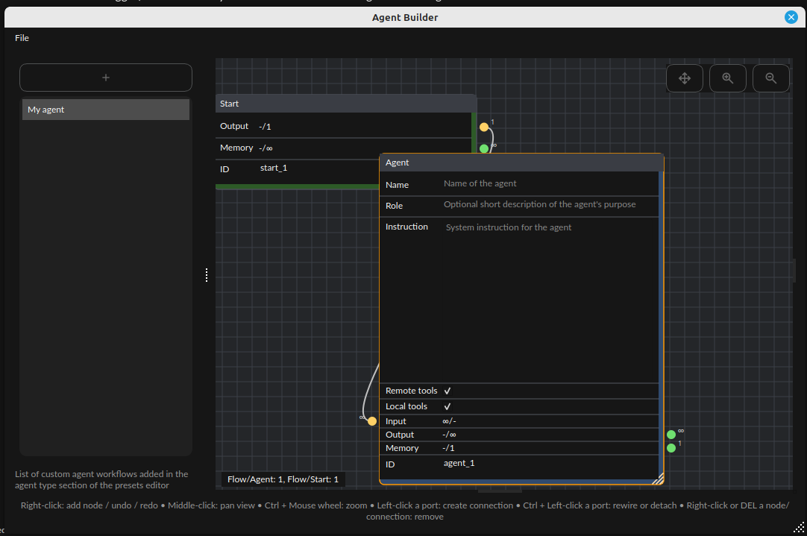

Tools
=====

PyGPT features several useful tools, including:

* Notepad
* Calendar
* Painter
* Indexer
* Media Player
* Image Viewer
* Text Editor
* Transcribe Audio/Video Files
* OpenAI Vector Stores
* Google Vector Stores
* Python/OS
* Terminal
* HTML/JS Canvas (built-in HTML renderer)
* Translator
* Canvas
* Agent Workflow
* Custom agent builder

Notepad
-------

The application has a built-in notepad, divided into several tabs. This can be useful for storing information in a convenient way, without the need to open an external text editor. The content of the notepad is automatically saved whenever the content changes.

Painter
-------

Using the ``Painter`` tool, you can create quick sketches and submit them to the model for analysis. You can also edit open or camera-captured images, for example, by adding elements like arrows or outlines to objects. Additionally, you can capture screenshots from the system - the captured image is placed in the drawing tool and attached to the query being sent.

When the **Canvas (inline)** plugin is enabled, the model can also request the current Painter content itself with ``get_user_painter_image``. The command captures the full logical drawing canvas into shared ``tmp/runtime_artifacts`` storage without creating a persistent chat attachment. In Agents it returns the path for the agent to attach through its normal file flow. In other modes with **Files I/O** enabled it also returns the path, allowing the model to call ``attach_runtime_file`` explicitly. If Files I/O is unavailable outside Agents, PyGPT automatically falls back to the same runtime-only attachment mechanism.

To quick capture the screenshot click on the option ``Ask with screenshot`` in tray-icon dropdown:

Calendar
--------

Choose ``Tools → Calendar`` to open Calendar in a separate dialog. The menu reuses the existing dialog. You can also add a Calendar tab through ``[+] → Add Tool → Calendar``; only one Calendar tab is allowed across all columns. The dialog and tab can stay open together with independent selected dates while sharing saved daily notes.

Using the calendar, you can go back to selected conversations from a specific day and add daily notes. After adding a note, it will be marked on the list, and you can change the color of its label by right-clicking and selecting ``Set label color`` option. By clicking on a particular day of the week, conversations from that day will be displayed.

Indexer
-------

This tool allows indexing of local files or directories and external web content to a vector database, which can then be selected through the ``RAG`` selector in Chat and other supported workflows. Using this tool, you can manage local indexes and add new data with built-in ``LlamaIndex`` integration. Project conversations can also use an isolated ``Current project`` index; see :doc:`indexing` for project-aware file and context indexing.

Media Player
------------

A simple video/audio player that allows you to play video files directly from within the app.

Image Viewer
------------

A simple image browser that lets you preview images directly within the app.

Text Editor
-----------

The built-in text editor provides syntax highlighting, line numbers, find/search support, zoom, configurable tabs and optional word wrapping. The same shared editor core is also used by the Files preview/editor and the Canvas source editor, so the editing behavior is consistent across these surfaces.

The editor context menu contains global tab settings:

* **Indent using spaces** - inserts spaces instead of literal tab characters. Default: enabled.
* **Tab width** - sets the shared tab/indent width from 1 to 8 columns. Default: ``4``.
* **Convert indentation to spaces/tabs** - rewrites indentation in the current document without changing the global preference.
* **Word wrap** - toggles wrapping of long lines. Default: disabled. This is an application-wide editor preference and is shared by the Text Editor, Files editor and Canvas source editor.

Transcribe Audio/Video Files
-----------------------------

An audio transcription tool with which you can prepare a transcript from a video or audio file. It uses the configured speech-recognition provider to generate the text. The tool's generated working transcript is stored as ``%workdir%/tmp/transcript.txt`` rather than in the user-facing ``data`` directory. The ``tmp`` path always belongs to the base profile workdir and is not redirected by a project data-workdir override.

OpenAI / Google Vector Stores
-----------------------------

Remote vector stores management.

.. _python-os:

Python/OS
---------

This tool runs Python/IPython code through the ``Python interpreter`` plugin. ``Use IPython`` selects IPython (default) or standard Python, while ``Sandbox`` selects host execution, the built-in uv-managed environment, or Docker. The built-in mode separates the runtime from PyGPT's own Python environment but does not restrict host filesystem or network access; Docker provides stronger isolation. In Docker mode the active conversation data workdir is available as ``/mnt/data``.

.. important::
   Host mode requires a working local Python environment. Docker requires Docker Engine or Docker Desktop.

Managing sandbox environments
~~~~~~~~~~~~~~~~~~~~~~~~~~~~~

Use ``Tools -> Sandbox / Docker`` to rebuild Docker images or recreate the built-in Python/System environments.

The built-in environments normally rebuild automatically after their package list changes. Use the menu actions when you want to rebuild immediately or reset an environment to its configured package set. Packages installed manually are removed by a rebuild unless they are also listed in the corresponding plugin's **Built-in sandbox** settings.

See the ``Python interpreter`` and ``System (OS)`` sections in :doc:`plugins` for package configuration and sandbox behavior.

Terminal
--------

**Tools -> Terminal** opens a terminal dialog. **Add tab [+] -> Add a new terminal**
creates another independent terminal tab. The left toolbar activates a terminal
tab, and the default layout includes one at the end of the second column.

Each terminal tab and the dialog have an independent session, starting in the active Files working directory.
Linux and macOS use the user's shell; Windows uses PowerShell 7 when available,
otherwise Command Prompt. Closing a frontend terminates its shell. Restoring a
layout starts new sessions rather than resuming previous processes.

ANSI colors, fullscreen text applications, keyboard input, terminal resizing and
2000 lines of scrollback are supported. Scroll with the mouse wheel. Use
**Ctrl+Shift+C** to copy selected text and **Ctrl+Shift+V** to paste;
**Ctrl+C** interrupts the foreground command. Use **Ctrl+mouse wheel** or the
context-menu Zoom submenu to change the terminal font size. The menu matches
the text editors, while the terminal saves its size independently. The terminal
uses a system monospace font. Drag to select text or use **Select all** from the
context menu (**Ctrl+Shift+A**). **Ctrl+C** and **Ctrl+V** remain shell controls.
Commands run locally with the permissions of the
user running PyGPT. The vertical scrollbar is always visible.

Terminal dependencies are included in the standard installation. For a manual
environment, install ``pyte>=0.8.2,<0.9`` on all systems, ``ptyprocess>=0.7,<0.8`` on Linux/macOS,
and ``pywinpty>=3,<4`` on Windows. Graphics protocols and terminal mouse reporting
are not supported.

HTML/JS Canvas
---------------

Allows HTML/JS code to be rendered in HTML Canvas (a built-in Chromium-based renderer). To use it, ask the model to render HTML/JS in the built-in HTML Canvas. The tool is integrated with the ``Python interpreter`` plugin, and its application-managed Canvas HTML file is stored under ``%workdir%/tmp``.

Translator
----------

Enables translation between multiple languages using an AI model.

Canvas
------

The **Canvas** tool is a persistent Chromium/QWebEngine browser and interactive rendering surface used by the **Canvas (inline)** plugin. It can render generated HTML/CSS/JavaScript, open external webpages, support scoped interaction, annotations, screenshots, DOM inspection, iterative live editing, and retrieve the user's current Painter drawing as runtime model input through ``get_user_painter_image``. Enable the plugin to expose the model-callable Canvas tools; the global ``Tools`` switch is not required.

See :doc:`canvas` for the feature overview and :ref:`plugin-canvas-web-html` for the complete tool and configuration reference.

Agent Workflow
--------------

**Agent Workflow** is a live, human-readable monitor for ``Agents`` / Agents v2. It shows the current run as a hierarchy of the primary agent or orchestrator and its worker agents, with timestamped status entries, agent turns, worker creation, task progress, and tool execution. Tool calls expose expandable input/output details, while each agent has a **Details** panel with available runtime information such as its system prompt, instruction, task, input, model/provider, language, and preset.

Open it from ``Tools -> Agent Workflow`` as a dialog, or pin it to an output tab from the tab context menu. The default layout includes an Agent Workflow tab in the second output column. When the first actual ``Agents`` run starts after the user sends input in a profile, PyGPT reveals that tab and expands split-screen once so the monitor is discoverable. Merely selecting the mode does not trigger this behavior; after the first-run introduction, the user's layout is left unchanged.

The view is runtime-only and is intended for observing active work rather than replacing conversation history or debug logs. A new top-level agent run clears the monitor automatically. Use **Clear view** to clear it manually. Closing or hiding the tab does not stop the active agent workflow.

Custom agent builder
--------------------

**Custom agent builder** is the visual node editor for the **Custom agents** mode. It is intended for experimenting with custom workflow structures and is separate from the newer **Agents** mode and its Agent Workflows editor.

Launch it from:

**Tools -> Custom agent builder**

The editor lets you create workflow graphs without writing the graph by hand. A saved workflow becomes available to Custom agents presets.

Node types include:

* **Start** - workflow input.
* **Agent** - an agent node with instructions and tool settings.
* **Memory** - shared context between connected agents.
* **End** - workflow output.

Agents connected to shared memory share it among themselves. Agents without shared memory receive the latest output from the previous agent. The first agent receives the full user context.

Node editor navigation:

* **Right-click** - add node, undo, redo, clear.
* **Middle-click + drag** - pan the view.
* **Ctrl + mouse wheel** - zoom.
* **Left-click a port** - create a connection.
* **Ctrl + left-click a port** - rewire or detach a connection.
* **Right-click or Delete** on a node/connection - remove it.

Enable agent debugging in ``Settings -> Debug -> Log Agents usage to console`` to inspect the workflow in the console.
